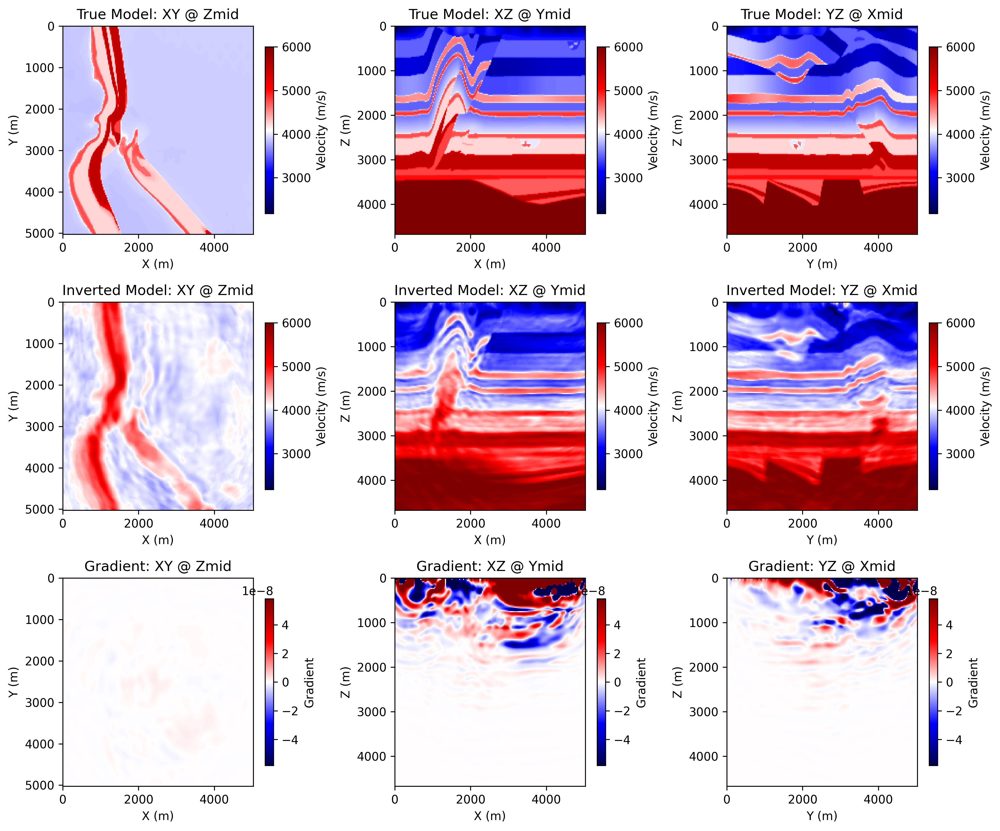

# 3D Acoustic FWI on Overthrust with Torch

Source file:

- `examples/FWI/3d/acoustic/torch/fwi_overthrust.py`

## What This Example Does

This example runs 3D acoustic full-waveform inversion on the Overthrust model
with one script that supports two propagator backends:

- `eager`: pure PyTorch propagation through `PropTorch(..., backend="eager")`
- `cuda`: compiled CUDA propagation through `PropTorch(..., backend="cuda")`

The script:

1. loads the 3D true and smooth Overthrust velocity models
2. builds a 3D acoustic solver for the selected backend
3. generates observed shot gathers from the true model
4. inverts the smooth model by matching synthetic and observed data

## Main Components

The solver is built from:

- `equation`: `Acoustic3D(...)`
- `propagator`: `PropTorch(...)`
- `wave`: a Ricker wavelet
- `sources`: a surface source grid over `x` and `y`
- `receivers`: a surface receiver grid repeated for each shot
- `models`: the 3D velocity model `vp`

## Backend Selection

Run the example with:

=== "PyTorch"

    ```bash
    python3 examples/FWI/3d/acoustic/torch/fwi_overthrust.py --backend eager
    ```

=== "CUDA"

    ```bash
    python3 examples/FWI/3d/acoustic/torch/fwi_overthrust.py --backend cuda
    ```

## Key Configuration

Shared configuration includes:

- `nt=1500`, `dt=0.002`
- `dh=25.0`
- `spatial_order=2`
- `abcn=10`
- `src_step=16`, `rec_step=4`
- `src_margin=8`, `rec_margin=4`
- `batchsize=4`
- `forward_batchsize=1`
- `model_stride_z=1`, `model_stride_y=4`, `model_stride_x=4`

The script uses:

- `batchsize`: the number of shots randomly selected for one optimizer step
- `forward_batchsize`: the number of shots used at once when generating observed data
- `train_shot_batchsize`: an optional runtime override that splits the selected training shots into smaller chunks during one optimizer step

## Memory Notes

This 3D example is much heavier than the 2D Marmousi examples.

Under the current default configuration, one reported CUDA run used about:

- `36671 MiB / 49140 MiB`

This means the default settings may not fit on smaller GPUs.

The default training setup selects `batchsize=4` shots per optimizer step. By
default those four shots are passed to the solver together, so memory demand is
set by a four-shot training batch.

If GPU memory is tight, keep the optimization batch at four shots but process
them sequentially with gradient accumulation:

```bash
python3 examples/FWI/3d/acoustic/torch/fwi_overthrust.py --backend cuda --train-shot-batchsize 1
```

This runs one selected shot at a time inside each optimizer step and usually
reduces peak shot-related memory substantially. The reduction is often close to
the training batch ratio, but it is not guaranteed to be exactly `1/4` because
model storage, optimizer state, PML buffers, and other fixed allocations remain.

If needed, you can also reduce the number of selected shots per optimizer step:

```bash
python3 examples/FWI/3d/acoustic/torch/fwi_overthrust.py --backend cuda --batchsize 1
```

That further lowers memory use, but it also changes the optimization behavior
because each step then uses only one shot instead of four.

## Geometry

The example uses a surface acquisition spread in 3D:

- sources are sampled on an `x-y` grid with spacing `src_step`
- receivers are sampled on an `x-y` grid with spacing `rec_step`
- all sources use the same depth `srcz`
- all receivers use the same depth `recz`

The final array shapes are:

- `sources`: `(nshots, 3)`
- `receivers`: `(nshots, nreceivers, 3)`

## Inversion Workflow

Observed data is generated first from the true model, then the inversion updates
the smooth model with `torch.optim.Adam`.

At each iteration, the script:

1. selects a random subset of `batchsize` shots
2. optionally splits that subset into chunks of `train_shot_batchsize`
3. computes synthetic data and accumulates gradients chunk by chunk
4. updates the model once after the full selected batch has contributed

## Outputs

The script creates an output directory under `examples/FWI/3d/acoustic/torch/`
and saves:

- `ricker.png`: the source wavelet
- `observed_data.png`: an example observed shot gather
- `loss.png`: the inversion loss curve
- `epoch_XXXX.png`: three orthogonal slices of the true model, the current inverted model, and the current gradient

Each backend writes into its own output directory:

=== "PyTorch"

    `acoustic_3d_fwi_overthrust_torch`

=== "CUDA"

    `acoustic_3d_fwi_overthrust_cuda`

## Example Figures

The following figures come from a completed CUDA run of the 3D Overthrust
example.

`epoch_0100.png`: the saved progress panel at a later epoch, showing three
orthogonal slices of the true model, the current inverted model, and the
current gradient.



## Running the Example

Step 1. Make sure the Overthrust 3D models have been prepared.

See [Model Assets](model_assets.md) for the download and conversion steps.

Step 2. Choose the backend you want to use.

=== "PyTorch"

    ```bash
    python3 examples/FWI/3d/acoustic/torch/fwi_overthrust.py --backend eager
    ```

=== "CUDA"

    ```bash
    python3 examples/FWI/3d/acoustic/torch/fwi_overthrust.py --backend cuda
    ```

Step 3. If memory is tight, retry with one-shot accumulation.

```bash
python3 examples/FWI/3d/acoustic/torch/fwi_overthrust.py --backend cuda --train-shot-batchsize 1
```

Step 4. Check the backend output directory for `loss.png`,
`observed_data.png`, and `epoch_XXXX.png`.
