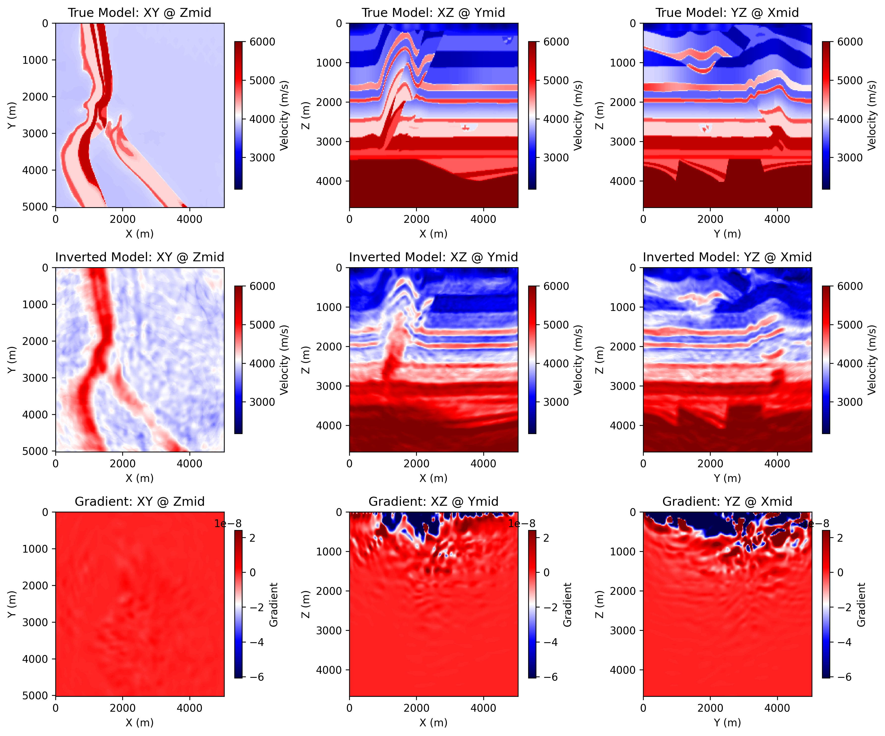

# 3D Acoustic FWI on Overthrust with Torch

> :material-github: **Source on GitHub** &mdash; [`examples/FWI/3d/acoustic/torch/`](https://github.com/DeepWave-KAUST/sweep/tree/main/examples/FWI/3d/acoustic/torch) (clone, run, modify)

Source file:

- [`examples/FWI/3d/acoustic/torch/fwi_overthrust.py`](https://github.com/DeepWave-KAUST/sweep/blob/main/examples/FWI/3d/acoustic/torch/fwi_overthrust.py)

## What This Example Does

This example runs 3D acoustic full-waveform inversion on the Overthrust model
with one script that supports two Torch implementations:

- `eager`: pure PyTorch propagation through `PropTorch(..., backend="torch", impl="eager")`
- `c`: compiled CUDA propagation through `PropTorch(..., backend="torch", impl="c")`

and two training modes:

- **mini-batch stochastic FWI** (default): each iteration randomly selects
  `batchsize` shots and propagates them shot-by-shot (or in chunks of
  `train_shot_batchsize`)
- **source-encoding FWI** (`--use-source-encoding`): each iteration randomly
  selects `batchsize` shots, applies random ±1 polarity and random time shifts,
  and combines them into one super-shot — one solver call per epoch

The script:

1. loads the 3D true and smooth Overthrust velocity models
2. builds a 3D acoustic solver for the selected backend
3. generates observed shot gathers from the true model
4. inverts the smooth model by matching synthetic and observed data

## Main Components

The solver is built from:

- `equation`: `Acoustic3D(...)`
- `propagator`: `PropTorch(...)`
- `wave`: a Ricker wavelet
- `sources`: a surface source grid over `x` and `y`
- `receivers`: a surface receiver grid repeated for each shot
- `models`: the 3D velocity model `vp`

## Prepare the Overthrust Model Files

This example reads:

- [`examples/models/overthrust/true_3d.npy`](https://github.com/DeepWave-KAUST/sweep/blob/main/examples/models/overthrust/true_3d.npy)
- [`examples/models/overthrust/smooth_3d.npy`](https://github.com/DeepWave-KAUST/sweep/blob/main/examples/models/overthrust/smooth_3d.npy)

Generate them from the official SEG/EAGE Overthrust archive before running the
example:

```bash
python3 examples/models/overthrust/download_3d_overthrust.py --extract
python3 examples/models/overthrust/convert_3d_overthrust_vites_to_npy.py
python3 examples/models/overthrust/make_smooth_model.py \
  --input examples/models/overthrust/true_3d.npy \
  --output examples/models/overthrust/smooth_3d.npy \
  --radii 6,6,6 \
  --passes 3
```

Optional preview:

```bash
python3 examples/models/overthrust/plot_true_smooth.py
```

The generated model files under `examples/models/` are ignored by git. The
helper scripts in that directory remain tracked.

## Backend / Implementation Selection

Run the example with:

=== "PyTorch"

    ```bash
    python3 examples/FWI/3d/acoustic/torch/fwi_overthrust.py --backend torch --impl eager
    ```

=== "CUDA"

    ```bash
    python3 examples/FWI/3d/acoustic/torch/fwi_overthrust.py --backend torch --impl c --device cuda
    ```

## Key Configuration

Shared configuration includes:

- `nt=1500`, `dt=0.002`
- `dh=25.0`
- `spatial_order=2`
- `abcn=10`
- `src_step=16`, `rec_step=4`
- `src_margin=8`, `rec_margin=4`
- `batchsize=4`
- `forward_batchsize=1`
- `lr=20.0` (mini-batch path)
- `lr_encoding=20.0` (source-encoding path)
- `max_time_shift_ratio=0.2` (source-encoding path)
- `model_stride_z=1`, `model_stride_y=4`, `model_stride_x=4`

The script uses:

- `batchsize`: the number of shots randomly selected for one optimizer step (or
  combined into one super-shot when source encoding is on)
- `forward_batchsize`: the number of shots used at once when generating observed data
- `train_shot_batchsize`: an optional runtime override that splits the selected
  training shots into smaller chunks during one optimizer step (mini-batch path
  only; mutually exclusive with `--use-source-encoding`)
- `lr_encoding`: learning rate used when source encoding is enabled (falls back
  to `lr` if not set)
- `max_time_shift_ratio`: maximum random time shift per encoded shot, expressed
  as a fraction of `nt` (only used when source encoding is on)

## Memory Notes

This 3D example is much heavier than the 2D Marmousi examples.

Under the current default configuration, one reported CUDA run used about:

- `36671 MiB / 49140 MiB`

This means the default settings may not fit on smaller GPUs.

The default training setup selects `batchsize=4` shots per optimizer step. By
default those four shots are passed to the solver together, so memory demand is
set by a four-shot training batch.

If GPU memory is tight, keep the optimization batch at four shots but process
them sequentially with gradient accumulation:

```bash
python3 examples/FWI/3d/acoustic/torch/fwi_overthrust.py --backend torch --impl c --device cuda --train-shot-batchsize 1
```

This runs one selected shot at a time inside each optimizer step and usually
reduces peak shot-related memory substantially. The reduction is often close to
the training batch ratio, but it is not guaranteed to be exactly `1/4` because
model storage, optimizer state, PML buffers, and other fixed allocations remain.

If needed, you can also reduce the number of selected shots per optimizer step:

```bash
python3 examples/FWI/3d/acoustic/torch/fwi_overthrust.py --backend torch --impl c --device cuda --batchsize 1
```

That further lowers memory use, but it also changes the optimization behavior
because each step then uses only one shot instead of four.

## Geometry

The example uses a surface acquisition spread in 3D:

- sources are sampled on an `x-y` grid with spacing `src_step`
- receivers are sampled on an `x-y` grid with spacing `rec_step`
- all sources use the same depth `srcz`
- all receivers use the same depth `recz`

The final array shapes are:

- `sources`: `(nshots, 3)`
- `receivers`: `(nshots, nreceivers, 3)`

## Inversion Workflow

Observed data is generated first from the true model, then the inversion updates
the smooth model with `torch.optim.Adam`.

### Mini-Batch Path (default)

At each iteration, the script:

1. selects a random subset of `batchsize` shots
2. optionally splits that subset into chunks of `train_shot_batchsize`
3. computes synthetic data and accumulates gradients chunk by chunk
4. updates the model once after the full selected batch has contributed

### Source-Encoding Path (`--use-source-encoding`)

At each iteration, the script:

1. selects a random subset of `batchsize` shots
2. assigns each selected shot a random ±1 polarity and a random time shift
   `tau ∈ [0, max_time_shift_ratio · nt)`
3. builds an encoded super-shot by summing the polarity- and time-shifted
   observed traces, with a matching encoded wavelet stack
4. runs **one** solver call with `source_encoding=True` and updates the model
   once per epoch

This makes each epoch ~3× faster than the mini-batch path on the default
configuration, at the cost of higher per-epoch loss noise (each super-shot is a
different encoded target).

## Source Encoding: Call Shapes

When `--use-source-encoding` is on, both the eager and `c` paths use the same
3D batched layout (so `_auto_detect_source_encoding` in `PropTorch` agrees with
the explicit `source_encoding=True` flag):

- `wavelet`: `(1, nsel, nt)`
- `sources`: `(1, nsel, 3)`
- `receivers`: `(1, nreceivers, 3)`

Here `nsel = batchsize` is the number of shots combined into the current
super-shot. The 3D Overthrust geometry replicates the same receiver grid for
every shot, so `receivers[:1]` is used as the shared receiver tensor for the
super-shot.

## Outputs

The script creates an output directory under `examples/FWI/3d/acoustic/torch/`
and saves:

- `ricker.png`: the source wavelet
- `observed_data.png`: an example observed shot gather
- `loss.png`: the inversion loss curve
- `epoch_XXXX.png`: three orthogonal slices of the true model, the current inverted model, and the current gradient

Each implementation/device combination writes into its own output directory:

=== "PyTorch"

    `acoustic_3d_fwi_overthrust_torch`

=== "CUDA"

    `acoustic_3d_fwi_overthrust_cuda`

## Example Figures

The following figures come from a completed CUDA run of the 3D Overthrust
example.

The smoothed initial model used as the inversion starting point (three
orthogonal mid-slices, same colour range as the true model):


`epoch_0100.png`: the saved progress panel at a later epoch, showing three
orthogonal slices of the true model, the current inverted model, and the
current gradient.


### Source-Encoding Run

The same panel from a completed CUDA run with `--use-source-encoding` and
identical default configuration (`batchsize=4`, `lr_encoding=20`, 101 epochs):



The encoding path achieves comparable inversion quality to the mini-batch
path. On one reference run with `batchsize=4` and 101 epochs:

| Path | RMSE → true (m/s) | Wallclock |
|---|---|---|
| init (smooth) | 306.5 | — |
| mini-batch | 250.8 | 1022 s |
| source encoding | 253.0 | 340 s (≈3× faster) |

## Running the Example

Step 1. Prepare the Overthrust 3D `.npy` files listed above if they do not
already exist.

Step 2. Choose the implementation you want to use.

=== "PyTorch"

    ```bash
    python3 examples/FWI/3d/acoustic/torch/fwi_overthrust.py --backend torch --impl eager
    ```

=== "CUDA"

    ```bash
    python3 examples/FWI/3d/acoustic/torch/fwi_overthrust.py --backend torch --impl c --device cuda
    ```

Step 3. If memory is tight, retry with one-shot accumulation.

```bash
python3 examples/FWI/3d/acoustic/torch/fwi_overthrust.py --backend torch --impl c --device cuda --train-shot-batchsize 1
```

Step 4. Optionally try source-encoding FWI for ~3× faster epochs.

```bash
python3 examples/FWI/3d/acoustic/torch/fwi_overthrust.py --backend torch --impl c --device cuda --use-source-encoding
```

`--use-source-encoding` is mutually exclusive with `--train-shot-batchsize`
(an encoded super-shot is one solver call by construction). The encoding path
writes `vp_inverted.npy` and `losses.npy` alongside the figures so the
inverted model can be loaded back with `np.load(...)`.

Step 5. Check the backend output directory for `loss.png`,
`observed_data.png`, `epoch_XXXX.png`, and (after the run finishes)
`vp_inverted.npy` / `losses.npy`.
