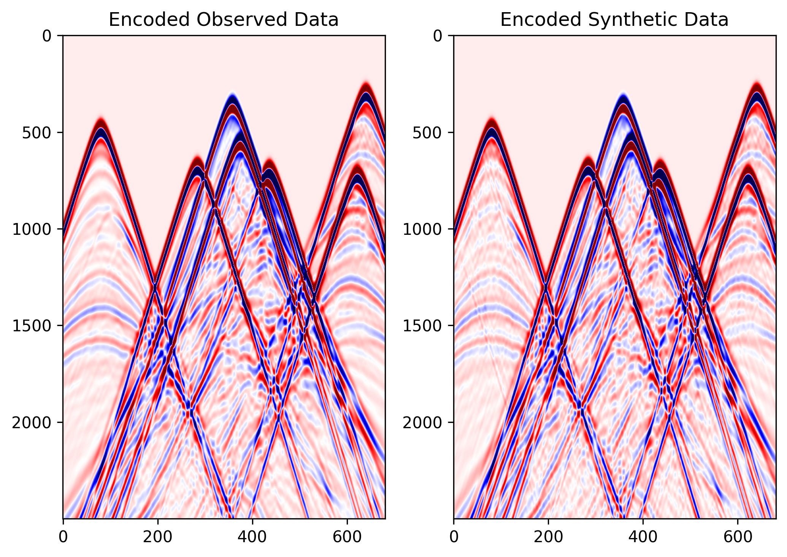

# 2D Acoustic FWI with Source Encoding on Marmousi with Torch

Source file:

- `examples/reducingmemory/source_encoding/torch/source_encoding_fwi.py`

This example demonstrates how to run acoustic full-waveform inversion (FWI)
with source encoding.

The example supports two propagation backends:

- `torch`: PyTorch-based wave propagation
- `cuda`: CUDA-accelerated wave propagation with boundary saving

Source encoding is used to reduce the cost of FWI. Instead of modeling all
shots independently at every iteration, the script randomly selects several
shots, applies random time shifts and polarity changes, and combines them into
one encoded super-shot.

## What This Example Does

This example performs the following steps:

1. loads a true velocity model and an initial velocity model
2. builds a Ricker wavelet
3. defines source and receiver geometry
4. generates observed data from the true model
5. runs source-encoded FWI from the initial model
6. saves figures showing the inversion progress

The output includes:

- the source wavelet
- the observed data
- encoded observed and synthetic data during inversion
- the inverted model
- the gradient
- the loss curve

## When to Use This Example

Use this example if you want to:

- test acoustic FWI with source encoding
- compare PyTorch and CUDA propagation backends
- reduce memory usage during FWI
- run a simple Marmousi-style inversion example
- understand how encoded shots are used in inversion

## Required input files

The script expects two NumPy model files in the same folder as the script:

```text
marmousi_true.npy    -> true velocity model
marmousi_smooth.npy  -> initial velocity model
```

Both files should have the same 2D shape:

```text
(nz, nx)
```

## How to Run

Step 1. Choose the backend you want to use.

=== "PyTorch"

    ```bash
    python source_encoding_fwi.py --backend eager
    ```

    This mode uses the PyTorch propagator.

=== "CUDA"

    ```bash
    python source_encoding_fwi.py --backend cuda
    ```

    This mode uses the CUDA propagator.

    The CUDA backend requires a CUDA-capable PyTorch environment and the CUDA propagation module to be available.

Step 2. Check the backend-specific output folder for figures and inversion
progress.

## Output Folders

Each backend writes results to a separate folder.

=== "PyTorch"

    ```text
    acoustic_fwi_encoding_torch/
    ```

=== "CUDA"

    ```text
    acoustic_fwi_encoding_cuda/
    ```

## Output Files

After running the script, the output directory contains:

```text
ricker.png
observed_data.png
loss.png
data_epoch_XXXX.png
epoch_XXXX.png
```

- `ricker.png`: Shows the Ricker wavelet used as the seismic source.
- `observed_data.png`: Shows one observed shot gather generated from the true velocity model.
- `data_epoch_XXXX.png`: Shows the encoded observed data and encoded synthetic
  data at a given epoch. This is useful for checking whether the synthetic data
  are gradually matching the encoded observations.
- `epoch_XXXX.png`: Shows three panels: 1) true model; 2) current inverted
  model; 3) current gradient. This figure helps monitor the inversion process.
- `loss.png`: Shows the FWI loss curve during optimization.

## Example Figures

The following figures show two common outputs from a completed
source-encoding FWI run.

`data_epoch_0100.png`: the encoded observed data and encoded synthetic data at
a late inversion epoch, useful for checking whether the encoded prediction is
matching the encoded target.



`loss.png`: the source-encoding FWI loss curve across optimization steps.


## Main Configuration

Most parameters are defined in the `COMMON_CONFIG` parameter.

```python
COMMON_CONFIG = {
    "nt": 2500,
    "dt": 0.002,
    "delay": 0.256,
    "fm": 5.0,
    "dh": 25.0,
    "spatial_order": 8,
    "abcn": 20,
    "free_surface": False,
    "src_step": 2,
    "rec_step": 1,
    "srcz": 1,
    "recz": 18,
    "lr": 25.0,
    "epochs": 101,
    "batchsize": 8,
    "show_every": 10,
    "true_model": "marmousi_true.npy",
    "init_model": "marmousi_smooth.npy",
    "max_time_shift_ratio": 0.2,
}
```

Important parameters:

- `nt, dt`: These define the number of time samples and the time interval.
- `fm, delay`: These define the dominant frequency and delay of the Ricker wavelet.
- `dh`: This is the grid spacing of the velocity model.
- `src_step, rec_step, srcz, recz`: Acquisition geometry settings. `src_step`
  is source spacing in grid points; `rec_step` is the receiver spacing in grid
  points; `srcz` is source depth index; `recz` is receiver depth index.
- `epochs, batchsize, lr`: These control the number of inversion iterations,
  the number of shots used per encoded batch, and the learning rate.
- `max_time_shift_ratio`: This controls the maximum random time shift used in
  source encoding. For example, if `nt=2500`, then the maximum shift is:
  `0.2 × 2500 = 500`.

## Backend-Specific Settings

Backend-specific settings are defined in `BACKEND_CONFIG`.

=== "PyTorch"

    ```python
    "torch": {
        "output_dir": "acoustic_fwi_encoding_torch",
        "use_ckpt": False,
        "use_compile": True,
        "transpose_shot": False,
    }
    ```

    This backend is useful for testing and debugging.

=== "CUDA"

    ```python
    "cuda": {
        "output_dir": "acoustic_fwi_encoding_cuda",
        "transpose_shot": True,
        "boundary_saving_config": {
            "enabled": True,
            "storage": "gpu",
            "transfer_interval": 10,
            "pinned_memory": True,
        }
    ```

    The CUDA backend is intended for faster propagation.

    Boundary saving is enabled to reduce memory usage during backpropagation.

## Source Encoding Call Shapes

The eager and CUDA paths both support source encoding, but they expect
different input layouts when `source_encoding=True`.

=== "Eager"

    The eager path keeps one encoded source per selected shot and collapses the
    selected shots internally.

    Use:

    - `wavelet`: `(nsel, nt)`
    - `sources`: `(nsel, 2)`
    - `receivers`: `(1, nreceivers, 2)`

    Here `nsel` is the number of randomly selected shots in the current
    inversion step.

=== "CUDA"

    The CUDA path expects a single batch that already contains multiple encoded
    sources inside that batch.

    Use:

    - `wavelet`: `(1, nsrc, nt)`
    - `sources`: `(1, nsrc, 2)`
    - `receivers`: `(1, nreceivers, 2)`

    Here `nsrc` is the number of encoded sources combined into the current
    super-shot.

In practice, the main difference is that eager passes selected sources as a
plain shot list, while CUDA passes them as one batched encoded-source block.
