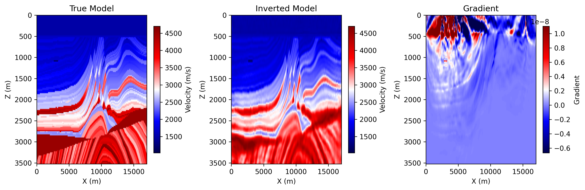

# 2D Acoustic FWI on Marmousi with Torch

Source file:

- `examples/FWI/2d/acoustic/torch/fwi_marmousi.py`

## What This Example Does

This example runs acoustic full-waveform inversion with one script that supports
two propagator backends:

- `eager`: pure PyTorch propagation through `PropTorch(..., backend="eager")`
- `cuda`: compiled CUDA propagation through `PropTorch(..., backend="cuda")`

The script:

1. loads a true velocity model and a smooth initial model
2. builds an acoustic solver for the selected backend
3. generates observed data from the true model
4. inverts the initial model by matching synthetic and observed gathers

## Main Components

The solver is built from:

- `equation`: `Acoustic(...)`
- `propagator`: `PropTorch(...)`
- `wave`: a Ricker wavelet
- `sources`: regularly sampled source coordinates
- `receivers`: regularly sampled receiver coordinates
- `models`: the velocity model `vp`

## Prepare the Marmousi Model Files

This example reads:

- `examples/models/marmousi/true.npy`
- `examples/models/marmousi/smooth.npy`

Generate them from the official Elastic Marmousi archive before running the
example:

```bash
python3 examples/models/marmousi/download_marmousi.py --extract
python3 examples/models/marmousi/extract_model_segy.py
python3 examples/models/marmousi/convert_segy_to_npy.py
python3 examples/models/marmousi/prepare_fwi_models.py \
  --input examples/models/marmousi/npy/vp_1p25m.npy \
  --source-dh 1.25 \
  --target-dh 25.0 \
  --radii 8,8 \
  --passes 3
```

Optional preview:

```bash
python3 examples/models/marmousi/plot_models.py
```

The generated model files under `examples/models/` are ignored by git. The
helper scripts in that directory remain tracked.

## Backend Selection

Run the example with:

=== "PyTorch"

    ```bash
    python3 examples/FWI/2d/acoustic/torch/fwi_marmousi.py --backend eager
    ```

=== "CUDA"

    ```bash
    python3 examples/FWI/2d/acoustic/torch/fwi_marmousi.py --backend cuda
    ```

The script keeps:

- `COMMON_CONFIG`: shared acquisition and inversion settings
- `BACKEND_CONFIG`: backend-specific options for the eager and CUDA paths

For `BACKEND_CONFIG`, the script uses:

- `EagerOptions(...)` for the eager path
- `CUDAOptions(memory=...)` for the CUDA path

## Key Configuration

Shared configuration includes:

- `nt`, `dt`: temporal sampling
- `dh`: spatial sampling
- `spatial_order`: finite-difference order
- `src_step`, `rec_step`: acquisition sampling in the x direction
- `true_model`, `init_model`: `.npy` files loaded from `examples/models/`
- `epochs`, `batchsize`, `lr`: inversion hyperparameters

Backend-specific configuration includes:

- eager: `EagerOptions(use_compile=...)` and `use_ckpt`
- CUDA: `CUDAOptions(memory=MemoryOptions(...))` and display transpose rules for saved figures

## Solver Setup

The equation side is shared across both modes:

```python
equation = Acoustic(
    spatial_order=cfg["spatial_order"],
    device=dev,
    backend="torch",
)
```

Even when the solver runs with `backend="cuda"`, the equation `backend`
remains `"torch"`.

Shared propagator arguments are collected first:

```python
prop_kwargs = dict(
    shape=shape,
    dev=dev,
    dh=cfg["dh"],
    dt=cfg["dt"],
    source_type=["h1"],
    receiver_type=["h1"],
    abcn=cfg["abcn"],
    free_surface=cfg["free_surface"],
    pml_type="cpmlr",
)
```

=== "PyTorch"

    ```python
    solver = PropTorch(
        equation,
        **prop_kwargs,
        use_ckpt=cfg["use_ckpt"],
        backend="eager",
        eager_options=EagerOptions(use_compile=cfg["use_compile"]),
    )
    ```

=== "CUDA"

    ```python
    solver = PropTorch(
        equation,
        **prop_kwargs,
        backend="cuda",
        cuda_options=CUDAOptions(
            memory=MemoryOptions(
                strategy="boundary",
                boundary=BoundaryOptions(...),
            )
        ),
    )
    ```

## Geometry

The example uses a fixed-depth surface acquisition:

- sources are placed every `src_step` grid points
- receivers are placed every `rec_step` grid points
- all sources use the same source depth `srcz`
- all receivers use the same receiver depth `recz`

The final array shapes are:

- `sources`: `(nshots, 2)`
- `receivers`: `(nshots, nreceivers, 2)`

## Inversion Workflow

Observed data is generated first from the true model, then the inversion updates
the smooth model with `torch.optim.Adam`.

At each iteration, the script:

1. selects a random subset of shots
2. computes synthetic data
3. evaluates the L2 data-misfit loss
4. backpropagates gradients to `vp`
5. updates the model

## Outputs

The script creates an output directory under `examples/` and saves:

- `ricker.png`
- `observed_data.png`
- `loss.png`
- `epoch_XXXX.png`: includes the true model, the current inverted model, and the current gradient

Each backend writes into its own output directory:

=== "PyTorch"

    `acoustic_fwi_torch`

=== "CUDA"

    `acoustic_fwi_cuda`

## Example Figures

The following figures show two common outputs from a completed acoustic FWI run.

`loss.png`: the inversion loss curve across optimization steps.


`epoch_0100.png`: the saved progress panel at the final shown epoch, including
the true model, the current inverted model, and the current gradient.



## Running the Example

Step 1. Prepare the Marmousi `.npy` files listed above if they do not already
exist.

Step 2. Choose the backend you want to use.

=== "PyTorch"

    ```bash
    python3 examples/FWI/2d/acoustic/torch/fwi_marmousi.py --backend eager
    ```

=== "CUDA"

    ```bash
    python3 examples/FWI/2d/acoustic/torch/fwi_marmousi.py --backend cuda
    ```

Step 3. Check the output directory for the saved figures.

Notes:

- `eager` mode runs on GPU if available and otherwise falls back to CPU
- `cuda` mode requires a CUDA-capable PyTorch environment and compiled binding
