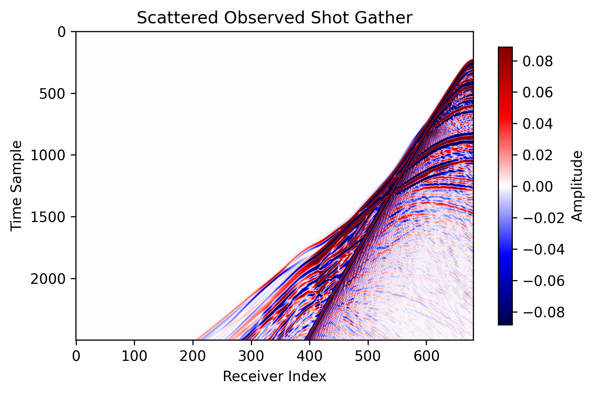
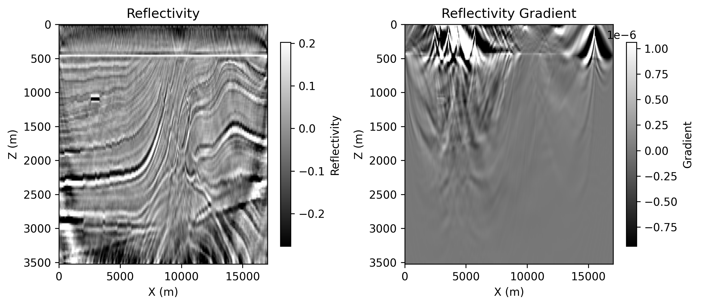

# 2D Acoustic LSRTM on Marmousi with Torch

Source file:

- `examples/LSRTM/2d/acoustic/torch/lsrtm.py`

## What This Example Does

This example runs 2D acoustic least-squares reverse time migration (LSRTM) on
the Marmousi model.

The script:

1. loads the true and smooth Marmousi velocity models
2. generates observed scattered data with `Acoustic`
3. builds an `AcousticLSRTM` solver on either the eager or CUDA backend
4. updates the reflectivity model `mp` by matching predicted and observed scattered gathers

## Main Components

The workflow is built from:

- `equation`: `Acoustic(...)` for observed-data generation
- `equation`: `AcousticLSRTM(...)` for reflectivity inversion
- `propagator`: `PropTorch(...)`
- `wave`: a Ricker wavelet
- `sources`: surface sources sampled every `src_step`
- `receivers`: surface receivers sampled every `rec_step`
- `models`: the smooth velocity model `vp` and the reflectivity model `mp`

## Prepare the Marmousi Model Files

This example reads:

- `examples/models/marmousi/true.npy`
- `examples/models/marmousi/smooth.npy`

Generate them from the official Elastic Marmousi archive before running LSRTM:

```bash
python3 examples/models/marmousi/download_marmousi.py --extract
python3 examples/models/marmousi/extract_model_segy.py
python3 examples/models/marmousi/convert_segy_to_npy.py
python3 examples/models/marmousi/prepare_fwi_models.py \
  --input examples/models/marmousi/npy/vp_1p25m.npy \
  --source-dh 1.25 \
  --target-dh 25.0 \
  --radii 8,8 \
  --passes 3
```

## Backend Selection

Run the example with:

=== "PyTorch"

    ```bash
    python3 examples/LSRTM/2d/acoustic/torch/lsrtm.py --backend eager
    ```

=== "CUDA"

    ```bash
    python3 examples/LSRTM/2d/acoustic/torch/lsrtm.py --backend cuda --cuda-memory full
    ```

The CUDA version also supports:

- `--cuda-memory bs`
- `--cuda-memory ckpt`
- `--cuda-memory recursive`

## Key Configuration

The script uses the shared Marmousi acoustic configuration and overrides a few
LSRTM-specific settings.

Important defaults include:

- `fm=10.0`: dominant frequency for the Ricker wavelet
- `nt`, `dt`, `dh`: temporal and spatial sampling from the Marmousi shared config
- `spatial_order=8`
- `abcn=20`
- `pml_type="cpmlr"`
- `source_type=["h1"]`
- `receiver_type=["sh1"]` for the LSRTM solver
- `lr_ref=0.01`

## Solver Setup

Observed scattered data is generated first with the acoustic equation:

```python
acoustic_solver = PropTorch(
    Acoustic(...),
    ...,
    source_type=["h1"],
    receiver_type=["h1"],
)
```

The LSRTM inversion then uses:

```python
lsrtm_solver = PropTorch(
    AcousticLSRTM(...),
    ...,
    source_type=["h1"],
    receiver_type=["sh1"],
)
```

The reflectivity model is initialized as zeros:

```python
ref = torch.zeros_like(vp, requires_grad=True)
```

## Observed Data Construction

The script forms scattered observed data by subtracting the smooth-background
response from the true-model response:

```python
obs = Acoustic(true_model) - Acoustic(smooth_model)
```

This scattered data is then matched with the `sh1` scattered field predicted by
`AcousticLSRTM`.

## Outputs

The script writes results under:

- `examples/LSRTM/2d/acoustic/torch/acoustic_lsrtm_torch_<backend>_<memory>`

For the CUDA full-memory run shown here, the output directory is:

- `examples/LSRTM/2d/acoustic/torch/acoustic_lsrtm_torch_cuda_full`

Saved files include:

- `ricker.png`: the source wavelet used by the run
- `observed_data.png`: one scattered observed shot gather
- `loss.png`: LSRTM data-misfit loss over iterations
- `epoch_XXXX.png`: saved reflectivity and reflectivity-gradient panels

## Example Figures

The following figures were copied from a completed CUDA full-memory run and
stored under `docs/figures/examples/`.

`ricker.png`: the Ricker wavelet used for the LSRTM example.


`observed_data.png`: the scattered observed shot gather used as the inversion target.



`loss.png`: the LSRTM loss curve across optimization steps.


`epoch_0100.png`: the saved panel at epoch 100, showing the migrated reflectivity
and the current reflectivity gradient.



## Running the Example

Step 1. Prepare the Marmousi `.npy` files listed above if they do not already
exist.

Step 2. Choose the backend and memory mode you want to test.

=== "PyTorch"

    ```bash
    python3 examples/LSRTM/2d/acoustic/torch/lsrtm.py --backend eager
    ```

=== "CUDA"

    ```bash
    python3 examples/LSRTM/2d/acoustic/torch/lsrtm.py --backend cuda --cuda-memory full
    ```

Step 3. Check the output directory for the saved wavelet, observed data, loss,
and epoch figures.

Notes:

- the eager path runs through `PropTorch(..., backend="eager")`
- the CUDA path requires a CUDA-capable PyTorch build and the compiled CUDA extension
- different CUDA memory modes trade runtime for peak memory usage
