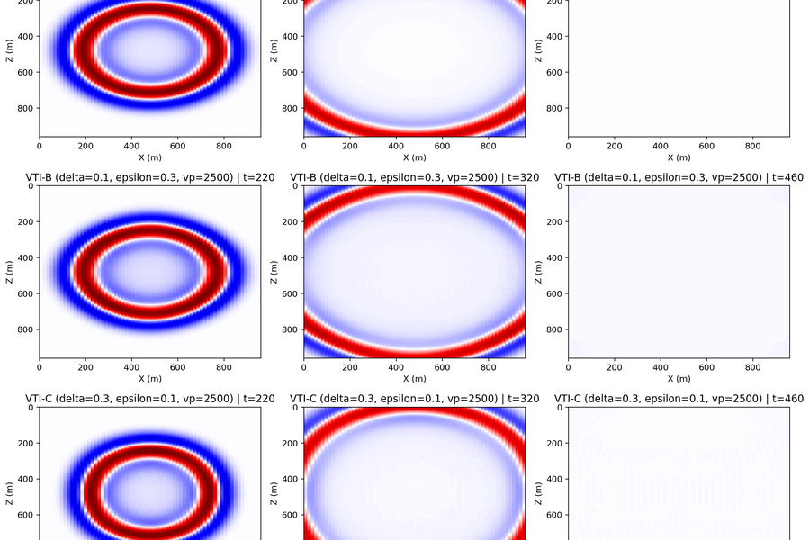
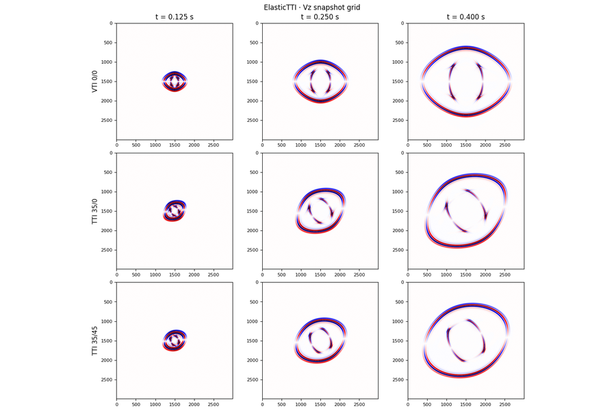
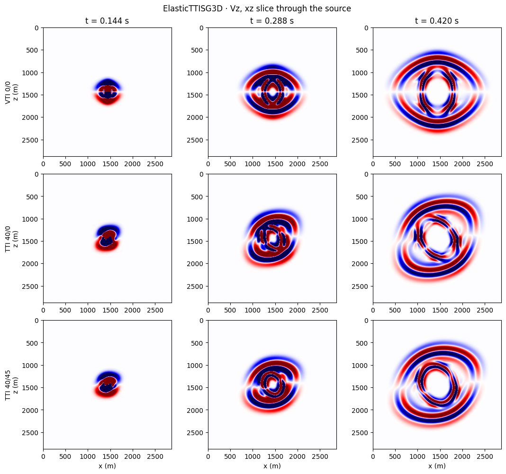
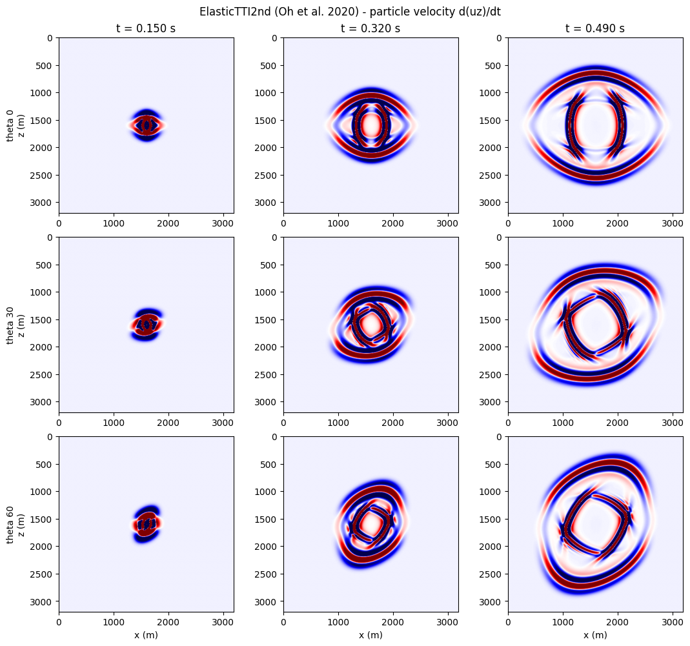

# Anisotropic

VTI and TTI media: pseudo-acoustic VTI, the rotated staggered grid in 2-D and
3-D, and the displacement formulation.

-   { loading=lazy }

    **Wavefield · VTI + shear suppression**

    ---

    Run Duveneck (1st-order), Liang (2nd-order pseudo-acoustic), and
    Alkhalifah (η-acoustic) through the unified `AcousticAniso` factory
    on the canonical Duveneck Fig 2 setup; the trailing cell demonstrates
    the δ→ε disk taper that kills the pseudo-acoustic shear artefact.

    [:material-notebook-outline: Open notebook](../../notebooks/05_wavefield_vti.ipynb)

-   { loading=lazy }

    **Wavefield · Elastic TTI**

    ---

    Rotated staggered-grid (`ElasticTTI`) `vz` snapshots across three
    tilt / azimuth cases — the Duveneck Fig 2 setup at full resolution
    with `(ε, δ, γ, θ, φ)` rotated symmetry axis.

    [:material-notebook-outline: Open notebook](../../notebooks/10_wavefield_elastic_tti.ipynb)

-   { loading=lazy }

    **Wavefield · Elastic TTI · 3-D**

    ---

    `ElasticTTISG3D` on a 2.88 km cube: `vz` through the source plane for a VTI
    reference and two rotated axes. In 3-D the azimuth stops being decorative —
    at φ = 45° the qP front leaves the x–z plane, which no 2-D run can show.

    [:material-notebook-outline: Open notebook](../../notebooks/27_wavefield_elastic_tti_3d.ipynb)

-   { loading=lazy }

    **Wavefield · Elastic TTI · displacement (Oh 2020)**

    ---

    `ElasticTTI2nd`: two displacements on a triple time buffer instead of three
    velocities and five stresses, with the hierarchical `(vh, η)` parametrisation
    of Oh et al. 2020. Three tilts, cross-checked against `ElasticTTISG` on the
    qP wavefront.

    [:material-notebook-outline: Open notebook](../../notebooks/28_wavefield_elastic_tti_2nd.ipynb)

