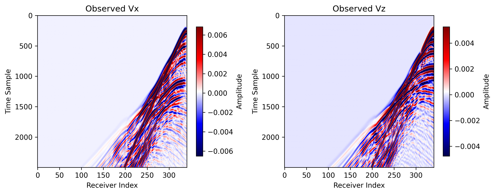
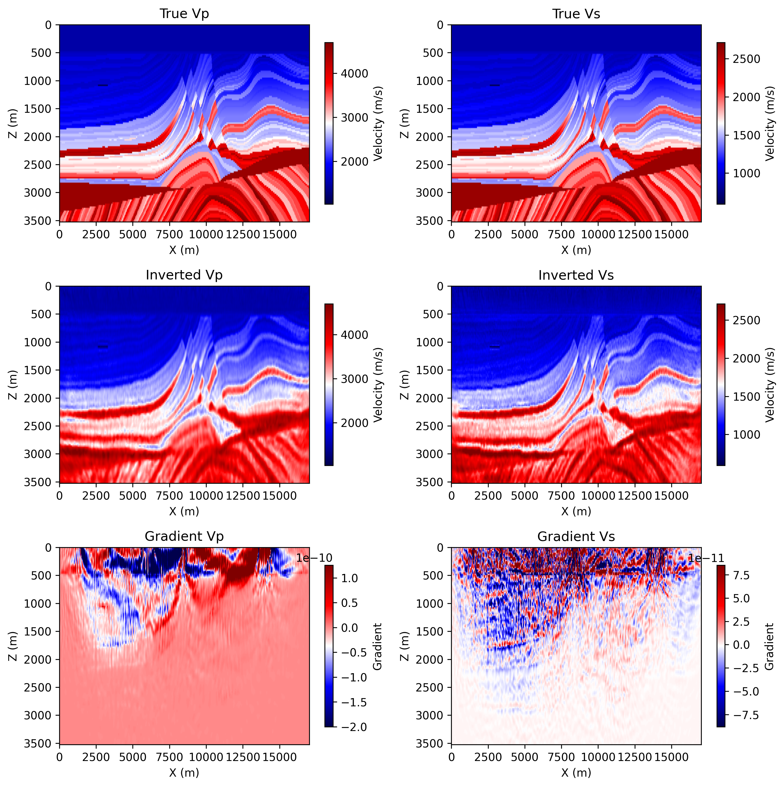

# 2D Elastic FWI on Marmousi with Torch

Source file:

- `examples/FWI/2d/elastic/torch/fwi_marmousi.py`

## What This Example Does

This example runs 2D elastic full-waveform inversion on the Marmousi model with
one script that supports two propagator backends:

- `eager`: pure PyTorch propagation through `PropTorch(..., backend="eager")`
- `cuda`: compiled CUDA propagation through `PropTorch(..., backend="cuda")`

The script:

1. loads the Marmousi true and smooth `vp` models
2. derives `vs` from `vp / 1.732` and uses constant `rho`
3. generates observed elastic shot gathers from the true model
4. inverts `vp` and `vs` from the smooth starting model

## Main Components

The solver is built from:

- `equation`: `Elastic(...)`
- `propagator`: `PropTorch(...)`
- `wave`: a Ricker wavelet injected into `sxx` and `szz`
- `sources`: regularly sampled surface sources
- `receivers`: regularly sampled surface receivers
- `models`: `vp`, `vs`, and `rho`

## Backend Selection

Run the example with:

=== "PyTorch"

    ```bash
    python3 examples/FWI/2d/elastic/torch/fwi_marmousi.py --backend eager
    ```

=== "CUDA"

    ```bash
    python3 examples/FWI/2d/elastic/torch/fwi_marmousi.py --backend cuda
    ```

## Key Configuration

Shared configuration comes from `examples/_shared/configure_marmousi.py` and includes:

- `nt=2500`, `dt=0.002`
- `dh=25.0`
- `spatial_order=8`
- `abcn=20`
- `src_step=4`, `rec_step=2`
- `source_encoding=True`
- `batchsize=8`

The script uses:

- `source_type=["sxx", "szz"]`
- `receiver_type=["vx", "vz"]`
- separate learning rates for `vp`, `vs`, and `rho`

## Geometry

The final array shapes are:

- `sources`: `(nshots, 2)`
- `receivers`: `(nshots, nreceivers, 2)`

## Outputs

The script saves:

- `ricker.png`
- `observed_data.png`
- `loss.png`
- `epoch_XXXX.png`

Each backend writes into its own output directory:

=== "PyTorch"

    `elastic_fwi_marmousi_torch`

=== "CUDA"

    `elastic_fwi_marmousi_cuda`

## Example Figures

The following figures come from a completed CUDA run of the 2D elastic
Marmousi example.

`observed_data.png`: observed `vx` and `vz` shot gathers generated from the
true model.



`loss.png`: the inversion loss curve across optimization steps.


`epoch_0100.png`: the saved progress panel at the final shown epoch, including
the true models, current inverted models, and current gradients.



## Notes

- the Marmousi elastic example defaults to source encoding
- `cuda` mode requires a CUDA-capable PyTorch environment and compiled bindings
