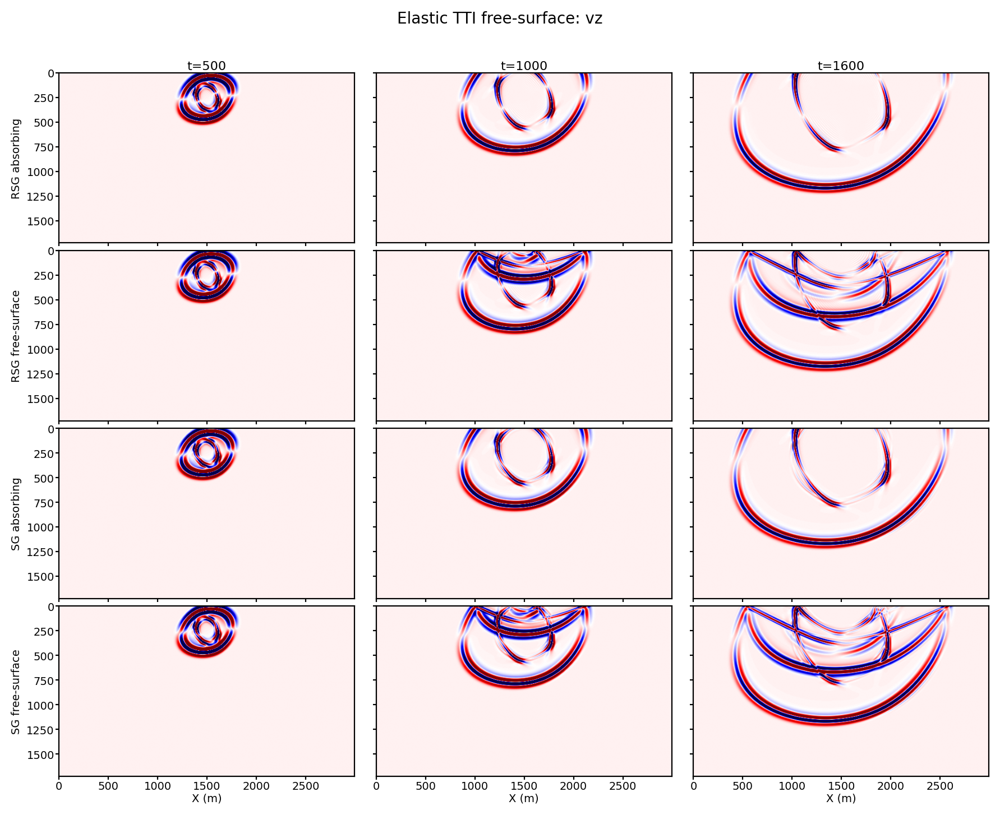

# Elastic TTI Wavefield Experiments

> :material-github: **Source on GitHub** &mdash; [`examples/wavefields/anisotropic/`](https://github.com/DeepWave-KAUST/sweep/tree/main/examples/wavefields/anisotropic) (clone, run, modify)

Source directory:

- [`examples/wavefields/anisotropic/`](https://github.com/DeepWave-KAUST/sweep/tree/main/examples/wavefields/anisotropic)

This example keeps the elastic TTI visualization set intentionally small. It
uses a homogeneous 2D three-component TTI medium and focuses on two diagnostics:

- wavefront rotation for a few representative symmetry-axis angles
- RSG/SG free-surface behavior with the same shallow explosion source

The examples use the eager Torch implementation. `ElasticTTI` is the rotated
staggered-grid (RSG) equation, and `ElasticTTISG` is the axis-aligned staggered
grid (SG) reference.

## How to Run

Run both representative experiments:

```bash
cd examples/wavefields/anisotropic
python elastic_tti_wavefields.py --device cuda
```

Run only the rotation experiment:

```bash
python elastic_tti_wavefields.py --experiment rotation --device cuda
```

Run only the free-surface comparison:

```bash
python elastic_tti_wavefields.py --experiment free-surface --device cuda
```

For a fast smoke run:

```bash
python elastic_tti_wavefields.py --quick --device cuda
```

For a docs-style compact plot that only writes `vz`:

```bash
python elastic_tti_wavefields.py --fields vz --device cuda
```

## Common Parameters

| Parameter | Value |
| --- | --- |
| physical grid | `600 x 600` |
| grid spacing | `5 m` |
| time step | `0.00025 s` |
| time steps | `1800` |
| absorbing width | `60` grid points |
| spatial order | `8` |
| source | Gaussian 5x5 explosion source on `sxx+szz` |
| dominant frequency | `30 Hz` |
| snapshots | `500, 1000, 1600` |

## Experiment 1: Rotation

This run uses RSG and compares three compact cases:

| Label | Tilt `theta` | Azimuth `phi` |
| --- | ---: | ---: |
| `VTI 0/0` | `0 deg` | `0 deg` |
| `TTI 35/0` | `35 deg` | `0 deg` |
| `TTI 35/45` | `35 deg` | `45 deg` |


## Experiment 2: Free Surface

This run compares the same TTI model and shallow source under four boundary/grid
choices:

| Label | Grid | Top boundary |
| --- | --- | --- |
| `RSG absorbing` | rotated staggered grid | absorbing |
| `RSG free-surface` | rotated staggered grid | free surface |
| `SG absorbing` | axis-aligned staggered grid | absorbing |
| `SG free-surface` | axis-aligned staggered grid | free surface |



The script crops free-surface plots to the active upper part of the model by
default. Use `--plot-zmax 1500` if you want a fixed displayed depth.
