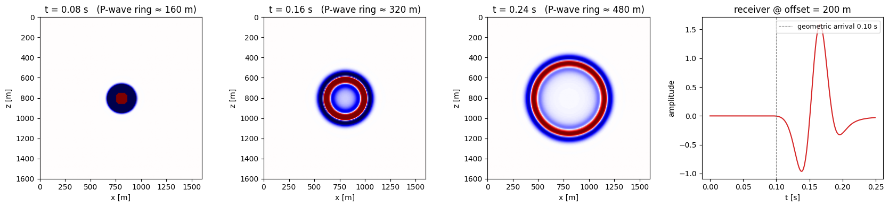

# Extending

Add a wave equation of your own and drive it through `PropTorch` like a built-in.

-   { loading=lazy }

    **Extending · add a new equation**

    ---

    Tutorial: add a brand-new wave equation to SWEEP — define its fields and
    time step, register it, and drive it through `PropTorch` like any built-in.

    [:material-notebook-outline: Open notebook](../../notebooks/18_extending_add_new_equation.ipynb)

