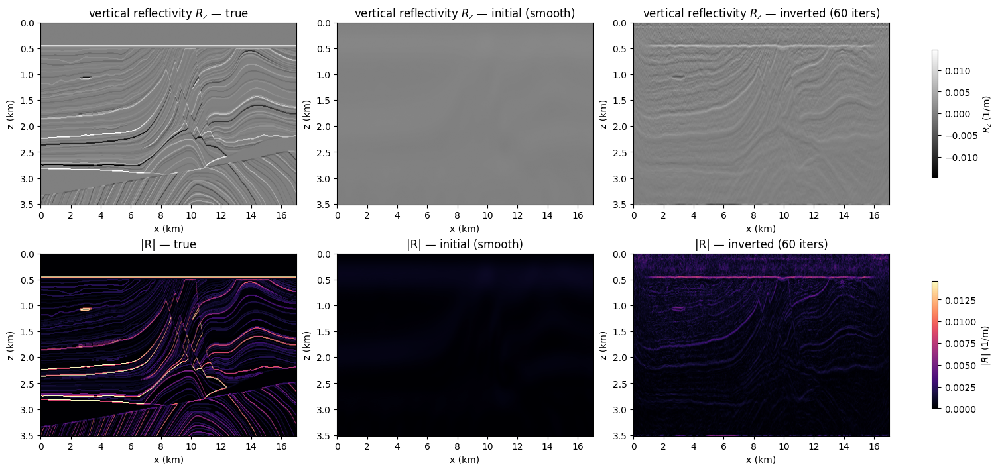
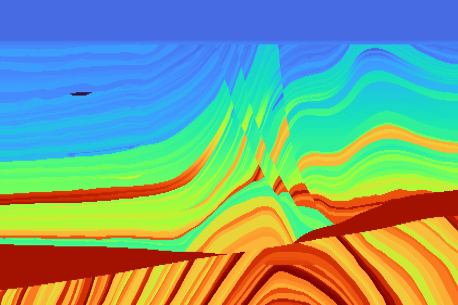
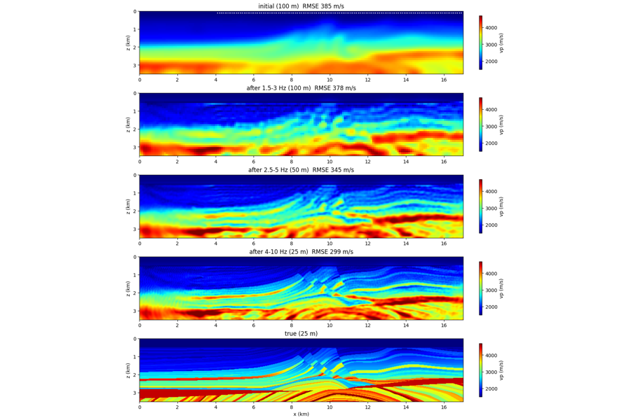
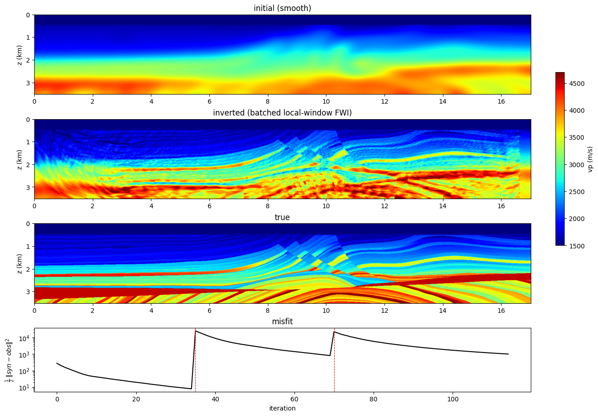
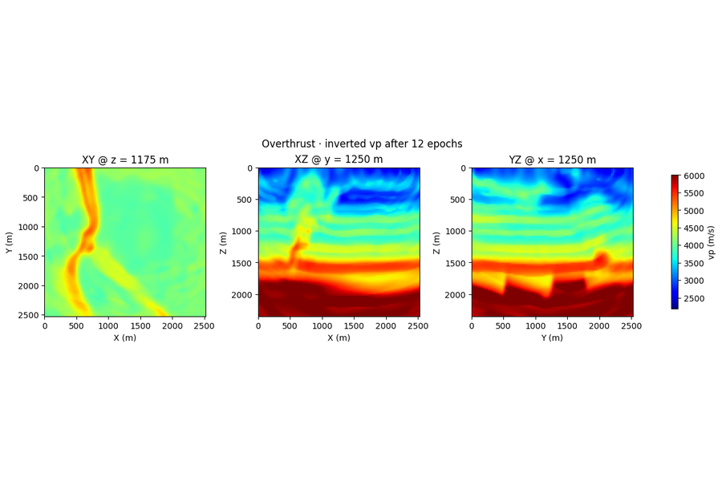

# FWI

Full-waveform inversion end to end: constant- and variable-density acoustic and
elastic Marmousi, multiscale and frequency-selection encoding, batched streamer
windows, and a 3-D Overthrust volume.

-   { loading=lazy }

    **FWI · Acoustic · Marmousi**

    ---

    Load Marmousi from `sweep.datasets`, build a 192×320 window, forward-model
    observed gathers, and invert the smooth start with Adam + MSE. Each phase
    is one cell.

    [:material-notebook-outline: Open notebook](../../notebooks/01_fwi_acoustic_marmousi.ipynb)

-   { loading=lazy }

    **FWI · VRZ · Marmousi**

    ---

    Acoustic variable-density (VRZ) FWI on Marmousi — vector reflectivity from
    impedance, inverted with the `AcousticVRZ` equation.

    [:material-notebook-outline: Open notebook](../../notebooks/17_fwi_vrz_marmousi.ipynb)

-   { loading=lazy }

    **FWI · Elastic · Marmousi**

    ---

    Same skeleton, but the equation is `Elastic` and the model is the
    `(vp, vs, rho)` triplet. `vs` and `rho` are derived from `vp` with Poisson
    + Gardner relations so the example still runs with zero downloads.

    [:material-notebook-outline: Open notebook](../../notebooks/02_fwi_elastic_marmousi.ipynb)

-   { loading=lazy }

    **FWI · multiscale**

    ---

    Three-band frequency progression (3 → 6 → 12 Hz) of acoustic FWI on
    Marmousi 25 m. Each band feeds its final model into the next; loss
    drops monotonically across the chain and avoids cycle skipping.

    [:material-notebook-outline: Open notebook](../../notebooks/03_fwi_multiscale.ipynb)

-   { loading=lazy }

    **FWI · Frequency-selection encoding**

    ---

    A towed-streamer survey, 129 shots every 100 m, all in one forward: each
    shot radiates its own monochromatic frequency, the steady-window DFT
    separates them with zero crosstalk, and a coherence misfit cancels the
    wavelet. Multiscale 1.5–3 / 2.5–5 / 4–10 Hz, each band on its own grid
    and time step (100 / 50 / 25 m), in plain torch on Marmousi.

    [:material-notebook-outline: Open notebook](../../notebooks/31_fwi_frequency_selection.ipynb)

-   { loading=lazy }

    **FWI · Batched per-shot local windows**

    ---

    A fixed streamer makes every shot's model window the same width, so all the
    crops stack into one batched solver call and the overlapping windows
    scatter-add back onto the full model through autograd. Frequency
    continuation recovers Marmousi from a smooth start on one GPU.

    [:material-notebook-outline: Open notebook](../../notebooks/23_batched_local_window_fwi.ipynb)

-   { loading=lazy }

    **FWI · 3-D · Overthrust**

    ---

    Acoustic FWI on a 3-D Overthrust volume — `Acoustic3D` solver on
    `impl='eager'`, chunked checkpointing for memory, depth/inline/crossline
    slices of the recovered `vp` cube vs ground truth.

    [:material-notebook-outline: Open notebook](../../notebooks/11_fwi_acoustic_overthrust_3d.ipynb)

