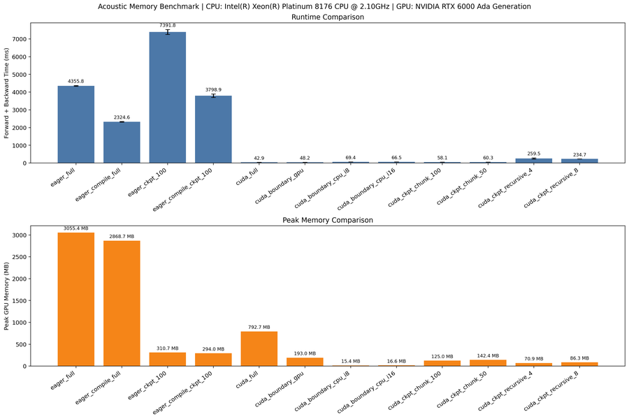
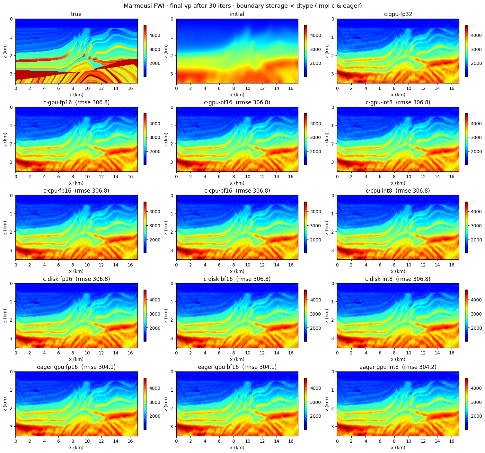
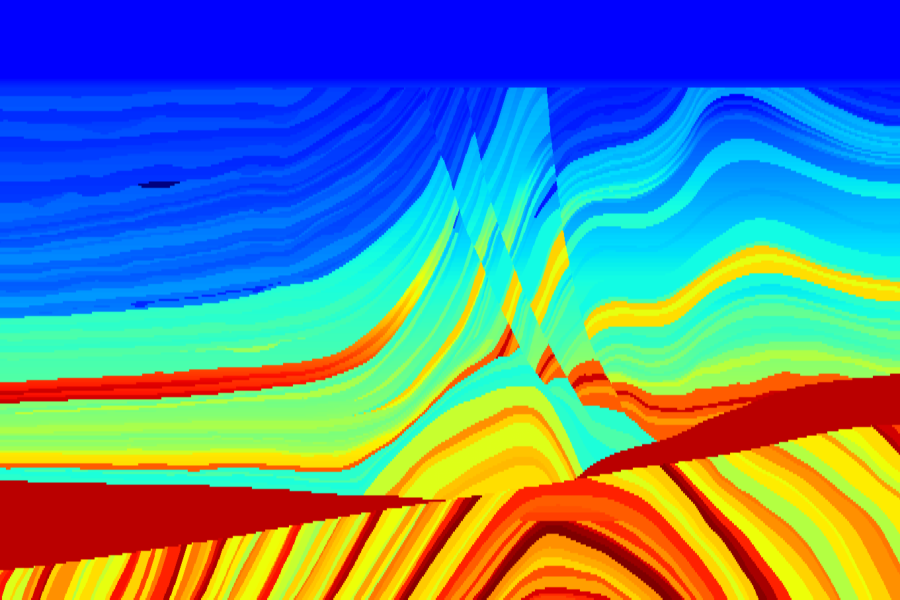
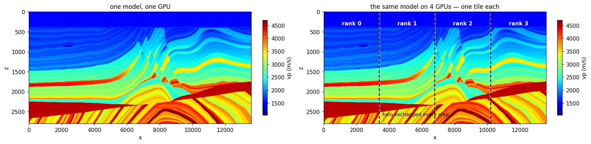
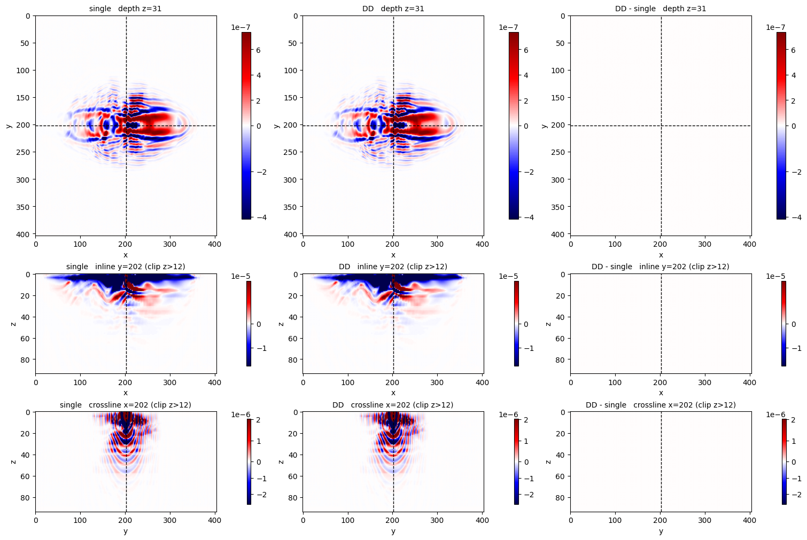

# HPC

Memory strategies, compressed boundary storage, one shot per GPU, and one model
split across GPUs.

-   { loading=lazy }

    **Memory · strategies**

    ---

    Same forward + backward step run under every memory strategy (eager
    full / chunk-ckpt / boundary-saving on gpu × dtype vs. c full /
    boundary-saving on `{gpu, cpu, disk}` × dtype / chunk-ckpt /
    recursive-ckpt) with side-by-side peak-memory and wallclock charts.

    [:material-notebook-outline: Open notebook](../../notebooks/07_memory_strategies.ipynb)

-   { loading=lazy }

    **FWI · boundary compression**

    ---

    `storage_dtype` (fp16/bf16/int8) shrinks the saved boundary wavefield while
    compute stays FP32. Marmousi FWI across the full `{gpu, cpu, disk} × dtype`
    matrix on the compiled path, plus gpu × dtype on eager — identical
    convergence, plus a runtime GPU-memory breakdown.

    [:material-notebook-outline: Open notebook](../../notebooks/19_fwi_boundary_dtype.ipynb)

-   { loading=lazy }

    **Multi-GPU · DDP vs 1 GPU**

    ---

    `torchrun --nproc_per_node=N` driver that shards shots across GPUs and
    syncs gradients via `torch.distributed`, timed against a single-GPU
    baseline on a two-layer toy model (the saved run: 3.53× on 4 GPUs).

    [:material-notebook-outline: Open notebook](../../notebooks/12_multi_gpu.ipynb)

-   { loading=lazy }

    **HPC · Domain decomposition**

    ---

    One model, several GPUs: `ModelParallel` slices it into tiles and exchanges
    a halo every step, so a single shot is solved cooperatively rather than
    replicated. Gradients are bit-identical to the single-domain run — the
    notebook checks that, tile by tile.

    [:material-notebook-outline: Open notebook](../../notebooks/25_domain_decomposition.ipynb)

-   { loading=lazy }

    **HPC · DD on Overthrust 3-D**

    ---

    The same split on a real 3-D benchmark, 2 × 2 tiles across four GPUs. The
    gradient is sliced three ways straight across the cut planes, where a halo
    bug would show as a stripe — and compared against the single-GPU answer.

    [:material-notebook-outline: Open notebook](../../notebooks/26_dd_overthrust_3d.ipynb)

