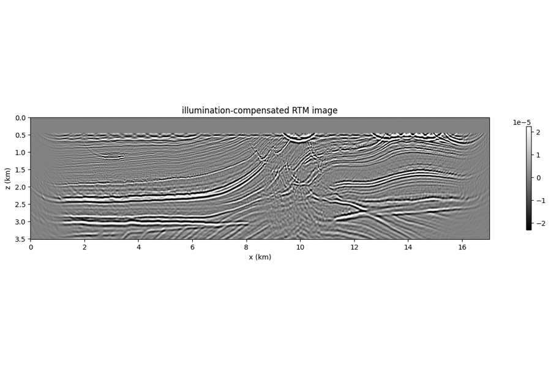
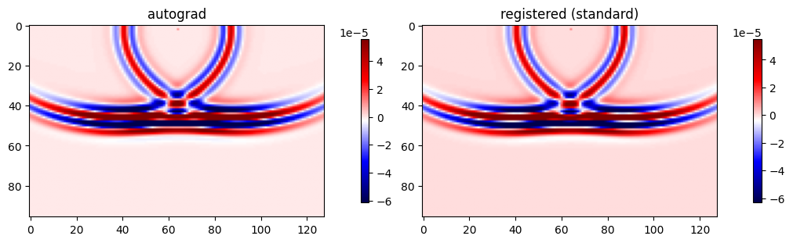
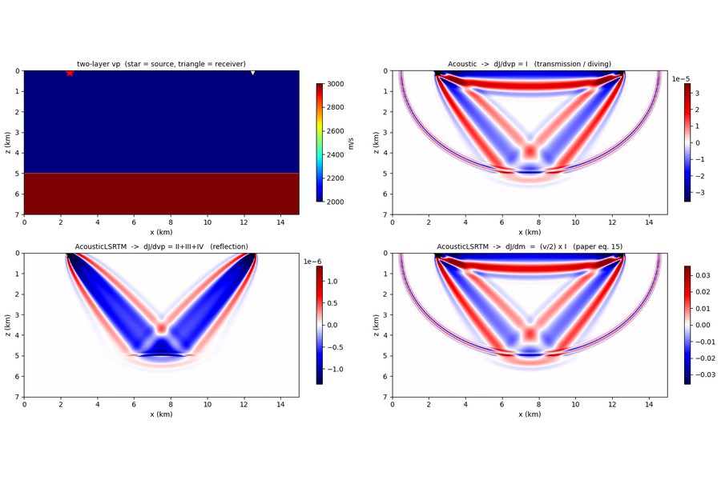
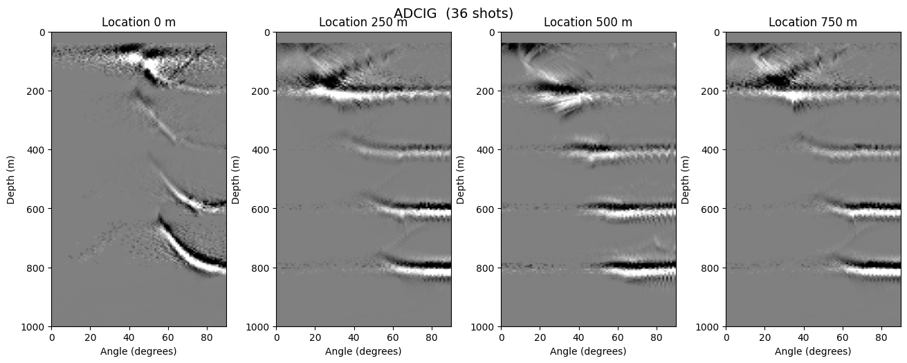
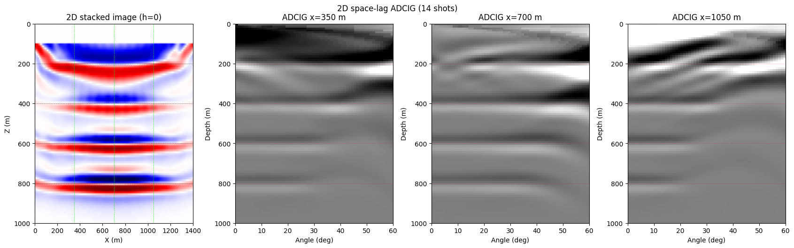

# Imaging

RTM, custom imaging conditions, the reflection-FWI velocity gradient, and
angle-domain common-image gathers.

-   { loading=lazy }

    **RTM · Acoustic · Marmousi**

    ---

    Reverse-time migration on full 12.5 m Marmousi with a 15 Hz Ricker —
    the RTM image as the gradient of an inner-product loss through the
    boundary-saving backward, with background subtraction, near-offset
    mask and illumination compensation. A clean reflectivity image in
    <3 s on 30 shots.

    [:material-notebook-outline: Open notebook](../../notebooks/08_rtm_acoustic_marmousi.ipynb)

-   { loading=lazy }

    **Custom gradients · imaging condition**

    ---

    Register your own imaging condition — override the default correlation with
    a user-defined gradient kernel via the autograd hook and compare it to the
    built-in one.

    [:material-notebook-outline: Open notebook](../../notebooks/14_custom_gradient.ipynb)

-   { loading=lazy }

    **Reflection FWI · where the velocity gradient comes from**

    ---

    The RWI velocity gradient splits into a transmission half and a reflection
    half from two equations: `Acoustic` gives term I, `AcousticLSRTM` gives
    II+III+IV. Shows the paper's eq. 15 identity, how to weight the image-point
    term III with the paper's beta, and the same anatomy in 3-D, where the
    wavepath becomes a pair of tubes and the image point a Fresnel-zone patch.

    [:material-notebook-outline: Open notebook](../../notebooks/32_rwi_acoustic_vs_lsrtm_gradient.ipynb)

-   { loading=lazy }

    **ADCIG · Poynting (custom backward)**

    ---

    Angle-domain common-image gathers via a *custom imaging condition* plugged
    into the eager backward with `register_gradient` — Poynting-vector recipe.
    For the space-lag ADCIG (2D + 3D, CUDA `compute_adcig`) see the next card.

    [:material-notebook-outline: Open notebook](../../notebooks/16_adcig.ipynb)

-   { loading=lazy }

    **ADCIG · space-lag (2D & 3D)**

    ---

    Subsurface-offset extended imaging condition (Sava & Fomel) via the built-in
    CUDA `compute_adcig` toggle, then slant-stack to angle. Boundary-saving path,
    acoustic 2D & 3D.

    [:material-notebook-outline: Open notebook](../../notebooks/22_adcig_space_lag.ipynb)

