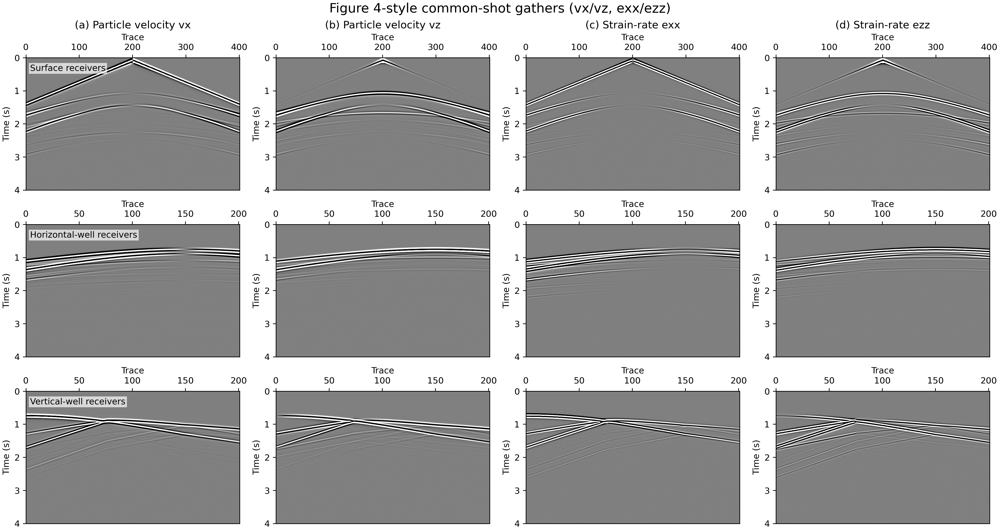

# Examples

Runnable example scripts live in the `examples/` directory of the repository.
Each card below points to a doc walk-through of the corresponding script.

## 2D Inversion

-   { loading=lazy }

    **Acoustic FWI · Marmousi**

    ---

    Full-waveform inversion on the Marmousi 2D acoustic model. Torch path
    has eager and compiled C++ / CUDA implementations plus optional MPI
    shot parallelism; JAX path runs through `PropJax`.

    [:octicons-arrow-right-24: Torch](acoustic_fwi_torch.md) ·
    [:octicons-arrow-right-24: JAX](acoustic_fwi_jax.md)

-   { loading=lazy }

    **Elastic FWI · Marmousi**

    ---

    PyTorch elastic FWI on Marmousi, inverting Vp and Vs simultaneously.

    [:octicons-arrow-right-24: View details](elastic_fwi_torch_marmousi.md)

-   { loading=lazy }

    **Elastic FWI · Overthrust**

    ---

    Elastic FWI on a slice of the SEG / EAGE Overthrust model.

    [:octicons-arrow-right-24: View details](elastic_fwi_torch_overthrust.md)

-   { loading=lazy }

    **2D Acoustic LSRTM**

    ---

    Least-squares reverse-time migration on Marmousi with PyTorch.

    [:octicons-arrow-right-24: View details](acoustic_lsrtm_torch.md)

## 3D Inversion

-   { loading=lazy }

    **3D Acoustic FWI**

    ---

    Source-encoded 3D acoustic FWI on the SEG/EAGE Overthrust model. The
    cutaway reveals the layered thrust structure the inversion has to
    recover. Torch path adds the compiled C++ / CUDA implementation; JAX
    path runs through `PropJax` with optional `jax.pmap`.

    [:octicons-arrow-right-24: Torch](acoustic_fwi_3d_torch.md) ·
    [:octicons-arrow-right-24: JAX](acoustic_fwi_3d_jax.md)

-   { loading=lazy }

    **3D Acoustic LSRTM**

    ---

    3D extension of the LSRTM example on the Overthrust model with PyTorch.

    [:octicons-arrow-right-24: View details](acoustic_lsrtm_3d_torch.md)

## Reducing memory

-   { loading=lazy }

    **Overview**

    ---

    Survey of source encoding, boundary saving, and checkpointing in the
    SWEEP propagator.

    [:octicons-arrow-right-24: View details](reducing_memory.md)

-   { loading=lazy }

    **Source-encoded FWI**

    ---

    Aggregate many shots into a few encoded super-shots and invert with
    PyTorch. The cover compares encoded observed vs synthetic gathers at
    epoch 100.

    [:octicons-arrow-right-24: View details](acoustic_fwi_encoding_torch.md)

-   { loading=lazy }

    **Method compare**

    ---

    Benchmark `full` / `boundary` / `disk` / `ckpt` memory modes across
    2D and 3D cases.

    [:octicons-arrow-right-24: View details](memory_method_compare.md)

## Modeling

-   { loading=lazy }

    **Overview**

    ---

    Landing page for the forward-modeling and wavefield-validation script
    family.

    [:octicons-arrow-right-24: View details](wavefields.md)

-   { loading=lazy }

    **CUDA FD orders**

    ---

    Compare 2nd / 4th / 6th / 8th-order finite-difference stencils in the
    compiled CUDA path.

    [:octicons-arrow-right-24: View details](wavefields_cuda_fd_orders.md)

-   { loading=lazy }

    **Free surface**

    ---

    Elastic and acoustic free-surface boundary validation runs — Rayleigh
    waves are clearly visible in the elastic vz comparison.

    [:octicons-arrow-right-24: View details](wavefields_free_surface.md)

-   { loading=lazy }

    **qP**

    ---

    Acoustic VTI / TTI quasi-P (qP) wavefield comparisons.

    [:octicons-arrow-right-24: View details](wavefields_anisotropic.md)

-   { loading=lazy }

    **Elastic TTI**

    ---

    Rotated staggered-grid TTI (`ElasticTTISG`) snapshots across tilt angles
    and free-surface modes.

    [:octicons-arrow-right-24: View details](elastic_tti_wavefields.md)

-   { loading=lazy }

    **DAS**

    ---

    Strain-rate gathers from the DAS modelling paper, reproduced with the
    SWEEP DAS family.

    [:octicons-arrow-right-24: View details](wavefields_das.md)

## Multi-GPU

-   { loading=lazy }

    **Overview**

    ---

    Notes on Torch Distributed and JAX `pmap` scaling for FWI workloads.

    [:octicons-arrow-right-24: View details](multi_gpu.md)

-   { loading=lazy }

    **Multi-GPU FWI · Marmousi**

    ---

    Distributed FWI on Marmousi compared across three data-parallel modes
    on 2 and 4 A100 GPUs: Torch DDP with the compiled C kernel, Torch DDP
    eager, and JAX `pmap` (XLA).

    [:octicons-arrow-right-24: Torch DDP](multi_gpu_torch.md) ·
    [:octicons-arrow-right-24: JAX pmap](multi_gpu_jax.md)

## Helpers

-   { loading=lazy }

    **Model helper scripts**

    ---

    Download, slice, and visualise the Marmousi and Overthrust models.

    [:octicons-arrow-right-24: View details](model_assets.md)

