# Examples

> :material-github: **All examples on GitHub** &mdash; [`examples/`](https://github.com/DeepWave-KAUST/sweep/tree/main/examples) (clone, run, modify)

Runnable example scripts and notebooks live in the `examples/` directory of the
repository. Each card below points to a doc walk-through; the walk-through page
links straight to the matching source folder on GitHub. The
**notebooks** folder under `examples/notebooks/` holds short, cell-by-cell
versions designed to be the easiest entry point.

## Notebooks (start here)

-   **Hello · SWEEP**

    ---

    Smallest end-to-end SWEEP story in one notebook: parameters → model →
    `Acoustic()` + `PropTorch()` → one shot gather → one `.backward()` for a
    vp gradient → 5-line Adam loop. No external data.

    [:material-notebook-outline: Open notebook](https://github.com/DeepWave-KAUST/sweep/blob/main/examples/notebooks/00_hello_fwi.ipynb)

-   **FWI · Acoustic · Marmousi**

    ---

    Load Marmousi from `sweep.datasets`, build a 192×320 window, forward-model
    observed gathers, and invert the smooth start with Adam + MSE. Each phase
    is one cell.

    [:material-notebook-outline: Open notebook](https://github.com/DeepWave-KAUST/sweep/blob/main/examples/notebooks/01_fwi_acoustic_marmousi.ipynb)

-   **FWI · Elastic · Marmousi**

    ---

    Same skeleton, but the equation is `Elastic` and the model is the
    `(vp, vs, rho)` triplet. `vs` and `rho` are derived from `vp` with Poisson
    + Gardner relations so the example still runs with zero downloads.

    [:material-notebook-outline: Open notebook](https://github.com/DeepWave-KAUST/sweep/blob/main/examples/notebooks/02_fwi_elastic_marmousi.ipynb)

-   **FWI · multiscale**

    ---

    Three-band frequency progression (3 → 6 → 12 Hz) of acoustic FWI on
    Marmousi 25 m. Each band feeds its final model into the next; loss
    drops monotonically across the chain and avoids cycle skipping.

    [:material-notebook-outline: Open notebook](https://github.com/DeepWave-KAUST/sweep/blob/main/examples/notebooks/03_fwi_multiscale.ipynb)

-   **DAS · Zhao vs Mu**

    ---

    Forward-model the same three-layer elastic medium with the two DAS
    formulations and compare the resulting strain-rate gathers side by side.

    [:material-notebook-outline: Open notebook](https://github.com/DeepWave-KAUST/sweep/blob/main/examples/notebooks/04_das_zhao_vs_mu.ipynb)

-   **Wavefield · VTI + shear suppression**

    ---

    Run Duveneck (1st-order), Liang (2nd-order pseudo-acoustic), and
    Alkhalifah (η-acoustic) through the unified `AcousticAniso` factory
    on the canonical Duveneck Fig 2 setup; the trailing cell demonstrates
    the δ→ε disk taper that kills the pseudo-acoustic shear artefact.

    [:material-notebook-outline: Open notebook](https://github.com/DeepWave-KAUST/sweep/blob/main/examples/notebooks/05_wavefield_vti.ipynb)

-   **Wavefield · Elastic**

    ---

    Wavefield snapshots from three different stress-source loadings on a
    uniform elastic medium — explosion, vertical dipole, and pure shear —
    to visualize P/S excitation and radiation patterns.

    [:material-notebook-outline: Open notebook](https://github.com/DeepWave-KAUST/sweep/blob/main/examples/notebooks/06_wavefield_elastic.ipynb)

-   **Memory · strategies**

    ---

    Same forward + backward step run under five memory strategies (eager
    full vs. eager ckpt vs. c boundary-saving / chunk-ckpt / recursive-ckpt)
    with side-by-side peak-memory and wallclock charts.

    [:material-notebook-outline: Open notebook](https://github.com/DeepWave-KAUST/sweep/blob/main/examples/notebooks/07_memory_strategies.ipynb)

-   **RTM · Acoustic · Marmousi**

    ---

    Reverse-time migration on full 12.5 m Marmousi with a 15 Hz Ricker —
    background subtraction, near-offset mask, illumination compensation,
    and `solver.rtm()`. Produces a clean reflectivity image in <3 s on
    30 shots.

    [:material-notebook-outline: Open notebook](https://github.com/DeepWave-KAUST/sweep/blob/main/examples/notebooks/08_rtm_acoustic_marmousi.ipynb)

## 2D Inversion

-   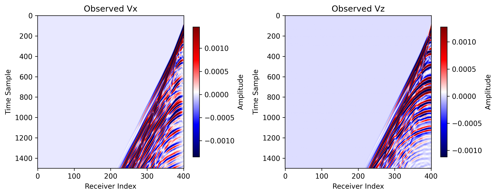{ loading=lazy }

    **Elastic FWI · Overthrust**

    ---

    Elastic FWI on a slice of the SEG / EAGE Overthrust model.

    [:octicons-arrow-right-24: View details](elastic_fwi_torch_overthrust.md)

-   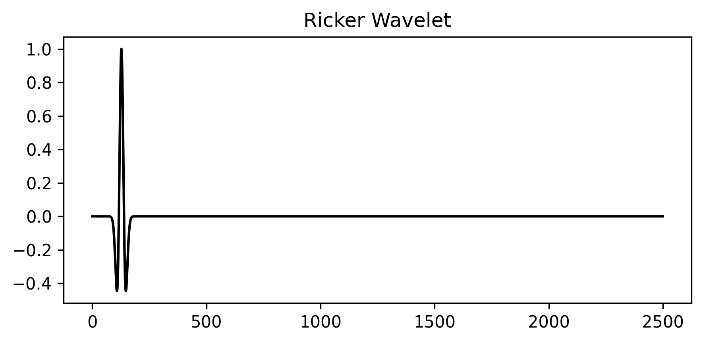{ loading=lazy }

    **2D Acoustic LSRTM**

    ---

    Least-squares reverse-time migration on Marmousi with PyTorch.

    [:octicons-arrow-right-24: View details](acoustic_lsrtm_torch.md)

## 3D Inversion

-   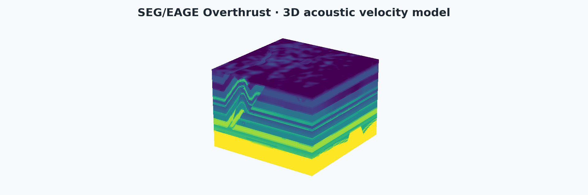{ loading=lazy }

    **3D Acoustic FWI**

    ---

    Source-encoded 3D acoustic FWI on the SEG/EAGE Overthrust model. The
    cutaway reveals the layered thrust structure the inversion has to
    recover. Torch path adds the compiled C++ / CUDA implementation; JAX
    path runs through `PropJax` with optional `jax.pmap`.

    [:octicons-arrow-right-24: Torch](acoustic_fwi_3d_torch.md) ·
    [:octicons-arrow-right-24: JAX](acoustic_fwi_3d_jax.md)

-   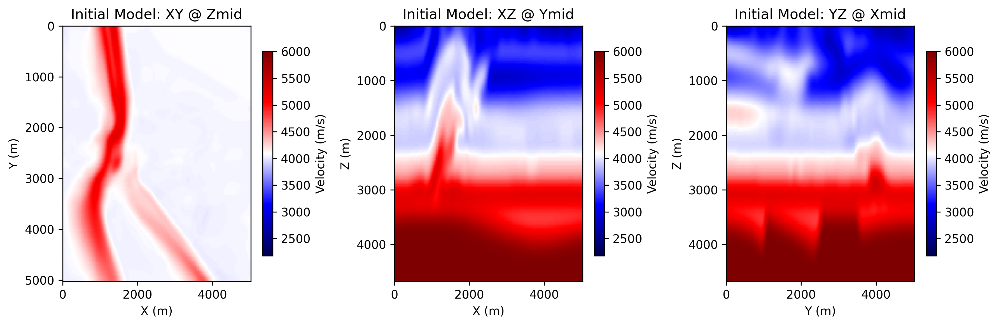{ loading=lazy }

    **3D Acoustic LSRTM**

    ---

    3D extension of the LSRTM example on the Overthrust model with PyTorch.

    [:octicons-arrow-right-24: View details](acoustic_lsrtm_3d_torch.md)

## Reducing memory

-   { loading=lazy }

    **Overview**

    ---

    Survey of source encoding, boundary saving, and checkpointing in the
    SWEEP propagator.

    [:octicons-arrow-right-24: View details](reducing_memory.md)

-   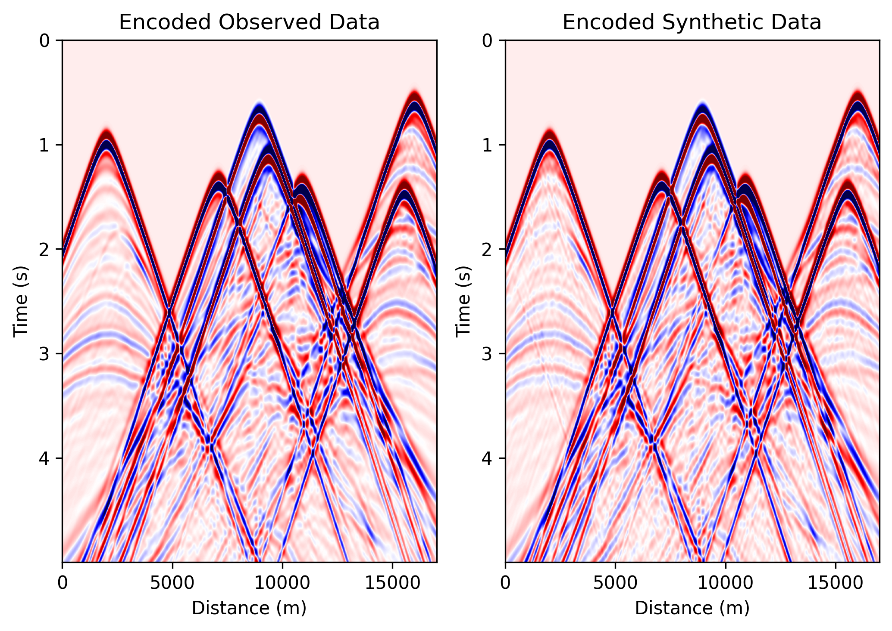{ loading=lazy }

    **Source-encoded FWI**

    ---

    Aggregate many shots into a few encoded super-shots and invert with
    PyTorch. The cover compares encoded observed vs synthetic gathers at
    epoch 100.

    [:octicons-arrow-right-24: View details](acoustic_fwi_encoding_torch.md)

## Modeling

-   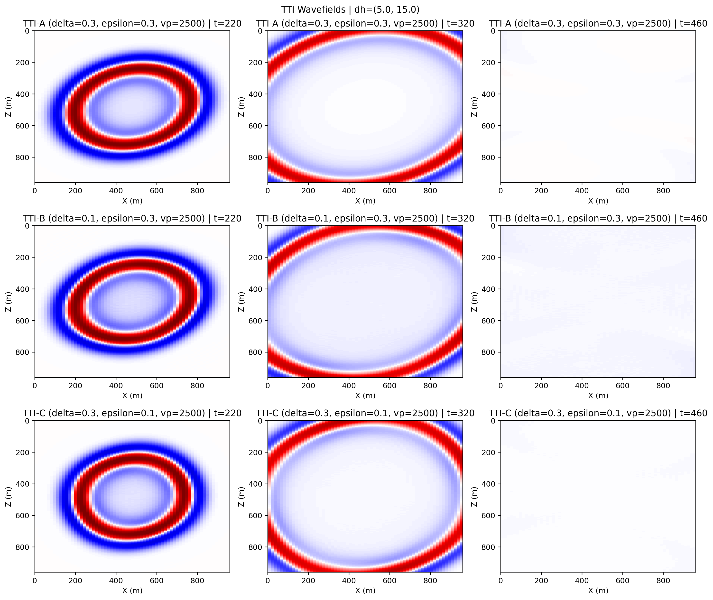{ loading=lazy }

    **Overview**

    ---

    Landing page for the forward-modeling and wavefield-validation script
    family.

    [:octicons-arrow-right-24: View details](wavefields.md)

-   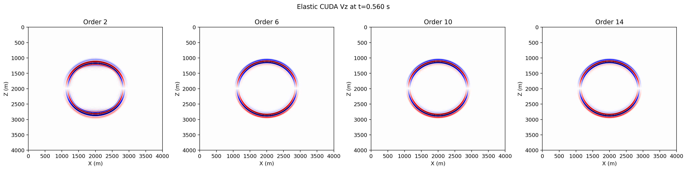{ loading=lazy }

    **CUDA FD orders**

    ---

    Compare 2nd / 4th / 6th / 8th-order finite-difference stencils in the
    compiled CUDA path.

    [:octicons-arrow-right-24: View details](wavefields_cuda_fd_orders.md)

-   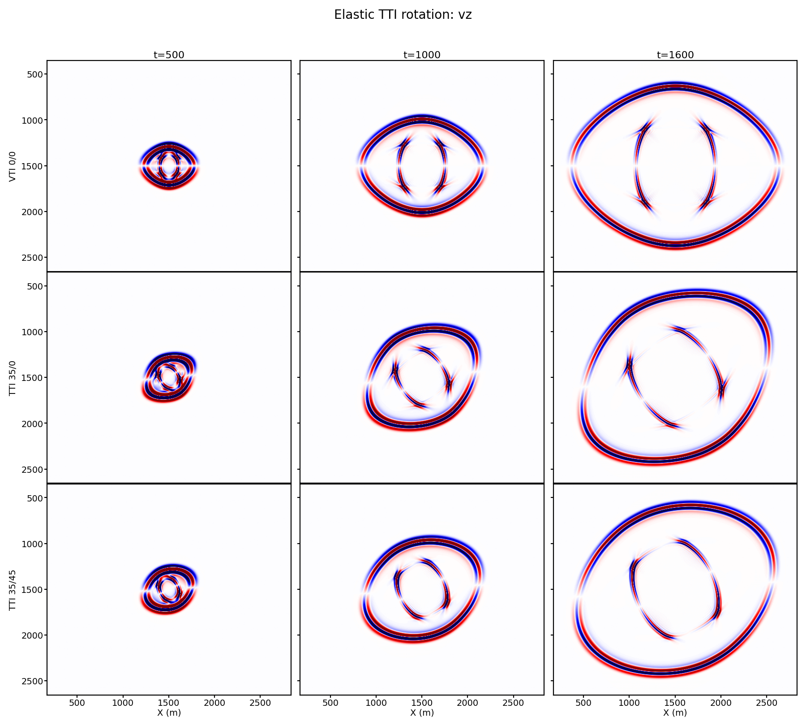{ loading=lazy }

    **Elastic TTI**

    ---

    Rotated staggered-grid TTI (`ElasticTTISG`) snapshots across tilt angles
    and free-surface modes.

    [:octicons-arrow-right-24: View details](elastic_tti_wavefields.md)

## Multi-GPU

-   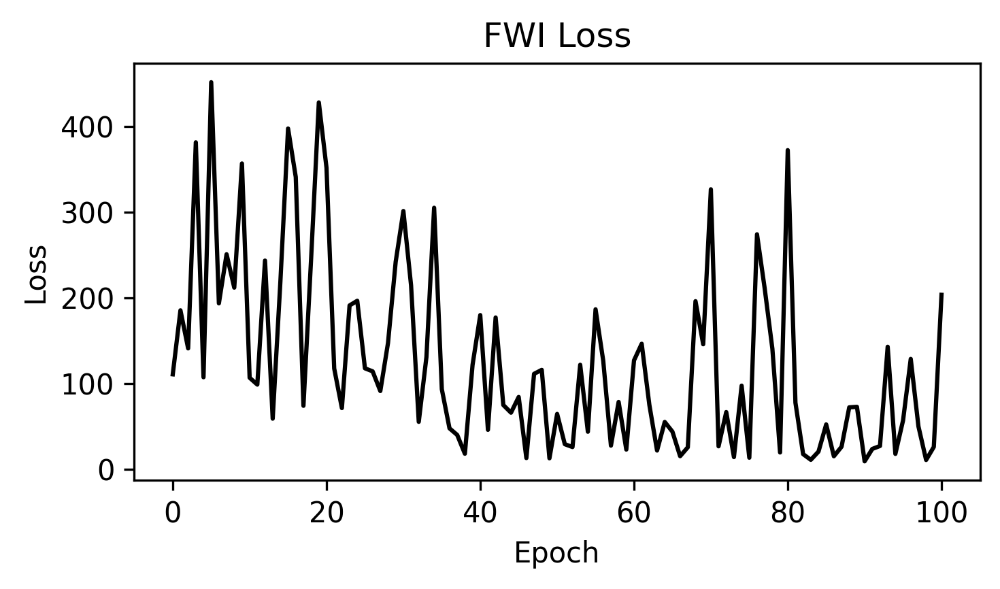{ loading=lazy }

    **Overview**

    ---

    Notes on Torch Distributed and JAX `pmap` scaling for FWI workloads.

    [:octicons-arrow-right-24: View details](multi_gpu.md)

-   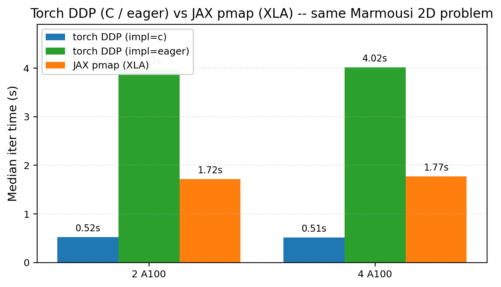{ loading=lazy }

    **Multi-GPU FWI · Marmousi**

    ---

    Distributed FWI on Marmousi compared across three data-parallel modes
    on 2 and 4 A100 GPUs: Torch DDP with the compiled C kernel, Torch DDP
    eager, and JAX `pmap` (XLA).

    [:octicons-arrow-right-24: Torch DDP](multi_gpu_torch.md) ·
    [:octicons-arrow-right-24: JAX pmap](multi_gpu_jax.md)

## Helpers

-   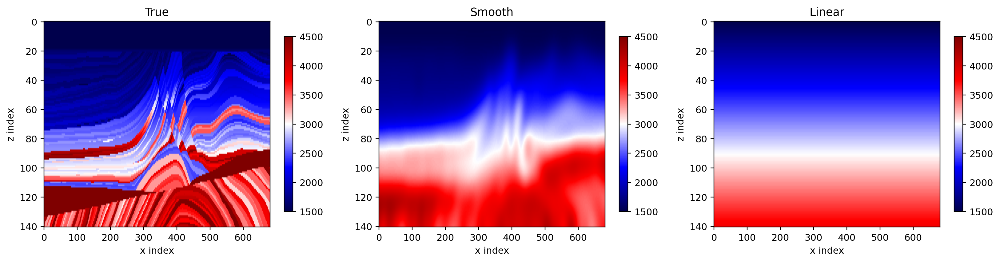{ loading=lazy }

    **Model helper scripts**

    ---

    Download, slice, and visualise the Marmousi and Overthrust models.

    [:octicons-arrow-right-24: View details](model_assets.md)

