# Examples

> :material-github: **All examples on GitHub** &mdash; [`examples/`](https://github.com/DeepWave-KAUST/sweep/tree/dev/examples) (clone, run, modify)

Runnable example scripts and notebooks live in the `examples/` directory of
the repository. The **notebooks** under `examples/notebooks/` (cards below)
are cell-by-cell tutorials and the easiest entry point; for a flat overview
of all of them see the [home page gallery](../index.md). Scripts for
workflows that don't fit a notebook (e.g. multi-process multi-GPU FWI) are
linked at the bottom of this page.

## Notebooks (start here)

-   { loading=lazy }

    **Hello · SWEEP**

    ---

    Smallest end-to-end SWEEP story in one notebook: parameters → model →
    `Acoustic()` + `PropTorch()` → one shot gather → one `.backward()` for a
    vp gradient → 5-line Adam loop. No external data.

    [:material-notebook-outline: Open notebook](../notebooks/00_hello_fwi.ipynb)

-   { loading=lazy }

    **FWI · Acoustic · Marmousi**

    ---

    Load Marmousi from `sweep.datasets`, build a 192×320 window, forward-model
    observed gathers, and invert the smooth start with Adam + MSE. Each phase
    is one cell.

    [:material-notebook-outline: Open notebook](../notebooks/01_fwi_acoustic_marmousi.ipynb)

-   { loading=lazy }

    **FWI · Elastic · Marmousi**

    ---

    Same skeleton, but the equation is `Elastic` and the model is the
    `(vp, vs, rho)` triplet. `vs` and `rho` are derived from `vp` with Poisson
    + Gardner relations so the example still runs with zero downloads.

    [:material-notebook-outline: Open notebook](../notebooks/02_fwi_elastic_marmousi.ipynb)

-   { loading=lazy }

    **FWI · multiscale**

    ---

    Three-band frequency progression (3 → 6 → 12 Hz) of acoustic FWI on
    Marmousi 25 m. Each band feeds its final model into the next; loss
    drops monotonically across the chain and avoids cycle skipping.

    [:material-notebook-outline: Open notebook](../notebooks/03_fwi_multiscale.ipynb)

-   { loading=lazy }

    **DAS · Zhao vs Mu**

    ---

    Forward-model the same three-layer elastic medium with the two DAS
    formulations and compare the resulting strain-rate gathers side by side.

    [:material-notebook-outline: Open notebook](../notebooks/04_das_zhao_vs_mu.ipynb)

-   { loading=lazy }

    **Wavefield · VTI + shear suppression**

    ---

    Run Duveneck (1st-order), Liang (2nd-order pseudo-acoustic), and
    Alkhalifah (η-acoustic) through the unified `AcousticAniso` factory
    on the canonical Duveneck Fig 2 setup; the trailing cell demonstrates
    the δ→ε disk taper that kills the pseudo-acoustic shear artefact.

    [:material-notebook-outline: Open notebook](../notebooks/05_wavefield_vti.ipynb)

-   { loading=lazy }

    **Wavefield · Elastic**

    ---

    Wavefield snapshots from three different stress-source loadings on a
    uniform elastic medium — explosion, vertical dipole, and pure shear —
    to visualize P/S excitation and radiation patterns.

    [:material-notebook-outline: Open notebook](../notebooks/06_wavefield_elastic.ipynb)

-   { loading=lazy }

    **Memory · strategies**

    ---

    Same forward + backward step run under five memory strategies (eager
    full vs. eager ckpt vs. c boundary-saving / chunk-ckpt / recursive-ckpt)
    with side-by-side peak-memory and wallclock charts.

    [:material-notebook-outline: Open notebook](../notebooks/07_memory_strategies.ipynb)

-   { loading=lazy }

    **RTM · Acoustic · Marmousi**

    ---

    Reverse-time migration on full 12.5 m Marmousi with a 15 Hz Ricker —
    background subtraction, near-offset mask, illumination compensation,
    and `solver.rtm()`. Produces a clean reflectivity image in <3 s on
    30 shots.

    [:material-notebook-outline: Open notebook](../notebooks/08_rtm_acoustic_marmousi.ipynb)

-   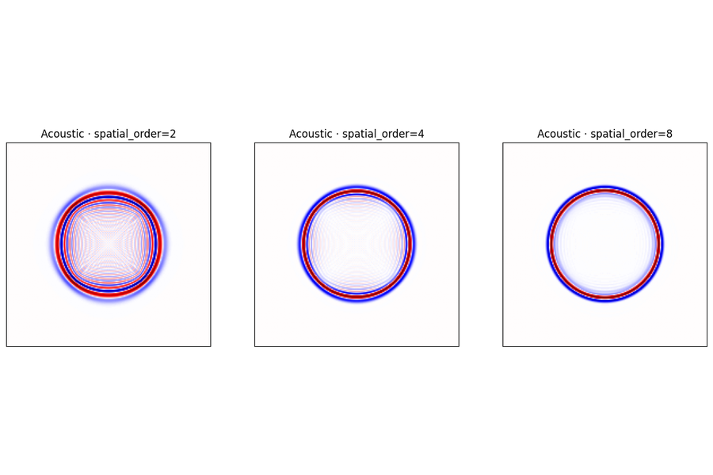{ loading=lazy }

    **Solver · hyperparameters**

    ---

    Side-by-side wavefield snapshots showing how the propagator's
    `spatial_order`, `abcn` (PML width) and `pml_type` choices visibly
    change boundary reflections and grid dispersion on a single shot.

    [:material-notebook-outline: Open notebook](../notebooks/09_solver_hyperparams.ipynb)

-   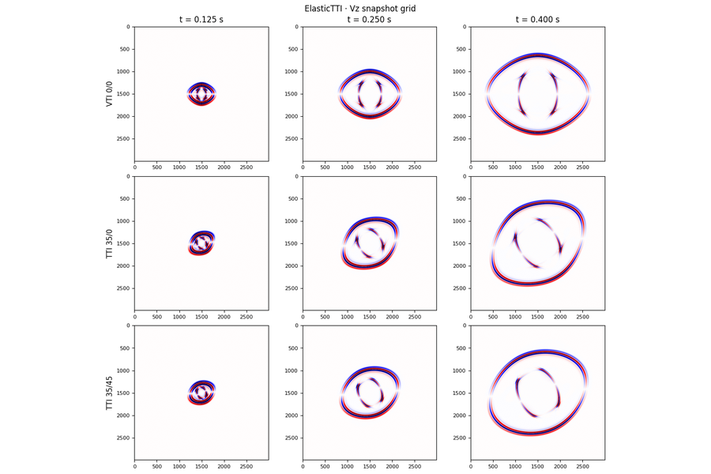{ loading=lazy }

    **Wavefield · Elastic TTI**

    ---

    Rotated staggered-grid (`ElasticTTI`) `vz` snapshots across three
    tilt / azimuth cases — the Duveneck Fig 2 setup at full resolution
    with `(ε, δ, γ, θ, φ)` rotated symmetry axis.

    [:material-notebook-outline: Open notebook](../notebooks/10_wavefield_elastic_tti.ipynb)

-   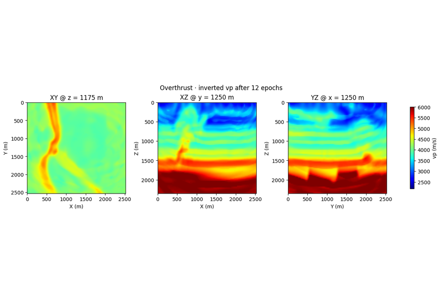{ loading=lazy }

    **FWI · 3-D · Overthrust**

    ---

    Acoustic FWI on a 3-D Overthrust volume — `Acoustic3D` solver,
    boundary-saving for memory, depth/inline/crossline slices of the
    recovered `vp` cube vs ground truth.

    [:material-notebook-outline: Open notebook](../notebooks/11_fwi_acoustic_overthrust_3d.ipynb)

-   { loading=lazy }

    **Multi-GPU · DDP vs 1 GPU**

    ---

    `torchrun --nproc_per_node=N` driver that shards shots across GPUs and
    syncs gradients via `torch.distributed`. Hits 3.79× speedup on 4× V100
    for Marmousi FWI compared to a single-GPU baseline.

    [:material-notebook-outline: Open notebook](../notebooks/12_multi_gpu.ipynb)

-   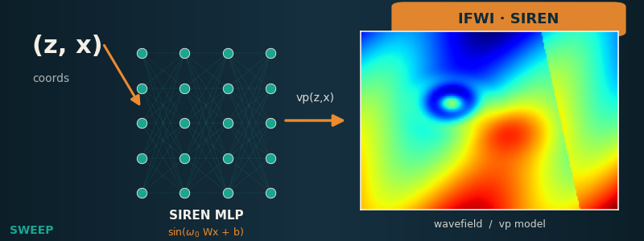{ loading=lazy }

    **IFWI · SIREN coordinate network**

    ---

    Implicit FWI: a SIREN coordinate network outputs `vp(x, z)` instead of a
    grid of free parameters; its weights are inverted by backprop through the
    propagator on Marmousi.

    [:material-notebook-outline: Open notebook](../notebooks/13_ifwi_siren.ipynb)

-   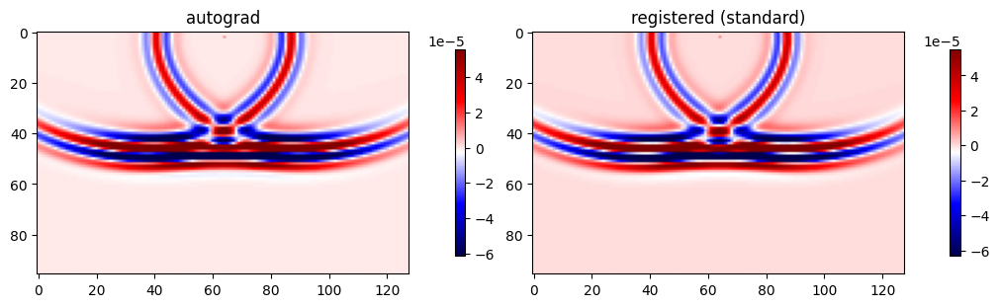{ loading=lazy }

    **Custom gradients · imaging condition**

    ---

    Register your own imaging condition — override the default correlation with
    a user-defined gradient kernel via the autograd hook and compare it to the
    built-in one.

    [:material-notebook-outline: Open notebook](../notebooks/14_custom_gradient.ipynb)

-   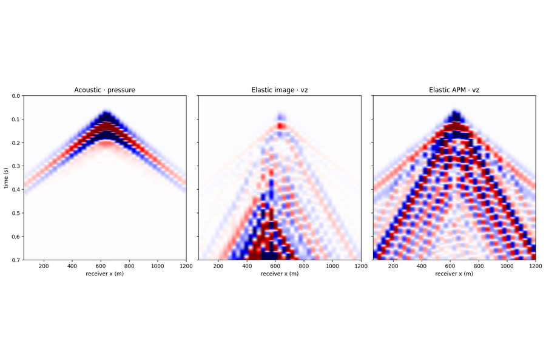{ loading=lazy }

    **Wavefield · irregular topography**

    ---

    Image-method irregular free-surface for acoustic & elastic 2-D — drape
    a non-flat surface along the top of the model and see how the topography
    reshapes the surface waves and primaries.

    [:material-notebook-outline: Open notebook](../notebooks/15_wavefield_topography.ipynb)

-   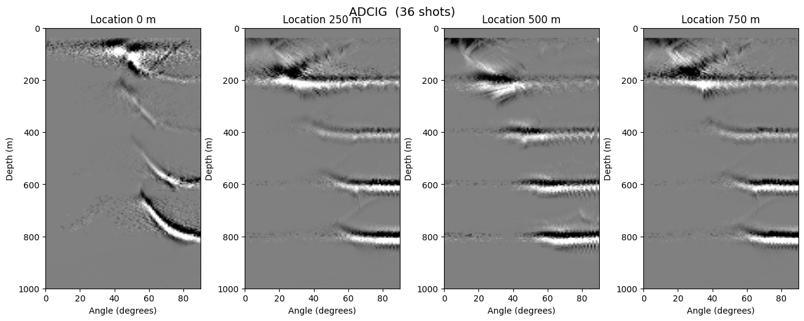{ loading=lazy }

    **ADCIG · angle-domain image gathers**

    ---

    Angle-domain common-image gathers — decompose the migrated image by
    reflection angle; flat gathers indicate a correct migration velocity,
    curved ones reveal the error.

    [:material-notebook-outline: Open notebook](../notebooks/16_adcig.ipynb)

-   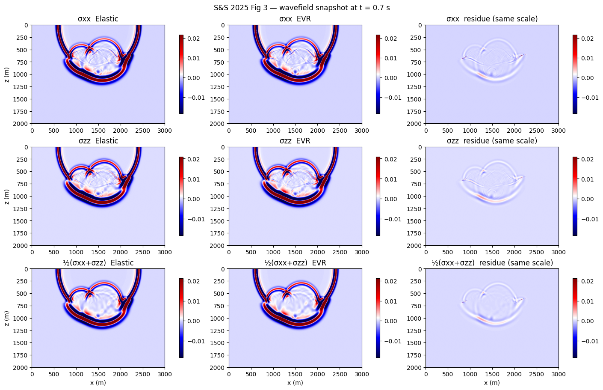{ loading=lazy }

    **Elastic vector reflectivity**

    ---

    Forward-modeling validation of elastic vector-reflectivity
    (Soares & Sacchi 2025) — the formulation reproduced and checked against
    the reference.

    [:material-notebook-outline: Open notebook](../notebooks/16_elastic_vector_reflectivity.ipynb)

-   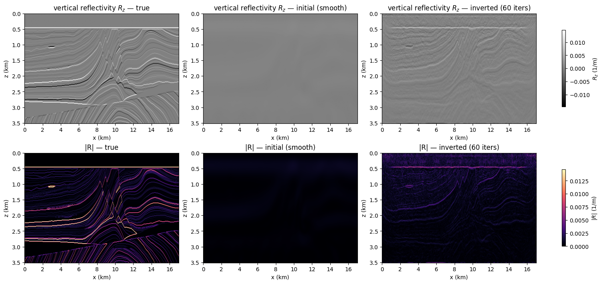{ loading=lazy }

    **FWI · VRZ · Marmousi**

    ---

    Acoustic variable-density (VRZ) FWI on Marmousi — vector reflectivity from
    impedance, inverted with the `AcousticVRZ` equation.

    [:material-notebook-outline: Open notebook](../notebooks/17_fwi_vrz_marmousi.ipynb)

-   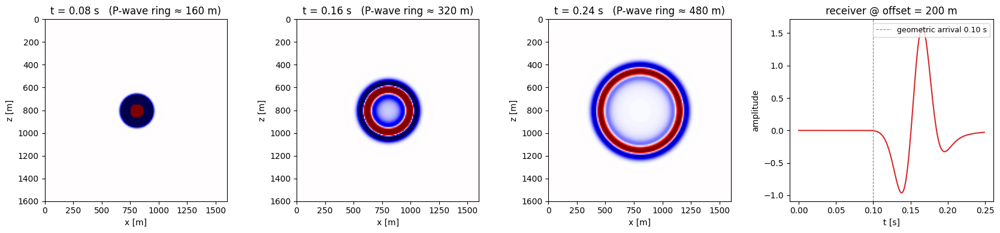{ loading=lazy }

    **Extending · add a new equation**

    ---

    Tutorial: add a brand-new wave equation to SWEEP — define its fields and
    time step, register it, and drive it through `PropTorch` like any built-in.

    [:material-notebook-outline: Open notebook](../notebooks/18_extending_add_new_equation.ipynb)

-   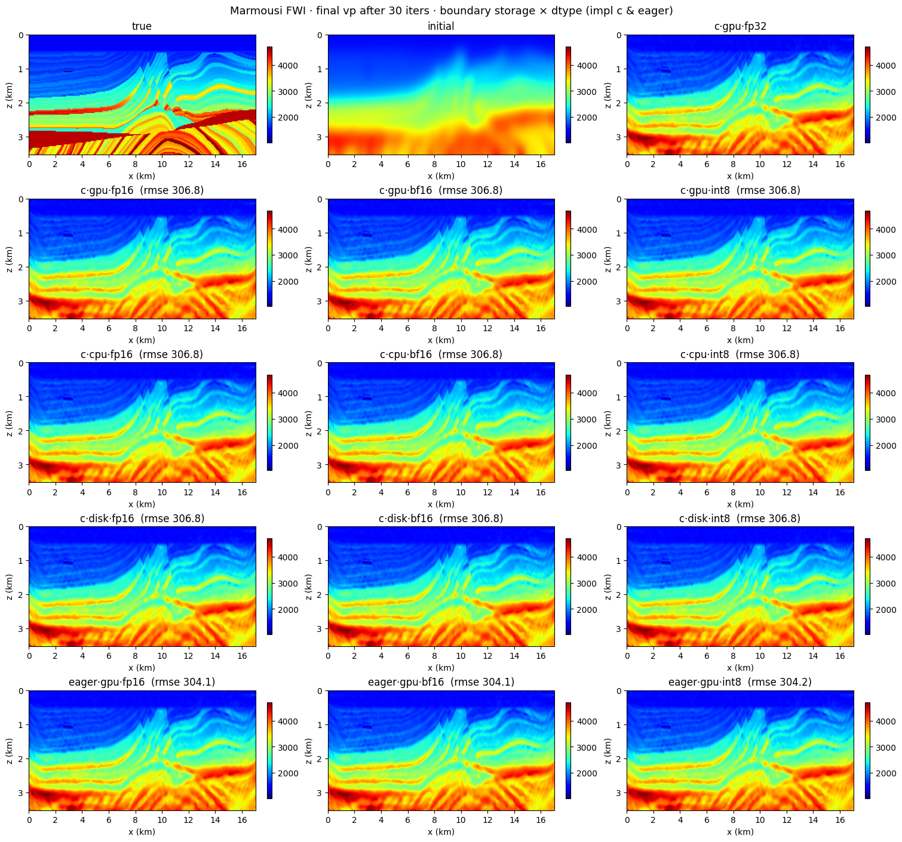{ loading=lazy }

    **FWI · boundary compression**

    ---

    `storage_dtype` (fp16/bf16/int8) shrinks the saved boundary wavefield while
    compute stays FP32. Marmousi FWI across the full `{gpu, cpu, disk} × dtype`
    matrix (compiled **and** eager) — identical convergence, plus a runtime
    GPU-memory breakdown.

    [:material-notebook-outline: Open notebook](../notebooks/19_fwi_boundary_dtype.ipynb)

-   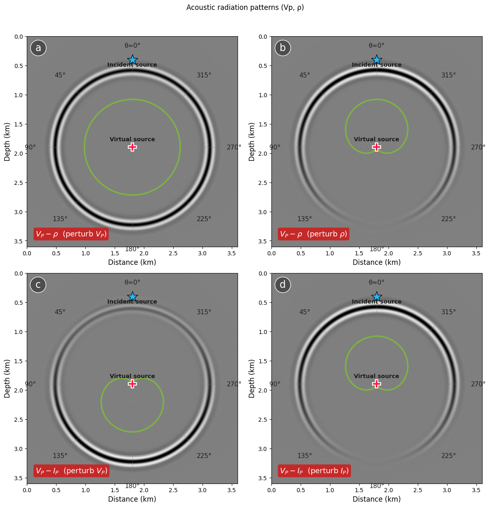{ loading=lazy }

    **Sensitivity · Acoustic radiation**

    ---

    Scattered-wavefield snapshots of the partial-derivative virtual sources for the
    acoustic `(Vp, ρ)` / `(Vp, Iₚ)` parameterizations — the angular sensitivity behind
    multiparameter trade-off. Reproduces Operto et al. (2013) Fig. 2.

    [:material-notebook-outline: Open notebook](../notebooks/20_radiation_acoustic.ipynb)

-   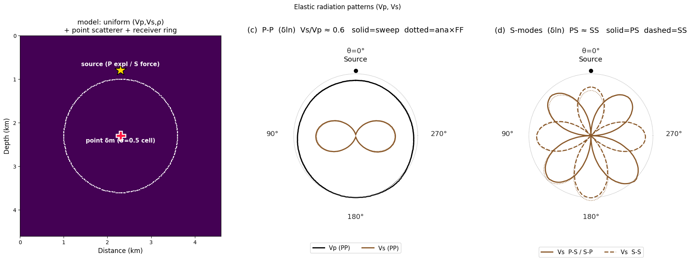{ loading=lazy }

    **Sensitivity · Elastic radiation**

    ---

    Elastic `(Vp, Vs, ρ)` P-P / P-S / S-S radiation patterns: the analytic Born kernel
    against sweep's Born-differenced numerics, the δln relative sizes (Vs/Vp ≈ 0.6), and
    scattered-wavefield snapshots. Cf. Operto Fig. 8(c,d) / Forgues & Lambaré.

    [:material-notebook-outline: Open notebook](../notebooks/21_radiation_elastic.ipynb)

## Scripts

For workflows that don't fit a single notebook — e.g. multi-process
multi-GPU FWI — see:

- [**Multi-GPU DDP** (`fwi_marmousi_dist.py`)](multi_gpu_dist.md) — Torch
  `torchrun` driver that scales one-shot-per-rank across multiple GPUs and
  syncs gradients with `torch.distributed`.

Browse [`examples/`](https://github.com/DeepWave-KAUST/sweep/tree/dev/examples)
on GitHub for the full collection of runnable scripts.
