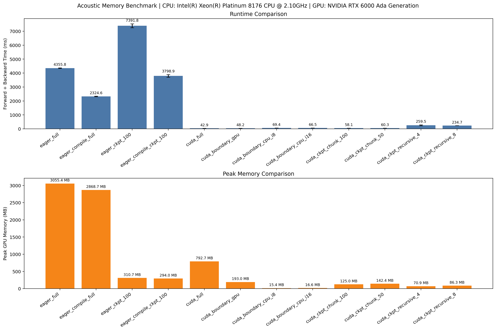
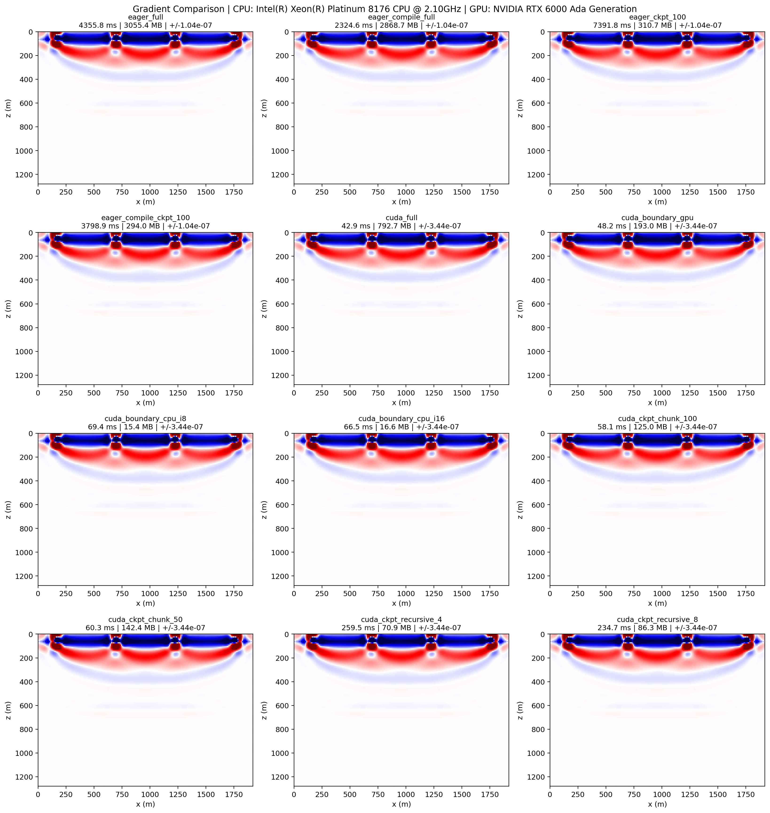
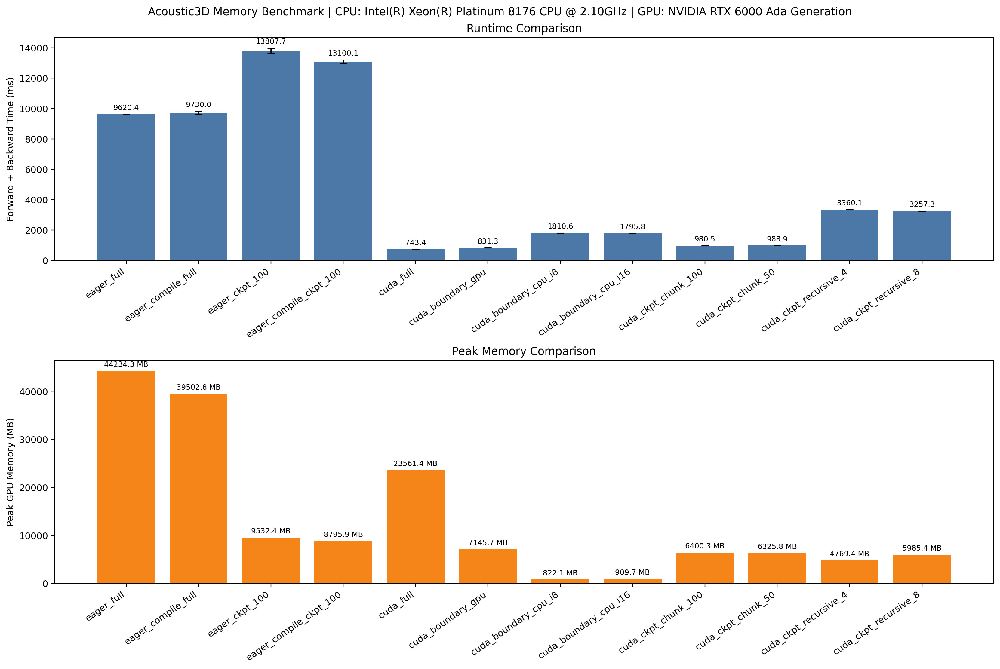
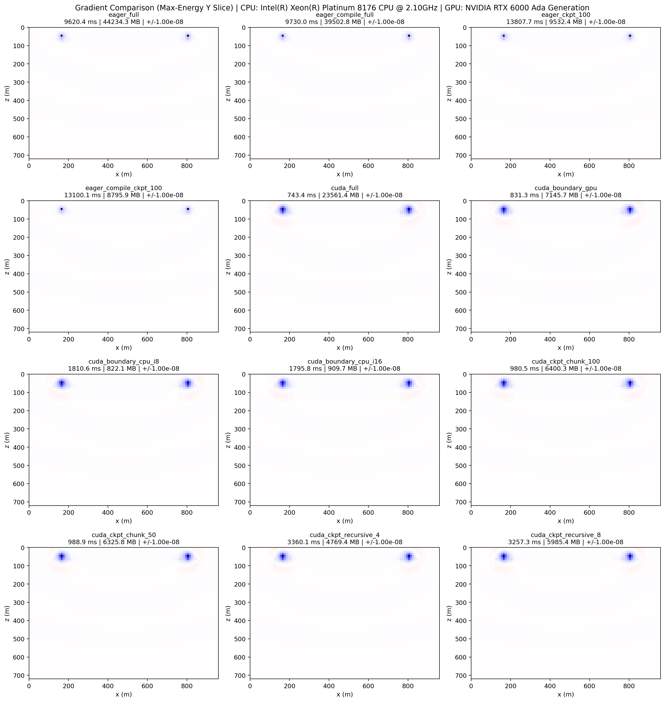

# Memory Method Compare

Source directory:

- `examples/reducingmemory/method_compare/`

This example group compares memory-saving methods that preserve the standard
shot-based objective while changing how wavefields are stored or recomputed.

## Main Methods

- `PyTorch eager + compile`
- `PyTorch eager + ckpt`
- `PyTorch eager + compile + ckpt`
- `CUDA boundary saving`
- `CUDA ckpt`

## Benchmark Scripts

- `common_benchmark.py`: shared benchmark loop, summary plotting, and gradient plotting
- `acoustic2d_memory_benchmark.py`: 2D acoustic benchmark setup
- `acoustic3d_memory_benchmark.py`: 3D acoustic benchmark setup

## What It Compares

- eager full
- eager compile full
- eager checkpointing with different chunk sizes
- eager compile plus checkpointing
- cuda full
- cuda boundary saving on GPU
- cuda boundary saving on CPU with transfer tuning
- cuda boundary saving on pinned CPU memory
- cuda boundary saving on disk, including asynchronous disk readback
- cuda chunk checkpointing
- cuda recursive checkpointing

## Practical Guidance

- if you need the simplest eager-side memory reduction, start with PyTorch checkpointing
- if you are already on the CUDA backend and want the best memory/runtime
  tradeoff, test CUDA boundary saving first
- if boundary saving is still too memory hungry, try CUDA checkpointing
- CPU boundary saving is useful when GPU memory is the bottleneck; pinned CPU
  storage can improve transfer behavior
- Disk-backed boundary saving gives the lowest GPU memory footprint among the
  boundary-saving modes, at the cost of disk I/O and sensitivity to staging
  buffer settings

## Example Figures

The following figures come from the 2D and 3D acoustic memory benchmarks.

`summary.png`: the 2D acoustic benchmark summary figure comparing methods by
runtime and memory-related metrics.

`gradients.png`: the 2D side-by-side gradient comparison, useful for checking
whether different memory-saving methods still produce consistent inversion
gradients.

`summary.png` from the 3D benchmark: a higher-cost comparison on the 3D
acoustic setup, showing how the same ideas behave when model size and wavefield
state are much larger.

`gradients.png` from the 3D benchmark: a 3D gradient comparison used to check
whether the reduced-memory methods still match the reference gradient pattern.

