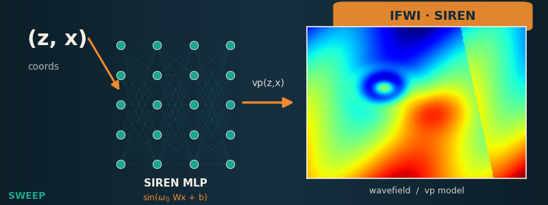

# NN · FWI

Let a neural network produce the velocity model and invert its weights by
backpropagating through the propagator.

-   { loading=lazy }

    **IFWI · SIREN coordinate network**

    ---

    Implicit FWI: a SIREN coordinate network outputs `vp(x, z)` instead of a
    grid of free parameters; its weights are inverted by backprop through the
    propagator on Marmousi.

    [:material-notebook-outline: Open notebook](../../notebooks/13_ifwi_siren.ipynb)

