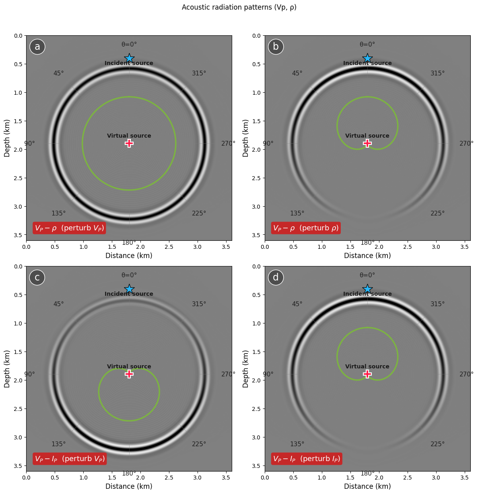
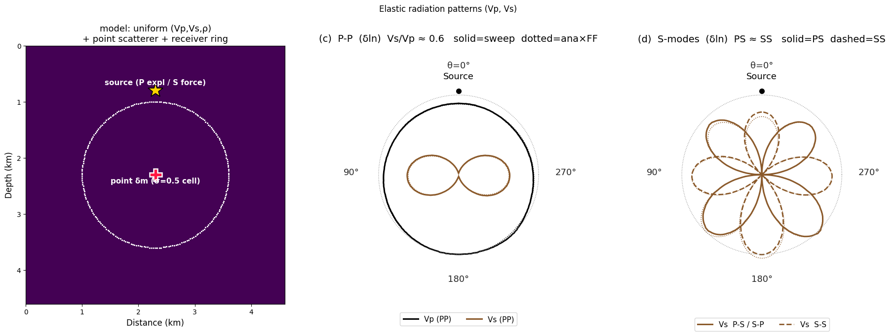

# Sensitivity & resolution

Radiation patterns of the scattering virtual sources: the angular sensitivity
behind multiparameter trade-off.

-   { loading=lazy }

    **Sensitivity · Acoustic radiation**

    ---

    Scattered-wavefield snapshots of the partial-derivative virtual sources for the
    acoustic `(Vp, ρ)` / `(Vp, Iₚ)` parameterizations — the angular
    sensitivity behind
    multiparameter trade-off. Reproduces Operto et al. (2013) Fig. 2.

    [:material-notebook-outline: Open notebook](../../notebooks/20_radiation_acoustic.ipynb)

-   { loading=lazy }

    **Sensitivity · Elastic radiation**

    ---

    Elastic `(Vp, Vs, ρ)` P-P / P-S / S-S radiation patterns: the analytic
    Born kernel
    against sweep's Born-differenced numerics, the δln relative sizes (Vs/Vp
    ≈ 0.6), and
    scattered-wavefield snapshots. Cf. Operto Fig. 8(c,d) / Forgues & Lambaré.

    [:material-notebook-outline: Open notebook](../../notebooks/21_radiation_elastic.ipynb)

