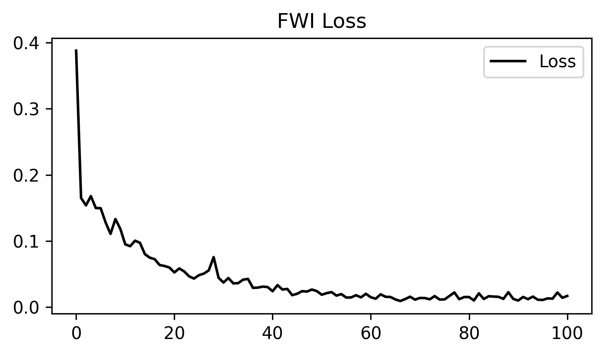

# Source Encoding Overview

Source directory:

- `examples/reducingmemory/source_encoding/`

Source encoding reduces memory and runtime by mixing multiple shots into a
single encoded super-shot during each optimization step.

This changes the optimization objective, so it is not a drop-in replacement
for exact shot-by-shot gradients.

## When It Helps

Source encoding is most useful when:

- the number of shots is large
- GPU memory limits the batch size
- some gradient noise is acceptable in exchange for lower per-iteration cost

## What It Saves

- fewer simultaneous shots in memory
- fewer forward and adjoint solves per iteration
- smaller effective observed and synthetic gathers per update

## Tradeoffs

- the gradient is stochastic
- convergence may require more iterations
- encoding design matters: polarity, time shift, and batch size all affect variance

## Example Scripts

- `examples/reducingmemory/source_encoding/torch/source_encoding_fwi.py`
- `examples/reducingmemory/source_encoding/jax/source_encoding_fwi.py`

## Related Example

- [Acoustic FWI with Source Encoding](acoustic_fwi_encoding_torch.md)

## Example Figure

`loss.png` from the JAX source-encoding run: the source-encoding FWI loss curve
for the JAX example under `examples/reducingmemory/source_encoding/jax/`.

