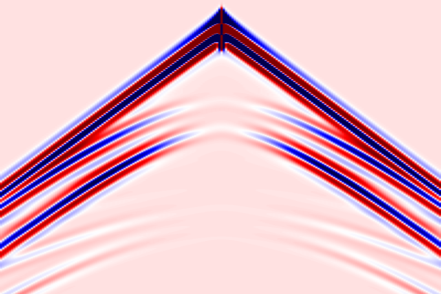
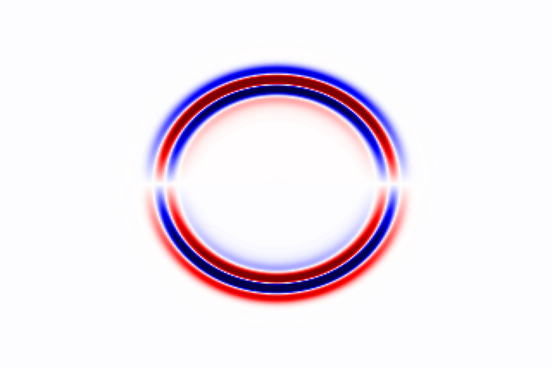
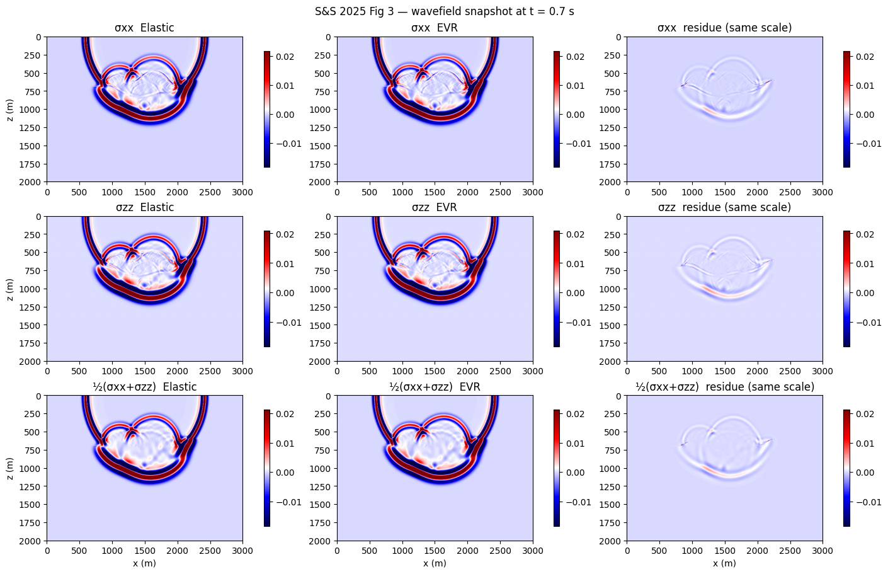
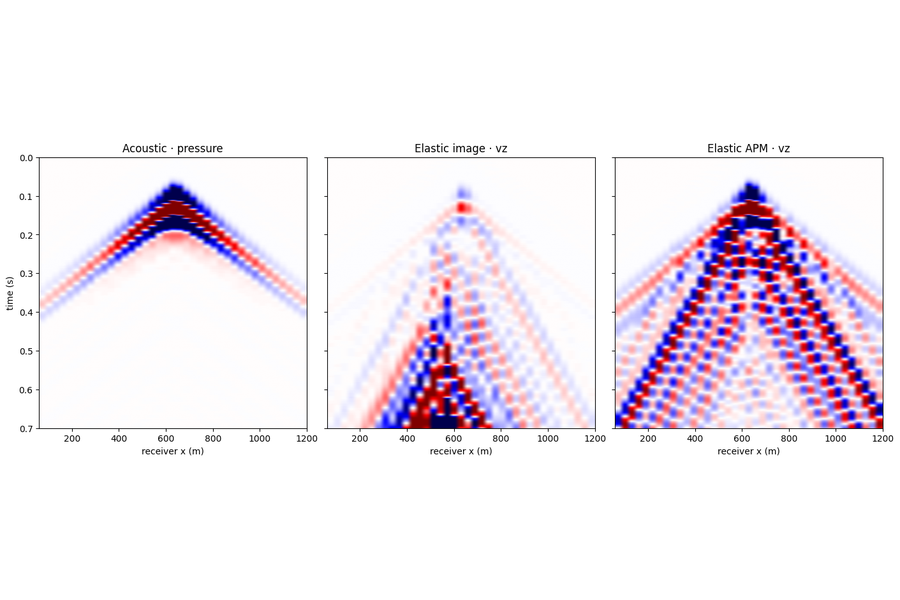
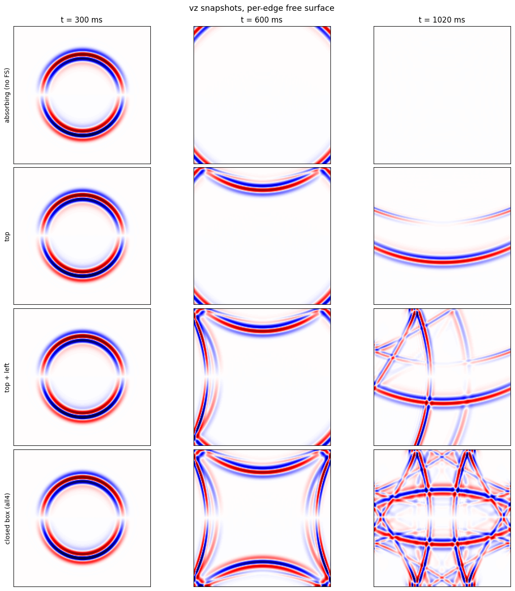
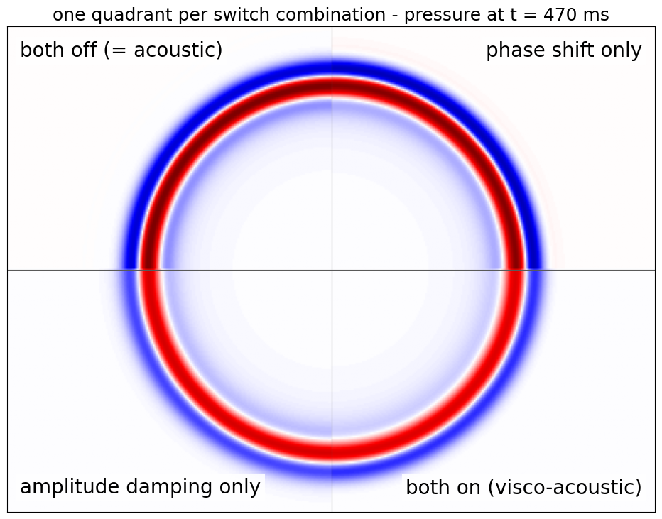
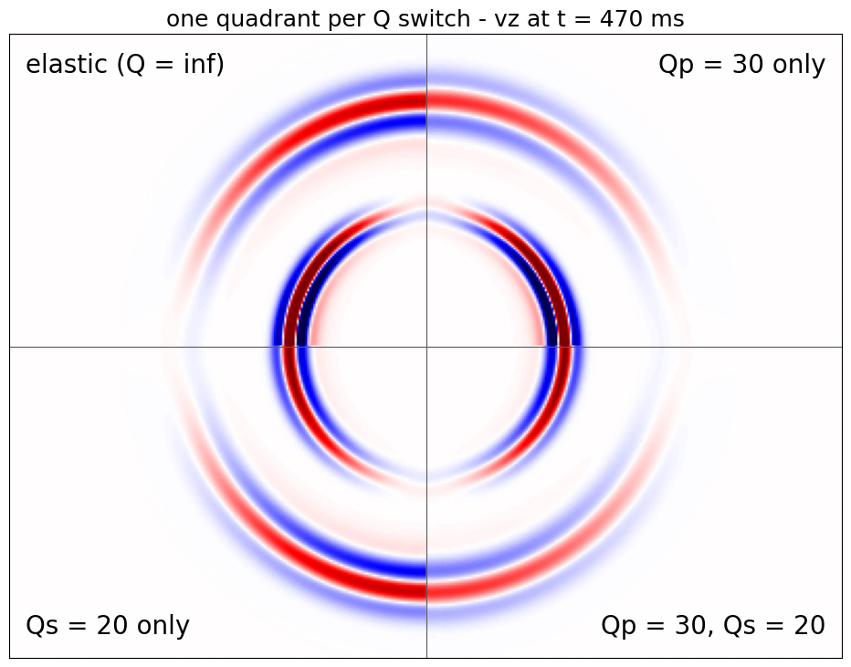
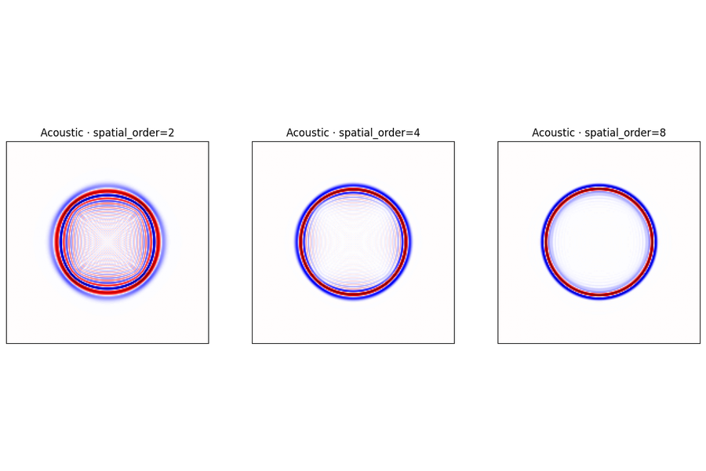

# Wavefields

Forward modelling: elastic sources, DAS, topography and per-edge free surfaces,
visco-acoustic and visco-elastic attenuation, and how solver settings change the
wavefield.

-   { loading=lazy }

    **DAS · Zhao vs Mu**

    ---

    Forward-model the same three-layer elastic medium with the two DAS
    formulations and compare the resulting strain-rate gathers side by side.

    [:material-notebook-outline: Open notebook](../../notebooks/04_das_zhao_vs_mu.ipynb)

-   { loading=lazy }

    **Wavefield · Elastic**

    ---

    Wavefield snapshots from three different stress-source loadings on a
    uniform elastic medium — explosion, vertical dipole, and pure shear —
    to visualize P/S excitation and radiation patterns.

    [:material-notebook-outline: Open notebook](../../notebooks/06_wavefield_elastic.ipynb)

-   { loading=lazy }

    **Elastic vector reflectivity**

    ---

    Forward-modeling validation of elastic vector-reflectivity
    (Soares & Sacchi 2025) — the formulation reproduced and checked against
    the reference.

    [:material-notebook-outline: Open notebook](../../notebooks/16_elastic_vector_reflectivity.ipynb)

-   { loading=lazy }

    **Wavefield · irregular topography**

    ---

    Image-method irregular free-surface for acoustic & elastic 2-D — drape
    a non-flat surface along the top of the model and see how the topography
    reshapes the surface waves and primaries.

    [:material-notebook-outline: Open notebook](../../notebooks/15_wavefield_topography.ipynb)

-   { loading=lazy }

    **Wavefield · Per-edge free surface**

    ---

    ``free_surface`` takes a list of faces, not just a bool: free surface on
    any subset of the four edges — top-only, two-face corners, or a fully
    closed reverberant box (deepwave-style) — with gradients on every
    backward memory mode.

    [:material-notebook-outline: Open notebook](../../notebooks/24_wavefield_per_edge_free_surface.ipynb)

-   { loading=lazy }

    **Wavefield · Visco-acoustic · constant-Q**

    ---

    `ViscoAcoustic`: the acoustic solver plus Zhu & Harris (2014) decoupled
    attenuation — a dispersion switch that moves the front and a damping
    switch that decays it, each demonstrated alone, with the measured decay
    checked against constant-Q theory.

    [:material-notebook-outline: Open notebook](../../notebooks/29_wavefield_visco_acoustic.ipynb)

-   { loading=lazy }

    **Wavefield · Visco-elastic · GSLS**

    ---

    `ViscoElastic`: the elastic solver plus the generalized standard linear
    solid SPECFEM2D uses — `Qp` and `Qs` switched independently, one quadrant
    per combination, the P/S decay checked against constant-Q theory, and why
    dispersion and attenuation cannot be switched apart.

    [:material-notebook-outline: Open notebook](../../notebooks/30_wavefield_visco_elastic.ipynb)

-   { loading=lazy }

    **Solver · hyperparameters**

    ---

    Side-by-side wavefield snapshots showing how the propagator's
    `spatial_order`, `abcn` (PML width) and `pml_type` choices visibly
    change boundary reflections and grid dispersion on a single shot.

    [:material-notebook-outline: Open notebook](../../notebooks/09_solver_hyperparams.ipynb)

