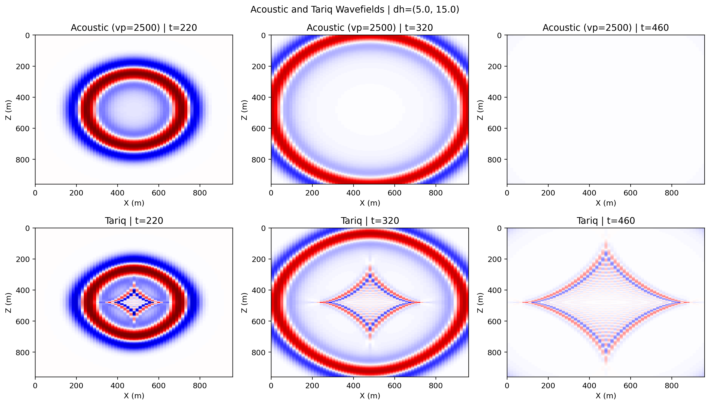
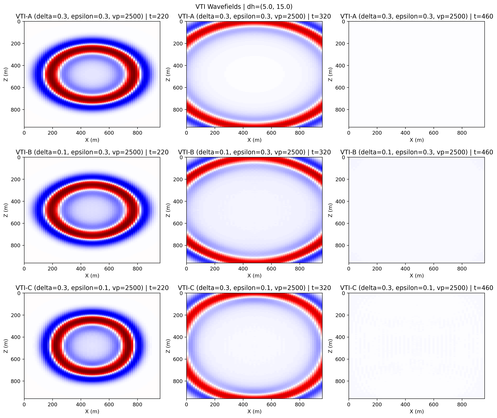

# Anisotropic Wavefields

Source directory:

- `examples/wavefields/anisotropic/`

This example runs an isotropic acoustic baseline plus qP anisotropic equations
with a centered source in a square physical domain.

## Outputs

- `acoustic_tariq_snapshots.png`
- `acoustic_tariq_records.png`
- `vti_snapshots.png`
- `vti_records.png`
- `tti_snapshots.png`
- `tti_records.png`
- `boundary_metrics.txt`

## Common Simulation Parameters

- physical size: `(Lz, Lx) = (960 m, 960 m)`
- grid spacing: `(dz, dx) = (5 m, 15 m)`
- time step: `dt = 0.001 s`
- number of time steps: `nt = 1100`
- absorbing boundary width: `abcn = 20`
- PML type: `cpmlr`
- dominant frequency: `15 Hz`
- spatial order: `8`
- snapshot times: `220, 320, 460`
- source location: `(x, z) = (480 m, 480 m)`
- receiver line: `z = 90 m`, `x = 90 m .. 870 m`, `33` receivers

## Model Parameters

| Model | `vp` (m/s) | `vv` (m/s) | `v` (m/s) | `epsilon` | `delta` | `eta` | `theta` (deg) |
| --- | ---: | ---: | ---: | ---: | ---: | ---: | ---: |
| Acoustic baseline | 2500 | - | - | - | - | - | - |
| Tariq | - | 2300 | 2100 | - | - | 0.15 | - |
| VTI-A | 2500 | - | - | 0.3 | 0.3 | - | - |
| VTI-B | 2500 | - | - | 0.3 | 0.1 | - | - |
| VTI-C | 2500 | - | - | 0.1 | 0.3 | - | - |
| TTI-A | 2500 | - | - | 0.3 | 0.3 | - | 20 |
| TTI-B | 2500 | - | - | 0.3 | 0.1 | - | 20 |
| TTI-C | 2500 | - | - | 0.1 | 0.3 | - | 20 |

## Recorded Fields

- Acoustic, VTI, and TTI: source on `h1`, receivers on `h1`
- Tariq: source on `h1`, receivers on `f1`

## How to Run

Step 1. Run the anisotropic wavefield script.

```bash
cd /home/wangs0j/repo/sweep/examples/wavefields/anisotropic
python anisotropic_wavefields.py
```

Step 2. If you want to force the repo sources instead of an installed package, run:

```bash
PYTHONPATH=../../../src python anisotropic_wavefields.py
```

## Example Figures

`acoustic_tariq_snapshots.png`: wavefield snapshots comparing the isotropic
acoustic baseline and the Tariq qP equation under the same geometry and grid.



`vti_snapshots.png`: snapshot comparison for the three VTI parameter sets
`A/B/C`.



`tti_snapshots.png`: snapshot comparison for the three TTI parameter sets
`A/B/C`.


