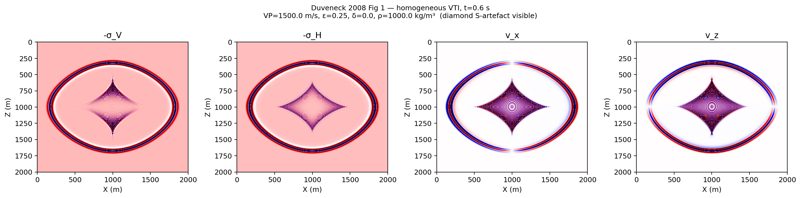
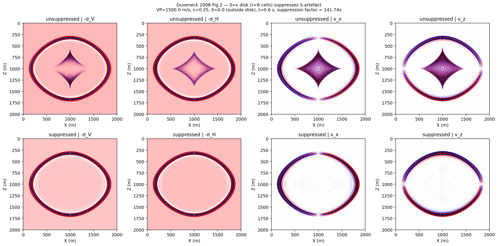

# Anisotropic Wavefields

Source directory:

- `examples/wavefields/anisotropic/`

SWEEP ships **four distinct acoustic anisotropic wave equation classes**,
each with its own trade-off between formulation, memory, model
parameters, and dimensional support. This page compares them and lists
the example scripts that exercise each one.

For elastic anisotropy (3-component stress-velocity TTI) see
[`elastic_tti_wavefields.md`](elastic_tti_wavefields.md).

## Comparison of acoustic anisotropic equations

| Class | Reference | Order | Wavefields (2-D) | Models | 3-D | Variable ρ | Compiled CUDA | Notes |
| --- | --- | --- | --- | --- | --- | --- | --- | --- |
| `AcousticVTI` (`AcousticVTILiang`) | Liang K. et al. 2022 [^liang2022] | 2nd-order scalar | `h1, h2 + 4 CPML aux` | `vp, ε, δ` | ✗ | ✗ (constant) | ✗ | Memory-light pseudo-acoustic VTI for RTM. |
| `AcousticTTI` (`AcousticTTILiang`) | Liang K. et al. 2022 [^liang2022] | 2nd-order scalar | `h1, h2 + 4 CPML aux` | `vp, ε, δ, θ` | ✗ | ✗ | ✗ | TTI rotation of `AcousticVTI`. Same scalar formulation. |
| `AcousticTariq` (`AcousticVTIAlkhalifah` / `AcousticTTIAlkhalifah`) | Alkhalifah 2000 [^alk2000] | 2nd-order scalar | `h1, f1 + CPML aux` | `vv, v, η` | ✗ | ✗ | ✗ | η-formulation; covers VTI & TTI through reparameterisation. |
| `AcousticVTI1st` / `AcousticVTI1st3D` (`AcousticVTIDuveneck` / `AcousticVTIDuveneck3D`) | Duveneck et al. 2008 [^duv2008] | 1st-order velocity-stress | `vx, vz, σ_H, σ_V + 4 CPML mem` | `vp, ε, δ, ρ` | ✅ | ✅ | ✅ (2-D forward + full / bs / chunk-ckpt backward) | Symmetric SSG. Native variable density. The only formulation in SWEEP with a 3-D class and a compiled CUDA path. |

[^liang2022]: Liang K. et al., "An efficient pseudo-pure-mode acoustic VTI/TTI equation", *Geophysics* 87, 2022. [doi:10.1190/geo2022-0292.1](https://doi.org/10.1190/geo2022-0292.1).
[^alk2000]: Alkhalifah T., "An acoustic wave equation for anisotropic media", *Geophysics* 65(4), 2000. [doi:10.1190/1.1444815](https://doi.org/10.1190/1.1444815).
[^duv2008]: Duveneck E., Milcik P., Bakker P. M., Perkins C., "Acoustic VTI wave equations and their application for anisotropic reverse-time migration", SEG Las Vegas 2008. [doi:10.1190/1.3059320](https://doi.org/10.1190/1.3059320).

### Author-named aliases (recap)

```python
from sweep.equations import (
    AcousticVTI,    AcousticVTILiang,        # 2nd-order pseudo-acoustic VTI
    AcousticTTI,    AcousticTTILiang,        # 2nd-order pseudo-acoustic TTI
    AcousticTariq,  AcousticVTIAlkhalifah,   # qP η-formulation (VTI)
                    AcousticTTIAlkhalifah,   #                 (TTI)
    AcousticVTI1st,   AcousticVTIDuveneck,   # 1st-order velocity-stress VTI 2-D
    AcousticVTI1st3D, AcousticVTIDuveneck3D, # 1st-order velocity-stress VTI 3-D
)
```

For users who don't care which author's formulation they get, the
**`AcousticAniso` factory** dispatches by `method=` + `symmetry=` +
`ndim=` and returns the right raw equation instance (it does *not* wrap
a solver — `PropTorch` stays explicit):

```python
from sweep.equations import AcousticAniso
from sweep.propagator.torch import PropTorch

eq = AcousticAniso(method="duveneck", symmetry="vti", ndim=2,
                   spatial_order=4, device="cuda", backend="torch")
prop = PropTorch(eq, shape=(nz, nx),
                 source_type=["sH", "sV"], receiver_type=["vz"],
                 dh=10.0, dt=1e-3, abcn=30)
record = prop(wavelet, sources, receivers,
              models=[vp, eps, delta, rho])
```

`method` ∈ {`"duveneck"`, `"liang"`, `"alkhalifah"`}, `symmetry` ∈
{`"vti"`, `"tti"`}. Unsupported combinations raise
`NotImplementedError` (e.g. Duveneck TTI is a future Bond-rotation
extension; Liang 3-D is not in this repo).

## Example scripts

### 1. `anisotropic_wavefields.py` — side-by-side qP comparison

Runs the isotropic acoustic baseline plus the three qP formulations
(`AcousticTariq`, `AcousticVTI`, `AcousticTTI`) on the same geometry
and grid, then dumps snapshot panels and shot records.

**Common simulation parameters**

- physical size: `(Lz, Lx) = (960 m, 960 m)`
- grid spacing: `(dz, dx) = (5 m, 15 m)`
- time step: `dt = 0.001 s`
- number of time steps: `nt = 1100`
- absorbing boundary width: `abcn = 20`
- PML type: `cpmlr`
- dominant frequency: `15 Hz`
- spatial order: `8`
- snapshot times: `220, 320, 460`
- source location: `(x, z) = (480 m, 480 m)`
- receiver line: `z = 90 m`, `x = 90 m .. 870 m`, `33` receivers

**Model parameters**

| Model | `vp` (m/s) | `vv` (m/s) | `v` (m/s) | `epsilon` | `delta` | `eta` | `theta` (deg) |
| --- | ---: | ---: | ---: | ---: | ---: | ---: | ---: |
| Acoustic baseline | 2500 | - | - | - | - | - | - |
| Tariq | - | 2300 | 2100 | - | - | 0.15 | - |
| VTI-A | 2500 | - | - | 0.3 | 0.3 | - | - |
| VTI-B | 2500 | - | - | 0.3 | 0.1 | - | - |
| VTI-C | 2500 | - | - | 0.1 | 0.3 | - | - |
| TTI-A | 2500 | - | - | 0.3 | 0.3 | - | 20 |
| TTI-B | 2500 | - | - | 0.3 | 0.1 | - | 20 |
| TTI-C | 2500 | - | - | 0.1 | 0.3 | - | 20 |

**Recorded fields**

- Acoustic, VTI, and TTI: source on `h1`, receivers on `h1`
- Tariq: source on `h1`, receivers on `f1`

**How to run**

```bash
cd examples/wavefields/anisotropic
python anisotropic_wavefields.py
```

If you want to force the repo sources instead of an installed package:

```bash
PYTHONPATH=../../../src python anisotropic_wavefields.py
```

**Outputs**

- `acoustic_tariq_snapshots.png` / `acoustic_tariq_records.png`
- `vti_snapshots.png` / `vti_records.png`
- `tti_snapshots.png` / `tti_records.png`
- `boundary_metrics.txt`

**Reproduction of Alkhalifah (2000) Figure** — isotropic acoustic baseline
vs the Tariq qP equation under the same geometry and grid; the qP
formulation produces the characteristic diamond-shape S-wave artefact
described in the paper:


`vti_snapshots.png` — snapshot comparison for three VTI parameter sets
`A / B / C` (not a direct paper reproduction; this is SWEEP's own
parameter sweep on the Liang K. et al. (2022) `AcousticVTI` class):


`tti_snapshots.png` — the same three parameter sets rotated by
`θ = 20°` using `AcousticTTI` (Liang K. et al. 2022, TTI extension):


### 2. Duveneck (1st-order velocity-stress) scripts

The Duveneck 2008 formulation has four focused scripts under the same
directory. They reproduce the canonical figures from the paper and add
a gradient-consistency demonstration against eager autograd. Per-script
descriptions and outputs are listed in
[`examples/wavefields/anisotropic/README.md`](https://github.com/DeepWave-KAUST/sweep/blob/main/examples/wavefields/anisotropic/README.md):

| Script | What it shows |
| --- | --- |
| `duveneck_vti_wavefield.py` | Duveneck Fig. 1 — homogeneous VTI at t = 0.6 s, diamond-shaped V_S = 0 S-wave artefact visible on all four panels (`-σ_V`, `-σ_H`, `v_x`, `v_z`). |
| `duveneck_vti_shear_suppression.py` | Duveneck Fig. 2 — same setup + `smooth_delta_to_epsilon_disk` source-region taper, prints the diamond/P amplitude-ratio drop (~140×). |
| `duveneck_vti_pml_absorption.py` | Two-case CPML absorption test: isotropic medium drops ~5.7×10⁵×; VTI + taper drops ~85×. |
| `duveneck_vti_backward_gradients.py` | eager-autograd vs CUDA backward gradient comparison on the canonical 2-D suite grid (nz=48, nx=56, nt=120). |

**Reproduction of Duveneck (2008) Figure 1** — homogeneous VTI source-generated S-wave artefact:



**Reproduction of Duveneck (2008) Figure 2** — same configuration with the
`δ → ε` source-region disk: the diamond S-artefact is suppressed by a
factor of ~140 while the outer P-wavefront is essentially unchanged.


