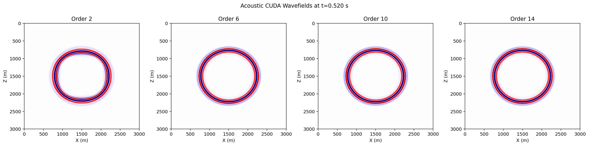

# C/CUDA FD Orders

Source directory:

- `examples/wavefields/cuda_fd_orders/`

These scripts compare compiled `c` CUDA wavefields under different spatial
orders on a uniform 2D model.

## Scripts

- `acoustic_fd_orders.py`: acoustic wavefield comparison for orders `2, 6, 10, 14`
- `elastic_fd_orders.py`: elastic `vx` and `vz` comparison for orders `2, 6, 10, 14`

The source is placed at the center of the model and outputs are written to the
local `outputs/` directory.

## How to Run

Step 1. Run the acoustic comparison.

```bash
python acoustic_fd_orders.py
```

Step 2. Run the elastic comparison.

```bash
python elastic_fd_orders.py
```

## Example Figures

`acoustic_fd_orders.png`: the acoustic wavefield snapshot comparison across
different finite-difference spatial orders on the same uniform model.



`elastic_fd_orders_vz.png`: the elastic `vz` wavefield snapshot comparison
across the same set of spatial orders, useful for checking how elastic
propagation changes as stencil order increases.


