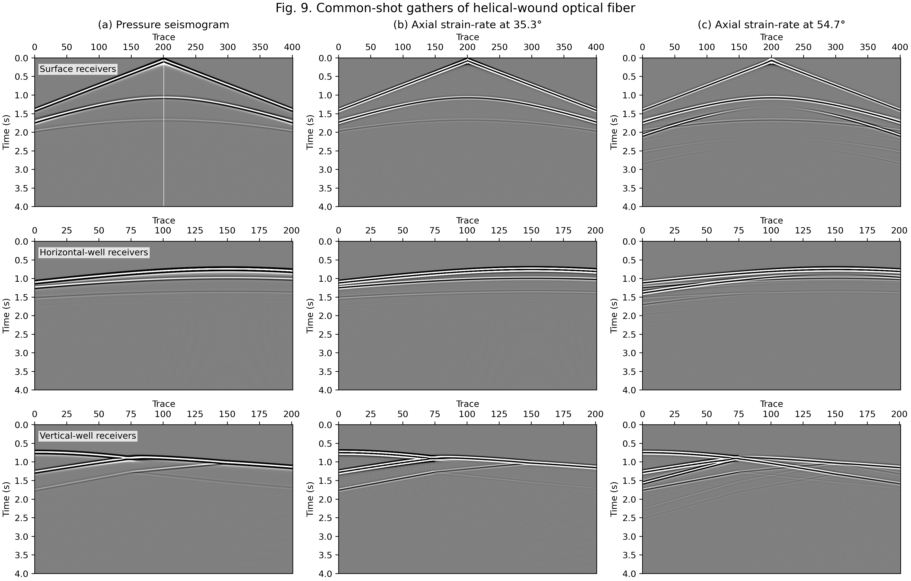

# DAS Figure 4 and Figure 9 Reproductions

Source directory:

- `examples/wavefields/das/`

This page reproduces layered-model DAS figures from
`Zhao et al., Petroleum Science, 23 (2026), 626-642 (https://doi.org/10.1016/j.petsci.2025.09.015)`.

## Unified Entry

`Figure 4` and `Figure 9` can be generated from the same script:

```bash
cd examples/wavefields/das
python reproduce_layered_das.py --figure both --backend both --records-path test/test_outputs/das_paper_reproduction/layered_fig3_paper_geometry_cpml/layered_records.npz
```

If you only need one figure, use `--figure 4` or `--figure 9`.
For figure-9 regeneration, omit `--records-path` and keep the same backend options.

## Figure 4 Reproduction

Layout: surface / horizontal / vertical receiver rows, columns are

- left two columns: `vx`, `vz`
- right two columns: `exx`, `ezz`

### Example Figure


## Figure 9 Reproduction

Fig. 9. Common-shot gathers of helical-wound optical fiber for the layered model.

- first row: surface receivers, panel (a) pressure, panel (b) axial strain-rate at 35.3°, panel (c) axial strain-rate at 54.7°
- second row: horizontal well, panel (d) pressure, panel (e) axial strain-rate at 35.3°, panel (f) axial strain-rate at 54.7°
- third row: vertical well, panel (g) pressure, panel (h) axial strain-rate at 35.3°, panel (i) axial strain-rate at 54.7°

### Example Figure



## Output Locations

- Figure-4 artifacts:
  - `test/test_outputs/das_figure4_reproduction/`
  - `examples/wavefields/das/outputs/`
- Figure-9 replay artifacts:
  - `examples/wavefields/das/outputs/`

The documentation images committed are:

- `docs/figures/examples/wavefields_das_figure4_eager.png`
- `docs/figures/examples/wavefields_das_figure4_cuda.png`
- `docs/figures/examples/wavefields_das_figure9.png`
