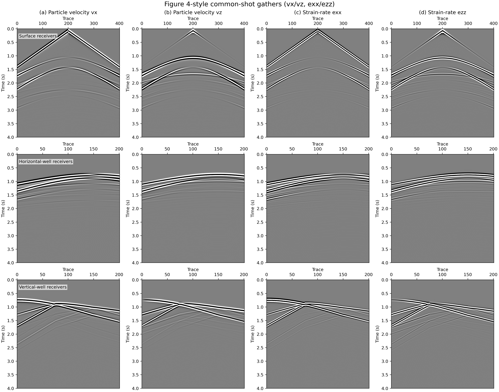
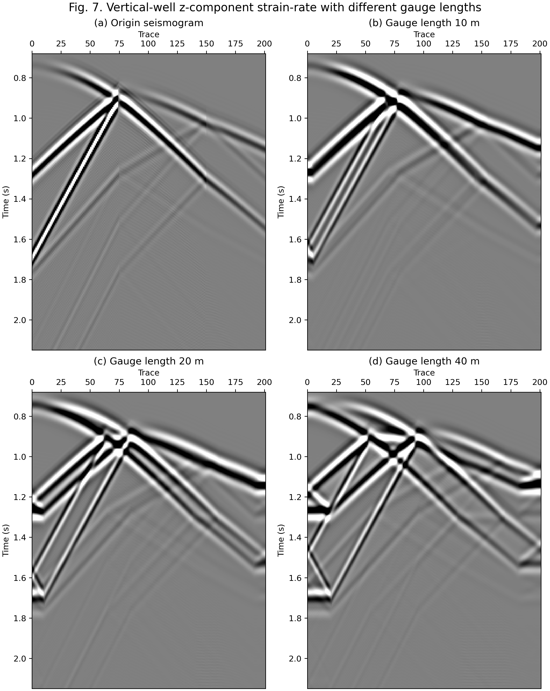
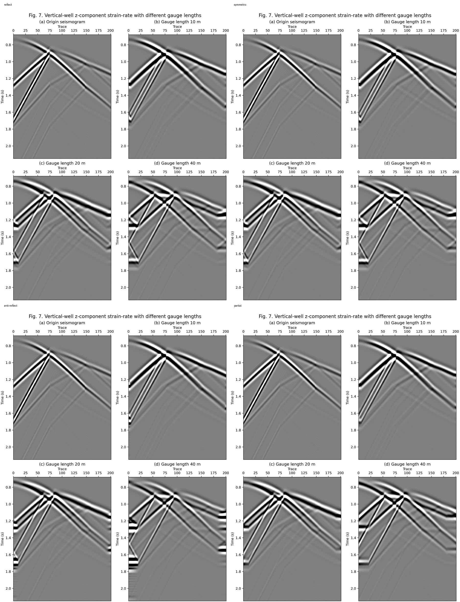
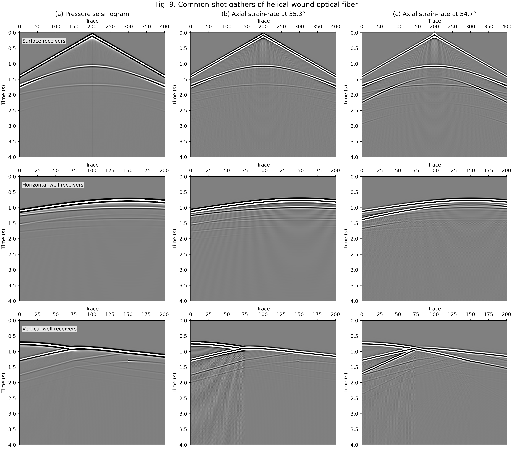
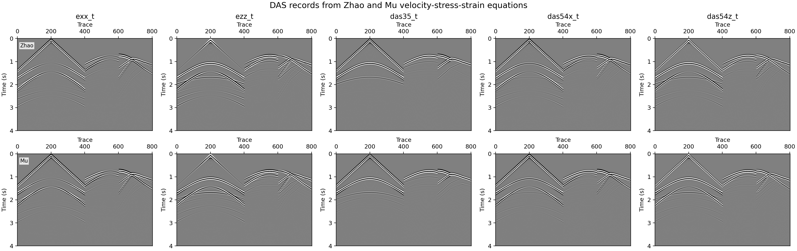

# DAS Layered-Model Reproductions

Source directory:

- `examples/wavefields/das/`

This page documents the layered-model DAS reproduction script:

- `examples/wavefields/das/reproduce_layered_das.py`

The script reproduces layered-model DAS figures from
`Zhao et al., Petroleum Science, 23 (2026), 626-642 (https://doi.org/10.1016/j.petsci.2025.09.015)`.
The default modeling setup uses the paper-style three-layer model, 4 s recording time,
10 m grid spacing, 1 ms time step, eighth-order finite differences, and CPML.

## Script Entry

Run from the repository root:

```bash
PYTHONPATH=src python examples/wavefields/das/reproduce_layered_das.py --figure both --backend torch --impl c --device cuda --output-dir examples/wavefields/das/outputs_elastic_derived
```

Figure choices:

- `--figure 4`: Figure-4-style `vx`, `vz`, `exx`, and `ezz` common-shot gathers.
- `--figure 7`: vertical-well `ezz` gathers with different gauge lengths.
- `--figure 9`: helical-wound DAS gathers.
- `--figure both`: Figures 4 and 9.
- `--figure compare`: direct DAS c CUDA, direct DAS eager, and Elastic-derived DAS comparison.

Use `--backend torch --impl eager`, `--backend torch --impl c --device cuda`, or `--backend torch --impl both` for solver selection.

## Figure 4

Figure 4 shows surface, horizontal-well, and vertical-well common-shot gathers. The left
two columns are particle velocities (`vx`, `vz`), and the right two columns are strain-rate
components (`exx`, `ezz`).



## Figure 7

Figure 7 shows the z-component strain-rate response in the vertical well for different
gauge lengths:

```bash
PYTHONPATH=src python examples/wavefields/das/reproduce_layered_das.py \
  --figure 7 \
  --backend torch --impl c --device cuda \
  --figure7-edge-mode reflect \
  --figure7-time-min 0.68 \
  --figure7-time-max 2.15 \
  --output-dir examples/wavefields/das/outputs_paper_reproduction
```

The output is a 2 by 2 panel layout: origin seismogram, 10 m, 20 m, and 40 m gauge
lengths. Each subplot uses its own 2/98 percentile display scale, and the records are not
trace-normalized.



Gauge-length edge note: the moving gauge average is centered on each vertical-well
receiver. Near the first and last receiver, a full centered window requires samples outside
the simulated receiver line. The default `--figure7-edge-mode reflect` keeps the same trace
count by mirror-padding those missing samples, so the top and bottom edge bands are
padding artifacts rather than physical responses from the model. Use
`--figure7-edge-mode valid` to drop edge traces, or `--figure7-edge-mode partial` to keep
all traces with shorter edge windows.

The default `--figure7-gauge-mode paper-grid` preserves the paper-style gauge contrast by
using 11, 21, and 41 averaging cells. With the default
10 m finite-difference receiver spacing, those windows span more modeled receiver
coordinates than the labels imply.

An edge-mode comparison can be generated by running the Figure 7 command with different
`--figure7-edge-mode` values (`reflect`, `symmetric`, `anti-reflect`, `partial`, `valid`).
The comparison below shows that padding changes only the boundary behavior; the central
receiver traces are the stable part of the gauge-length test.



## Figure 9

Figure 9 shows pressure and helical-wound fiber strain-rate gathers. The rows are surface,
horizontal well, and vertical well. The columns are pressure, axial strain-rate at 35.3
degrees, and axial strain-rate at 54.7 degrees.

```bash
PYTHONPATH=src python examples/wavefields/das/reproduce_layered_das.py --figure 9 --backend torch --impl c --device cuda --output-dir examples/wavefields/das/outputs_elastic_derived
```



## DAS Method Comparison

The comparison mode checks whether the direct DAS equation and the Elastic-derived DAS
post-processing path produce consistent records:

```bash
PYTHONPATH=src python examples/wavefields/das/reproduce_layered_das.py --figure compare --backend torch --impl c --device cuda --output-dir examples/wavefields/das/outputs_das_method_compare
```



## Output Files

The main generated artifacts are:

| Mode | PNG outputs | Record and metadata outputs |
| --- | --- | --- |
| Figure 4 | `figure4_<backend>.png` | `figure4_records_<backend>.npz`, `figure4_metadata.json` |
| Figure 7 | `figure7_<backend>.png` | `figure7_records_<backend>.npz`, `figure7_metadata.json` |
| Figure 9 | `figure9_<backend>.png` | `figure9_records_<backend>.npz`, `figure9_metadata.json` |
| Compare | `das_method_records.png`| `*_records.npz`, `das_method_comparison_summary.json` |

The documentation images are copied from the corresponding generated output directories
under `examples/wavefields/das/`.
