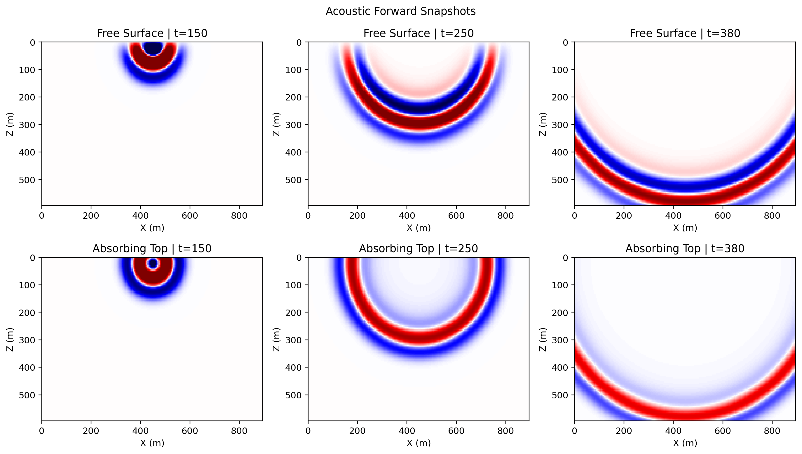
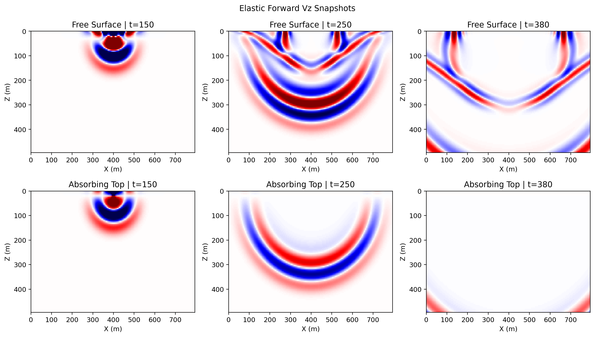

# Free Surface Forward

Source directory:

- `examples/wavefields/free_surface_forward/`

This example group compares forward-only wavefields with and without
`free_surface=True`.

`free_surface=True` places the physical top of the model at the finite-
difference halo boundary and applies the free-surface mirror condition above
that row. The CUDA and eager elastic implementations share the same convention:
the top physical stress components that must vanish at the free surface are
projected to zero, and the matching adjoint/gradient paths use the same top
boundary rule.

## Scripts

- `acoustic_free_surface.py`: compares acoustic snapshots and seismograms
- `elastic_free_surface.py`: compares elastic `vz` snapshots and seismograms

The elastic free-surface implementation is available for both 2D `Elastic` and
3D `Elastic3D` in eager and CUDA modes. CUDA full-wavefield, boundary-saving,
and checkpoint modes are covered by the gradient consistency suite.

## How to Run

Step 1. Run the acoustic free-surface example.

```bash
python acoustic_free_surface.py
```

Step 2. Run the elastic free-surface example.

```bash
python elastic_free_surface.py
```

## Example Figures

`acoustic_free_surface_snapshots.png`: acoustic snapshot panels comparing the
same forward simulation with and without `free_surface=True`.



`elastic_free_surface_snapshots_vz.png`: elastic `vz` snapshot panels comparing
the absorbing-top and free-surface runs, which makes the reflected free-surface
energy much easier to see in the elastic case.


