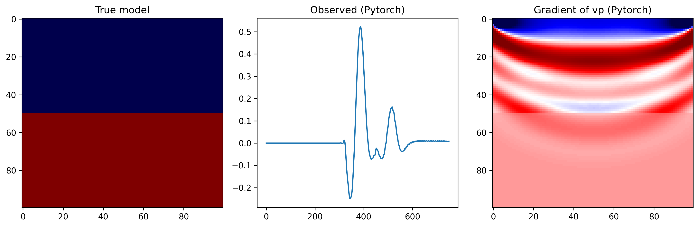

# Quick Start

This page should contain the smallest working example for new users.

## Minimal Workflow

1. Choose a backend
2. Choose an equation
3. Create a propagator
4. Define sources, receivers, and models
5. Run forward modeling or inversion

## Example

=== "PyTorch"

    ```python
    import torch

    from sweep.propagator.torch import PropTorch
    from sweep.equations import Acoustic
    from sweep.signal import ricker

    import numpy as np
    import matplotlib.pyplot as plt

    # Model parameters
    nt = 1500
    dt = 0.002
    dh = 10
    delay = 0.1
    fm = 5
    spatial_order = 8
    shape = (100, 100)

    # Device
    dev = torch.device("cuda") if torch.cuda.is_available() else torch.device("cpu")

    # Create a 2-layer velocity model
    true_model = np.ones(shape, dtype=np.float32) * 1500
    true_model[50:, :] = 2000

    eq_kwargs = dict(spatial_order=spatial_order, device=dev)
    solver_kwargs = dict(
        shape=shape,
        dev=dev,
        dh=dh,
        dt=dt,
        source_type=["h1"],
        receiver_type=["h1"],
        abcn=30,
        free_surface=False,
        pml_type="cpmlr",
        use_ckpt=False,
    )
    solver_torch = PropTorch(Acoustic(**eq_kwargs, backend="torch"), **solver_kwargs)

    # Create a wavelet
    t = np.arange(0, int(nt // 2) * dt, dt)
    wave = ricker(t - delay, f=fm)

    # Acquisition geometry
    sources = np.array([[1, 1]])      # shape = (nshots, 2)
    receivers = np.array([[[99, 1]]]) # shape = (nshots, nreceivers, 2)

    # Forward modeling + backward propagation
    vp = torch.from_numpy(true_model).to(dev).requires_grad_(True)
    obs_torch = solver_torch(wave, sources, receivers, models=[vp])
    obs_torch.pow(2).sum().backward()
    grad_torch = vp.grad.detach().cpu().numpy()

    # Show the results
    fig, axes = plt.subplots(1, 3, figsize=(12, 4))

    axes[0].imshow(true_model, cmap="seismic", aspect="auto")
    axes[0].set_title("True model")

    axes[1].plot(obs_torch.detach().cpu().numpy().squeeze(), label="Observed data")
    axes[1].set_title("Observed (PyTorch)")

    vmin, vmax = np.percentile(grad_torch, [1, 99])
    axes[2].imshow(grad_torch, cmap="seismic", aspect="auto", vmin=vmin, vmax=vmax)
    axes[2].set_title("Gradient of vp (PyTorch)")

    fig.tight_layout()
    plt.savefig("fwi_torch.png", dpi=300, bbox_inches="tight")
    plt.show()
    ```

=== "CUDA"

    ```python
    import torch

    from sweep.propagator.cuda import PropCUDA
    from sweep.equations import Acoustic
    from sweep.signal import ricker

    import numpy as np
    import matplotlib.pyplot as plt

    # Model parameters
    nt = 1500
    dt = 0.002
    dh = 10
    delay = 0.1
    fm = 5
    spatial_order = 8
    shape = (100, 100)

    # Device
    dev = torch.device("cuda") if torch.cuda.is_available() else torch.device("cpu")

    # Create a 2-layer velocity model
    true_model = np.ones(shape, dtype=np.float32) * 1500
    true_model[50:, :] = 2000

    eq_kwargs = dict(spatial_order=spatial_order, device=dev)
    solver_kwargs = dict(
        shape=shape,
        dev=dev,
        dh=dh,
        dt=dt,
        source_type=["h1"],
        receiver_type=["h1"],
        abcn=30,
        free_surface=False,
        pml_type="cpmlr",
        boundary_saving_config=dict(
            enabled=True,
            storage="gpu",
            transfer_interval=1,
            pinned_memory=False,
        ),
    )
    solver_cuda = PropCUDA(Acoustic(**eq_kwargs), **solver_kwargs)

    # Create a wavelet
    t = np.arange(0, int(nt // 2) * dt, dt)
    wave = ricker(t - delay, f=fm)

    # Acquisition geometry
    sources = np.array([[1, 1]])      # shape = (nshots, 2)
    receivers = np.array([[[99, 1]]]) # shape = (nshots, nreceivers, 2)

    # Forward modeling + backward propagation
    vp = torch.from_numpy(true_model).to(dev).requires_grad_(True)
    obs_cuda = solver_cuda(wave, sources, receivers, models=[vp])
    obs_cuda.pow(2).sum().backward()
    grad_cuda = vp.grad.detach().cpu().numpy()

    # Show the results
    fig, axes = plt.subplots(1, 3, figsize=(12, 4))

    axes[0].imshow(true_model, cmap="seismic", aspect="auto")
    axes[0].set_title("True model")

    axes[1].plot(obs_cuda.detach().cpu().numpy().squeeze(), label="Observed data")
    axes[1].set_title("Observed (CUDA)")

    vmin, vmax = np.percentile(grad_cuda, [1, 99])
    axes[2].imshow(grad_cuda, cmap="seismic", aspect="auto", vmin=vmin, vmax=vmax)
    axes[2].set_title("Gradient of vp (CUDA)")

    fig.tight_layout()
    plt.savefig("fwi_cuda.png", dpi=300, bbox_inches="tight")
    plt.show()
    ```

=== "JAX"

    ```python
    import jax
    import jax.numpy as jnp

    from sweep.propagator.jax import PropJax
    from sweep.equations import Acoustic
    from sweep.signal import ricker

    import numpy as np
    import matplotlib.pyplot as plt

    # Model parameters
    nt = 1500
    dt = 0.002
    dh = 10
    delay = 0.1
    fm = 5
    spatial_order = 8
    shape = (100, 100)

    # Create a 2-layer velocity model
    true_model = np.ones(shape, dtype=np.float32) * 1500
    true_model[50:, :] = 2000

    eq_kwargs = dict(spatial_order=spatial_order)
    solver_kwargs = dict(
        shape=shape,
        dev=None,
        dh=dh,
        dt=dt,
        source_type=["h1"],
        receiver_type=["h1"],
        abcn=30,
        free_surface=False,
        pml_type="cpmlr",
        use_ckpt=False,
    )
    solver_jax = PropJax(Acoustic(**eq_kwargs, backend="jax"), **solver_kwargs)

    # Create a wavelet
    t = np.arange(0, int(nt // 2) * dt, dt)
    wave = ricker(t - delay, f=fm)

    # Acquisition geometry
    sources = np.array([[1, 1]], dtype=np.int32)      # shape = (nshots, 2)
    receivers = np.array([[[99, 1]]], dtype=np.int32) # shape = (nshots, nreceivers, 2)

    wave_jax = jnp.array(wave)
    sources_jax = jnp.array(sources)
    receivers_jax = jnp.array(receivers)
    vp0 = jnp.array(true_model)

    def loss_fn(vp):
        obs_jax = solver_jax(wave_jax, sources_jax, receivers_jax, models=[vp])
        return jnp.sum(obs_jax ** 2), obs_jax

    (loss, obs_jax), grad_jax = jax.value_and_grad(loss_fn, has_aux=True)(vp0)
    obs_jax = np.array(obs_jax)
    grad_jax = np.array(grad_jax)

    # Show the results
    fig, axes = plt.subplots(1, 3, figsize=(12, 4))

    axes[0].imshow(true_model, cmap="seismic", aspect="auto")
    axes[0].set_title("True model")

    axes[1].plot(obs_jax.squeeze(), label="Observed data")
    axes[1].set_title("Observed (JAX)")

    vmin, vmax = np.percentile(grad_jax, [1, 99])
    axes[2].imshow(grad_jax, cmap="seismic", aspect="auto", vmin=vmin, vmax=vmax)
    axes[2].set_title("Gradient of vp (JAX)")

    fig.tight_layout()
    plt.savefig("fwi_jax.png", dpi=300, bbox_inches="tight")
    plt.show()
    ```

The figure below shows the gradient result produced by the example above.



## Checkpointing and Boundary Saving

`use_ckpt` controls gradient checkpointing during backpropagation. This is the memory-saving option supported by the PyTorch and JAX propagators.

`boundary_saving_config` configures boundary saving for the CUDA propagator. This mode stores boundary wavefields instead of all forward wavefields, which can significantly reduce memory usage during backward propagation.

Use `boundary_saving_config` with `sweep.propagator.cuda.PropCUDA`. The main fields are:

- `enabled`: turn boundary saving on or off
- `storage`: where saved boundaries are kept, either `"gpu"` or `"cpu"`
- `transfer_interval`: how often boundary data is transferred when CPU storage is used
- `pinned_memory`: whether to use pinned host memory for CPU transfers

PyTorch and JAX propagators currently support checkpointing through `use_ckpt`, but they do not support boundary saving.


## Verify the Installation

After installing SWEEP, you can run a lightweight smoke test with `pytest` to confirm that the package import, equation registry, and CLI are working:

```bash
pytest test/test_installation_smoke.py -q
```

If `pytest` is not installed in your environment yet, install it first:

```bash
pip install pytest
```

This test checks that:

- `import sweep` works
- backend availability helpers can be queried
- core equations are registered correctly
- the installed `sweep` CLI can list equations


## What To Explain Here Later

- What `models=[vp]` means
- How `source_type` and `receiver_type` are chosen
- How geometry arrays are shaped
- How this changes for JAX or CUDA bindings
