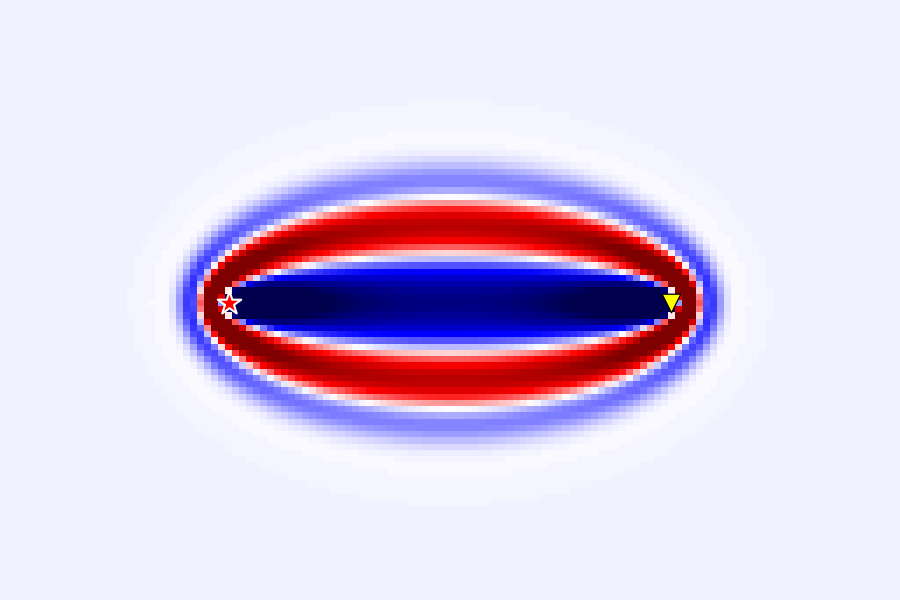
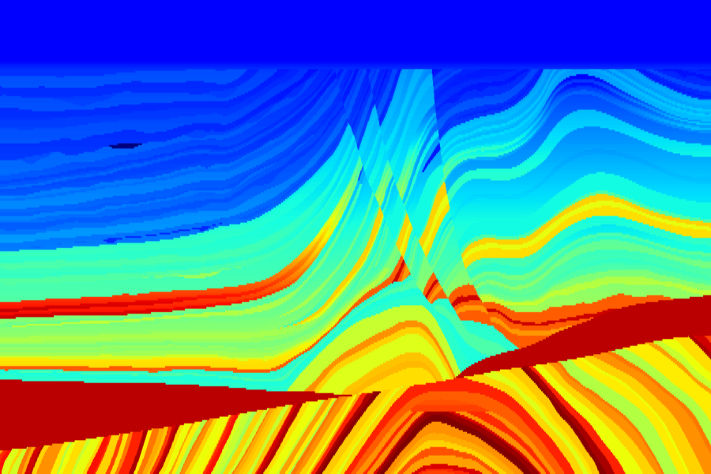
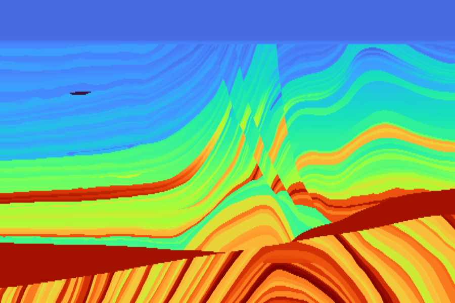
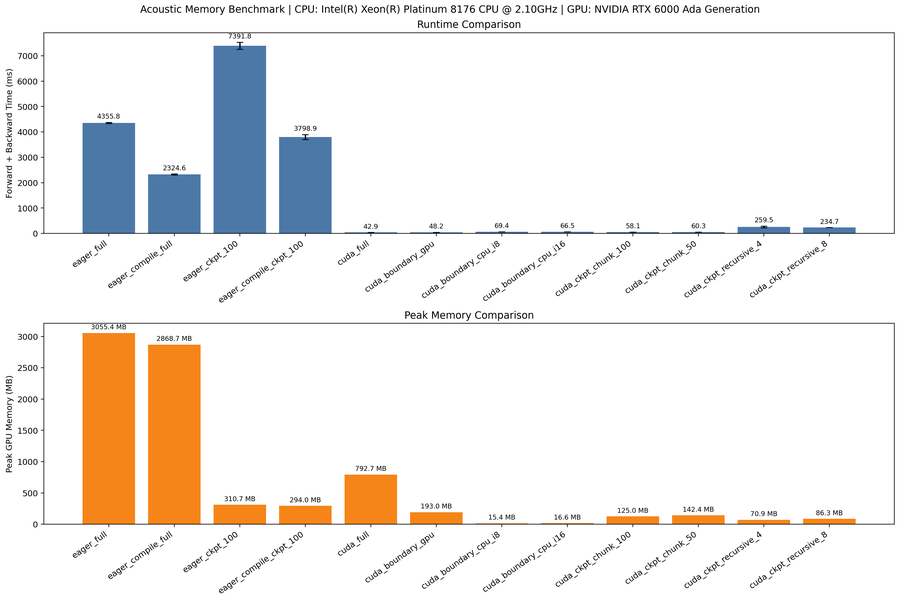
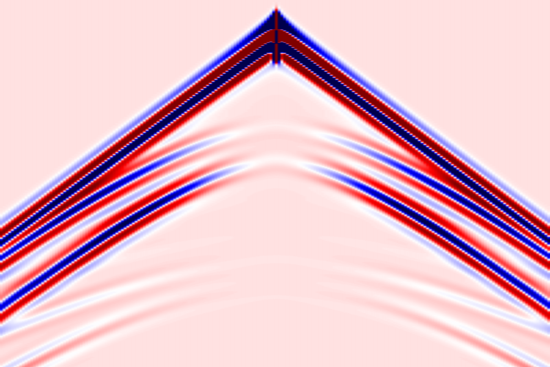
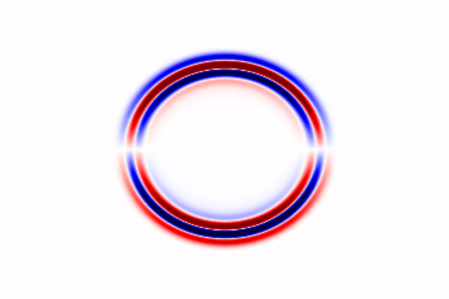
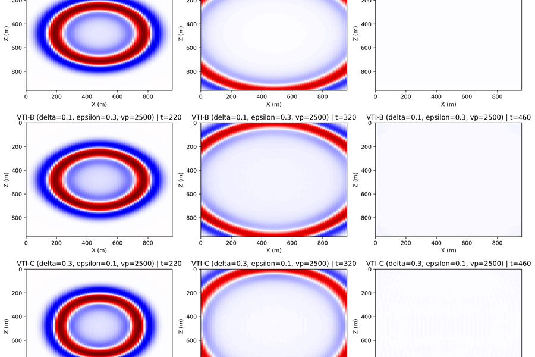
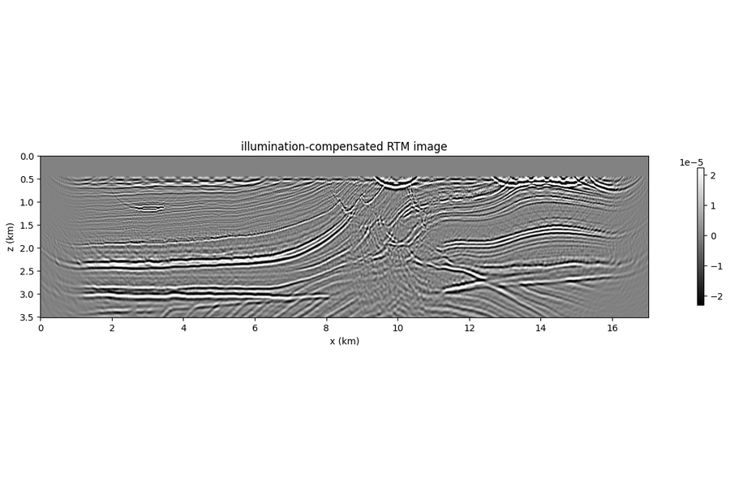

# SWEEP — Seismic Wave Equation Exploration Platform

A PyTorch + JAX framework for **differentiable** seismic wave-equation modeling,
migration, and full-waveform inversion. Built for research where you want to
swap equations, switch backends, and inspect every gradient.

## Try the notebooks

Browser-rendered Jupyter notebooks — every cell already executed, figures
inline. Click a thumbnail to read it online, or download the `.ipynb` to run
it locally.

### Start here

<div class="grid cards" markdown style="max-width: 18rem;">

-   [{ loading=lazy }](notebooks/00_hello_fwi.ipynb)

    **Hello · SWEEP**

    ---

    One shot, one receiver, one `.backward()` — read off the Fresnel-zone
    sensitivity kernel for a single trace, then stack shots into a 5-line
    Adam loop. The 30-second tour of SWEEP.

    [:octicons-arrow-right-24: Open](notebooks/00_hello_fwi.ipynb)

</div>

### FWI

<div class="grid cards" markdown>

-   [{ loading=lazy }](notebooks/01_fwi_acoustic_marmousi.ipynb)

    **Acoustic · Marmousi**

    ---

    Velocity inversion on Marmousi with the PyTorch backend, single-GPU.

    [:octicons-arrow-right-24: Open](notebooks/01_fwi_acoustic_marmousi.ipynb)

-   [{ loading=lazy }](notebooks/02_fwi_elastic_marmousi.ipynb)

    **Elastic · Marmousi**

    ---

    Joint Vp / Vs inversion with the 2D elastic equation, autograd end-to-end.

    [:octicons-arrow-right-24: Open](notebooks/02_fwi_elastic_marmousi.ipynb)

-   [{ loading=lazy }](notebooks/03_fwi_multiscale.ipynb)

    **Multiscale**

    ---

    Frequency-sweep strategy to climb out of cycle-skipping on Marmousi.

    [:octicons-arrow-right-24: Open](notebooks/03_fwi_multiscale.ipynb)

-   [{ loading=lazy }](notebooks/07_memory_strategies.ipynb)

    **Memory strategies**

    ---

    Boundary saving, checkpointing, disk offload — how to fit large-model FWI.

    [:octicons-arrow-right-24: Open](notebooks/07_memory_strategies.ipynb)

</div>

### Wavefields

<div class="grid cards" markdown>

-   [{ loading=lazy }](notebooks/04_das_zhao_vs_mu.ipynb)

    **DAS**

    ---

    Compare two distributed-acoustic-sensing forward operators on a layered model.

    [:octicons-arrow-right-24: Open](notebooks/04_das_zhao_vs_mu.ipynb)

-   [{ loading=lazy }](notebooks/06_wavefield_elastic.ipynb)

    **Elastic**

    ---

    P/S separation snapshots from the 2D elastic staggered-grid solver.

    [:octicons-arrow-right-24: Open](notebooks/06_wavefield_elastic.ipynb)

</div>

### Anisotropic

<div class="grid cards" markdown style="max-width: 18rem;">

-   [{ loading=lazy }](notebooks/05_wavefield_vti.ipynb)

    **AcousticVTI**

    ---

    Pseudo-acoustic VTI propagation with shear-leakage suppression.

    [:octicons-arrow-right-24: Open](notebooks/05_wavefield_vti.ipynb)

</div>

### Imaging

<div class="grid cards" markdown style="max-width: 18rem;">

-   [{ loading=lazy }](notebooks/08_rtm_acoustic_marmousi.ipynb)

    **RTM · Marmousi**

    ---

    Reverse-time migration with the acoustic solver — image from one gradient.

    [:octicons-arrow-right-24: Open](notebooks/08_rtm_acoustic_marmousi.ipynb)

</div>

## A 30-line example

Compute a velocity-model gradient from one shot of synthetic data.

!!! info "Coordinate convention (read this first)"

    `sources` and `receivers` use **`(x, z)`** in grid indices for 2D, and
    **`(x, y, z)`** for 3D — that is, horizontal axes first, depth last. In
    the example below, `[50, 2]` means *column 50, depth 2*, and the receiver
    line `[[ix, 2] for ix in range(10, 90)]` is a horizontal cable at depth
    `z = 2` spanning `x ∈ [10, 90)`. Model arrays themselves are stored as
    `(nz, nx)` / `(nz, ny, nx)` — depth first — matching how
    `matplotlib.imshow` displays them with depth growing downwards.

```python
import numpy as np
import torch

from sweep.equations import Acoustic
from sweep.propagator.torch import PropTorch
from sweep.signal import ricker

dev = torch.device("cuda" if torch.cuda.is_available() else "cpu")
nt, dt, dh = 750, 0.002, 10.0
shape = (100, 100)

vp_np = np.full(shape, 1500.0, dtype=np.float32)
vp_np[50:, :] = 2000.0
vp = torch.from_numpy(vp_np).to(dev).requires_grad_(True)

solver = PropTorch(
    Acoustic(spatial_order=8, device=dev, backend="torch"),
    shape=shape, dev=dev, dh=dh, dt=dt,
    source_type=["h1"], receiver_type=["h1"],
    pml_type="cpmlr", backend="torch", impl="eager",
)

wave = ricker(np.arange(nt) * dt - 0.1, f=8.0).astype(np.float32)
sources = np.array([[50, 2]], dtype=np.int32)
receivers = np.array([[[ix, 2] for ix in range(10, 90)]], dtype=np.int32)

obs = solver(wave, sources, receivers, models=[vp])
obs.pow(2).sum().backward()
print("gradient shape:", tuple(vp.grad.shape))
```

The [Quick Start](getting-started/quickstart.md) walks through every line above
in detail.

## Installing

The fastest path — PyTorch / JAX Python interface only:

```bash
pip install .
```

For the compiled C++ / CUDA extension (recommended for production-scale runs,
required for `impl="c"` boundary saving / checkpointing / disk offload):

```bash
SWEEP_BUILD_CUDA=1 pip install -v ".[cuda]" --no-build-isolation
```

If the build cannot auto-detect your GPU architecture, set
`TORCH_CUDA_ARCH_LIST` (e.g. `"7.0"` for V100, `"8.0"` for A100, `"8.9"` for
RTX 6000 Ada, or `"7.0;8.0"` for a multi-arch wheel) before running the
command. See [Installation](getting-started/installation.md) for the full
notes on CUDA toolkit selection and verification.

## Citing SWEEP

If SWEEP supports your research, please cite the preprint:

> Wang, S. and Alkhalifah, T. **SWEEP (Seismic Wave Equation Exploration
> Platform): A Unified Solver Framework for Differentiable Wave Physics.**
> arXiv preprint
> [arXiv:2604.14189](https://arxiv.org/abs/2604.14189), 2026.

BibTeX:

```bibtex
@misc{wang2026sweep,
  title         = {{SWEEP} ({S}eismic {W}ave {E}quation {E}xploration {P}latform):
                   A Unified Solver Framework for Differentiable Wave Physics},
  author        = {Wang, Shaowen and Alkhalifah, Tariq},
  year          = {2026},
  eprint        = {2604.14189},
  archivePrefix = {arXiv},
  primaryClass  = {physics.gen-ph},
  url           = {https://arxiv.org/abs/2604.14189},
}
```

## Project links

- GitHub: [DeepWave-KAUST/sweep](https://github.com/DeepWave-KAUST/sweep)
- Documentation: [deepwave-kaust.github.io/sweep](https://deepwave-kaust.github.io/sweep/)
- License: [MIT](https://opensource.org/licenses/MIT)
