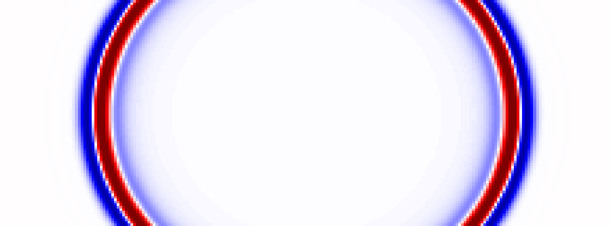

<section class="sweep-features-3">
  <a class="sweep-features-3__card" href="user-guide/propagators/">
    <div class="sweep-features-3__tag">DIFFERENTIABLE</div>
    <h3 class="sweep-features-3__title">Gradients all the way down.</h3>
    <p class="sweep-features-3__desc">
      Every <code>PropTorch</code> call is an autograd node. <code>loss.backward()</code> populates <code>vp.grad</code> as an ordinary torch Tensor — feed it to any optimizer.
    </p>
    <span class="sweep-features-3__link">Learn more <span aria-hidden="true">→</span></span>
  </a>
  <a class="sweep-features-3__card" href="notebooks/12_multi_gpu/">
    <div class="sweep-features-3__tag">HPC · MULTI-GPU</div>
    <h3 class="sweep-features-3__title">Scale across GPUs.</h3>
    <p class="sweep-features-3__desc">
      Wrap the inversion in <code>torchrun --nproc_per_node=4</code> and shots distribute themselves. Marmousi FWI hits <strong>3.79×</strong> on 4 × V100.
    </p>
    <span class="sweep-features-3__link">Learn more <span aria-hidden="true">→</span></span>
  </a>
  <a class="sweep-features-3__card" href="api/">
    <div class="sweep-features-3__tag">PHYSICS ZOO</div>
    <h3 class="sweep-features-3__title">Acoustic to TTI, 2D and 3D.</h3>
    <p class="sweep-features-3__desc">
      33 equation classes across nine families — Acoustic, Elastic, VTI, TTI, LSRTM-Born, DAS. PML and sponge boundaries. Same solver API for all of them.
    </p>
    <span class="sweep-features-3__link">Learn more <span aria-hidden="true">→</span></span>
  </a>
</section>

<section class="sweep-onefile" markdown>
<div class="sweep-onefile__inner" markdown>
<div class="sweep-onefile__eyebrow">MINIFILM · HELLO · FWI</div>
<h2 class="sweep-onefile__title">One file.<br><span class="sweep-onefile__dim">Forward → loss → backward.</span></h2>
<p class="sweep-onefile__lede">A two-layer truth, one shot, sixty-four receivers — and a single <code>.backward()</code> hands you the velocity gradient.</p>

```python
import numpy as np, torch
from sweep.equations import Acoustic
from sweep.propagator.torch import PropTorch
from sweep.signal import ricker

dev    = torch.device('cuda' if torch.cuda.is_available() else 'cpu')
solver = PropTorch(Acoustic(device=dev),
                   shape=(96, 128), dh=10.0, dt=2e-3, dev=dev)

wavelet   = ricker(np.arange(600) * 2e-3 - 0.12, f=10.0).astype(np.float32)
sources   = np.array([[64, 2]], dtype=np.int64)
receivers = np.array([[[ix, 4] for ix in range(0, 128, 2)]], dtype=np.int64)

vp   = torch.tensor(vp_init, device=dev, requires_grad=True)
pred = solver(wavelet, sources, receivers, models=[vp])
loss = 0.5 * (pred - obs).pow(2).sum()
loss.backward()            # vp.grad ready for any torch.optim step
```

<a class="sweep-cta sweep-cta--ghost-dark" href="notebooks/00_hello_fwi/">Open the notebook →</a>
</div>
</section>

<section class="sweep-features-2">
  <div class="sweep-feature-card">
    <div class="sweep-feature-card__tag">EQUATIONS</div>
    <h3 class="sweep-feature-card__title">Acoustic. Elastic.<br>VTI. TTI.</h3>
    <p class="sweep-feature-card__desc">
      Nine equation classes, one solver API. Swap <code>Acoustic</code> for <code>ElasticTTI</code> without touching your inversion loop.
    </p>
    <code class="sweep-feature-card__code">from sweep.equations import ElasticTTI</code>
    <div class="sweep-feature-card__fig">
      
    </div>
  </div>
  <div class="sweep-feature-card">
    <div class="sweep-feature-card__tag">OPTIMIZER</div>
    <h3 class="sweep-feature-card__title">Adam, L-BFGS, or write<br>your own.</h3>
    <p class="sweep-feature-card__desc">
      Gradients are torch Tensors. <code>eps=1e-16</code> on Adam keeps tiny FWI gradients from getting masked.
    </p>
    <code class="sweep-feature-card__code">torch.optim.Adam([vp], lr=25.0, eps=1e-16)</code>
    <div class="sweep-feature-card__fig">
      
    </div>
  </div>
</section>

<section class="sweep-nb">
  <div class="sweep-nb__hd">
    <div class="sweep-nb__eyebrow">EXAMPLES</div>
    <h2 class="sweep-nb__title">Pre-baked notebooks.</h2>
    <p class="sweep-nb__lede">Every cell already executed. Read in the browser, or download to run locally.</p>
  </div>

  <div class="sweep-nb__grid">
    <a class="sweep-nb__featured" href="notebooks/01_fwi_acoustic_marmousi/">
      <div class="sweep-nb__featured-media">
        
      </div>
      <div class="sweep-nb__featured-body">
        <span class="sweep-nb__chip teal">BENCHMARK · ACOUSTIC</span>
        <h4>Marmousi FWI</h4>
        <p>3.5 km × 17 km Marmousi at 25 m grid. 20 shots, 200 receivers, 4 s record. Adam (lr=25, eps=1e-16) on the compiled CUDA backend.</p>
        <div class="sweep-nb__stats">
          <div><span>RUNTIME</span><strong>6.7 s</strong></div>
          <div><span>ITERS</span><strong>30</strong></div>
          <div><span>LOSS</span><strong>17× drop</strong></div>
        </div>
      </div>
    </a>

    <div class="sweep-nb__side">
      <a class="sweep-nb__small" href="notebooks/05_wavefield_vti/">
        <span class="sweep-nb__chip amber">VTI · FORWARD</span>
        <h4>Diamond qP wavefront</h4>
        <p>Duveneck Fig. 2: ε = 0.25, δ = 0 on a 193 × 193 grid. Three VTI parameterizations side-by-side.</p>
        <div class="sweep-nb__small-media">
          
        </div>
      </a>

      <a class="sweep-nb__cta" href="examples/">
        <div class="sweep-nb__cta-num">12 notebooks · 9 equations</div>
        <div class="sweep-nb__cta-title">See every<br><span class="sweep-nb__cta-italic">example.</span></div>
        <div class="sweep-nb__cta-tags">
          <span>FWI</span><span>RTM</span><span>LSRTM</span><span>Elastic</span><span>VTI</span><span>TTI</span><span>DAS</span><span>3D</span><span>Multi-GPU</span>
        </div>
        <div class="sweep-nb__cta-arrow">Browse all examples →</div>
      </a>
    </div>
  </div>
</section>

<section class="sweep-stack">
<div class="sweep-stack__eyebrow">THE STACK</div>
<h2 class="sweep-stack__title">Built on what you already trust.</h2>
<p class="sweep-stack__lede">Lazy imports — only the backend you actually use is loaded.</p>
<div class="sweep-stack__grid">
  <div class="sweep-stack__card">
    <div class="sweep-stack__head"><span class="sweep-stack__dot" style="background:#1AA690"></span><span class="sweep-stack__role">PRIMARY</span></div>
    <div class="sweep-stack__name">PyTorch</div>
    <div class="sweep-stack__version">≥ 2.1</div>
    <div class="sweep-stack__desc">Default training backend. CUDA + CPU + MPS.</div>
  </div>
  <div class="sweep-stack__card">
    <div class="sweep-stack__head"><span class="sweep-stack__dot sweep-stack__dot--tri" style="border-bottom-color:#BCC83C"></span><span class="sweep-stack__role">PRIMARY</span></div>
    <div class="sweep-stack__name">JAX</div>
    <div class="sweep-stack__version">≥ 0.4.20</div>
    <div class="sweep-stack__desc">Functional autograd, jit, vmap.</div>
  </div>
  <div class="sweep-stack__card">
    <div class="sweep-stack__head"><span class="sweep-stack__dot sweep-stack__dot--sq" style="background:#ED8B2E"></span><span class="sweep-stack__role">GPU</span></div>
    <div class="sweep-stack__name">CUDA</div>
    <div class="sweep-stack__version">11 / 12</div>
    <div class="sweep-stack__desc">NVIDIA H100, A100, L40S, RTX 6000 Ada.</div>
  </div>
  <div class="sweep-stack__card">
    <div class="sweep-stack__head"><span class="sweep-stack__dot" style="background:#1AA690"></span><span class="sweep-stack__role">ALWAYS-ON</span></div>
    <div class="sweep-stack__name">NumPy</div>
    <div class="sweep-stack__version">≥ 1.26</div>
    <div class="sweep-stack__desc">Numerical interop, IO.</div>
  </div>
</div>
</section>
