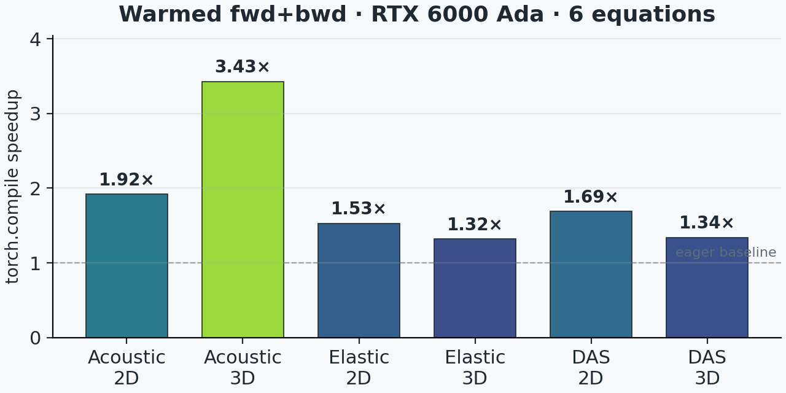
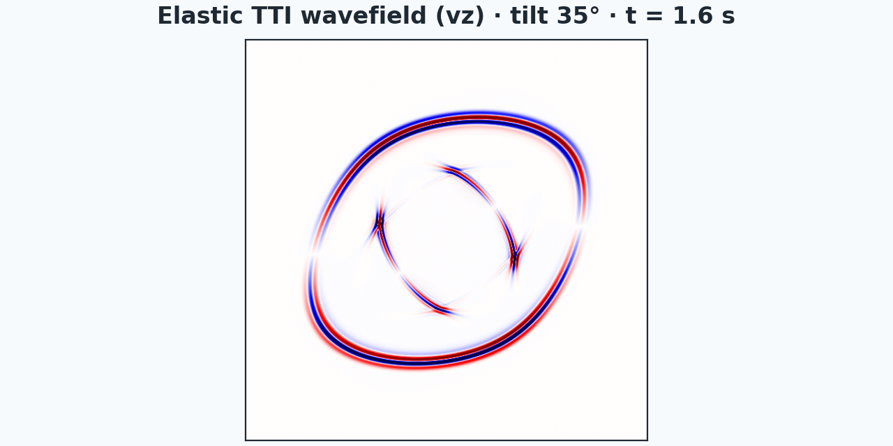
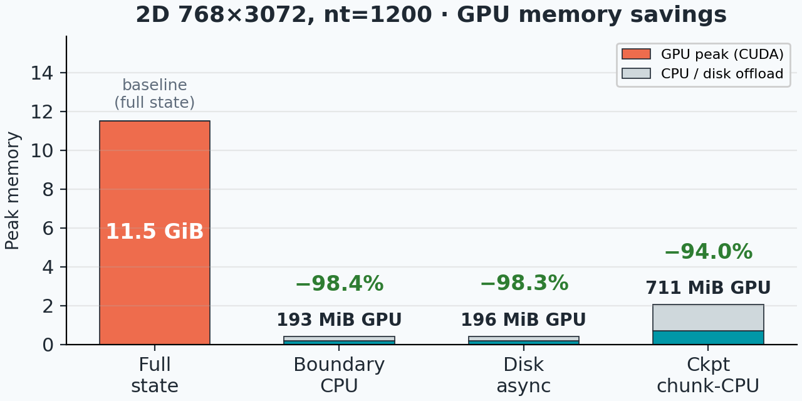
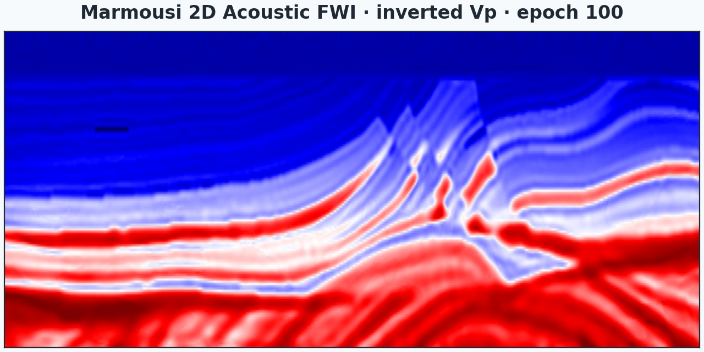

# SWEEP — Seismic Wave Equation Exploration Platform

A PyTorch + JAX framework for **differentiable** seismic wave-equation modeling,
migration, and full-waveform inversion. Built for research where you want to
swap equations, switch backends, and inspect every gradient.

<div class="grid cards" markdown>

-   { loading=lazy }

    **Multi-backend by design**

    ---

    PyTorch eager, compiled CUDA / C++ extension, and JAX behind one API.
    Switch with one flag — autograd everywhere.

    [:octicons-arrow-right-24: Backends](user-guide/backends.md)

-   { loading=lazy }

    **Twenty-plus equations**

    ---

    Acoustic, elastic, TTI / VTI anisotropic, DAS, visco-acoustic — both 2D
    and 3D variants, ready for forward modeling and adjoint-based inversion.

    [:octicons-arrow-right-24: Equations](user-guide/equations.md)

-   { loading=lazy }

    **GPU-accelerated, memory-friendly**

    ---

    Hand-tuned CUDA kernels with boundary-saving, source encoding, and
    activation checkpointing for memory-bound large-model FWI.

    [:octicons-arrow-right-24: Reducing memory](examples/reducing_memory.md)

-   { loading=lazy }

    **Research-ready**

    ---

    Multi-GPU, MPI shot parallelism, joint migration inversion, DAS-specific
    physics — all exercised on Marmousi, Overthrust, and SEAM benchmarks.

    [:octicons-arrow-right-24: Examples](examples/index.md)

</div>

## Pick your path

<div class="grid cards" markdown>

-   :material-rocket-launch-outline:{ .lg .middle } &nbsp; **New to FWI?**

    ---

    Start with the [Quick Start](getting-started/quickstart.md) — a 12-step
    PyTorch walkthrough that builds one acoustic solver and computes a
    velocity gradient.

-   :material-swap-horizontal:{ .lg .middle } &nbsp; **Migrating from another solver?**

    ---

    Jump straight to [Examples](examples/index.md) — runnable FWI / LSRTM
    scripts on Marmousi and Overthrust models, in both PyTorch and JAX.

-   :material-api:{ .lg .middle } &nbsp; **Need the API?**

    ---

    [API Reference](api/index.md) documents every equation class and
    propagator option, including model parameter order and supported
    backends.

-   :material-speedometer:{ .lg .middle } &nbsp; **Optimizing for large models?**

    ---

    [Multi-GPU](examples/multi_gpu.md) and
    [Reducing memory](examples/reducing_memory.md) cover Torch Distributed,
    JAX pmap, source encoding, and checkpointing.

</div>

## A 30-line example

Compute a velocity-model gradient from one shot of synthetic data:

```python
import numpy as np
import torch

from sweep.equations import Acoustic
from sweep.propagator.torch import PropTorch
from sweep.signal import ricker

dev = torch.device("cuda" if torch.cuda.is_available() else "cpu")
nt, dt, dh = 750, 0.002, 10.0
shape = (100, 100)

vp_np = np.full(shape, 1500.0, dtype=np.float32)
vp_np[50:, :] = 2000.0
vp = torch.from_numpy(vp_np).to(dev).requires_grad_(True)

solver = PropTorch(
    Acoustic(spatial_order=8, device=dev, backend="torch"),
    shape=shape, dev=dev, dh=dh, dt=dt,
    source_type=["h1"], receiver_type=["h1"],
    pml_type="cpmlr", backend="torch", impl="eager",
)

wave = ricker(np.arange(nt) * dt - 0.1, f=8.0).astype(np.float32)
sources = np.array([[50, 2]], dtype=np.int32)
receivers = np.array([[[ix, 2] for ix in range(10, 90)]], dtype=np.int32)

obs = solver(wave, sources, receivers, models=[vp])
obs.pow(2).sum().backward()
print("gradient shape:", tuple(vp.grad.shape))
```

!!! info "Coordinate convention"

    `sources` and `receivers` use **`(x, z)`** in grid indices for 2D, and
    **`(x, y, z)`** for 3D — that is, horizontal axes first, depth last. In
    the example above, `[50, 2]` means *column 50, depth 2*, and the receiver
    line `[[ix, 2] for ix in range(10, 90)]` is a horizontal cable at depth
    `z = 2` spanning `x ∈ [10, 90)`. Model arrays themselves are stored as
    `(nz, nx)` / `(nz, ny, nx)` — depth first — matching how
    `matplotlib.imshow` displays them with depth growing downwards.

The [Quick Start](getting-started/quickstart.md) walks through every line above
in detail.

## Installing

The fastest path — PyTorch / JAX Python interface only:

```bash
pip install .
```

For the compiled C++ / CUDA extension (recommended for production-scale runs,
required for `impl="c"` boundary saving / checkpointing / disk offload):

```bash
SWEEP_BUILD_CUDA=1 pip install -v ".[cuda]" --no-build-isolation
```

If the build cannot auto-detect your GPU architecture, set
`TORCH_CUDA_ARCH_LIST` (e.g. `"7.0"` for V100, `"8.0"` for A100, `"8.9"` for
RTX 6000 Ada, or `"7.0;8.0"` for a multi-arch wheel) before running the
command. See [Installation](getting-started/installation.md) for the full
notes on CUDA toolkit selection and verification.

## Citing SWEEP

If SWEEP supports your research, please cite the preprint:

> Wang, S. and Alkhalifah, T. **SWEEP (Seismic Wave Equation Exploration
> Platform): A Unified Solver Framework for Differentiable Wave Physics.**
> arXiv preprint
> [arXiv:2604.14189](https://arxiv.org/abs/2604.14189), 2026.

BibTeX:

```bibtex
@misc{wang2026sweep,
  title         = {{SWEEP} ({S}eismic {W}ave {E}quation {E}xploration {P}latform):
                   A Unified Solver Framework for Differentiable Wave Physics},
  author        = {Wang, Shaowen and Alkhalifah, Tariq},
  year          = {2026},
  eprint        = {2604.14189},
  archivePrefix = {arXiv},
  primaryClass  = {physics.gen-ph},
  url           = {https://arxiv.org/abs/2604.14189},
}
```

## Project links

- GitHub: [DeepWave-KAUST/sweep](https://github.com/DeepWave-KAUST/sweep)
- Documentation: [deepwave-kaust.github.io/sweep](https://deepwave-kaust.github.io/sweep/)
- License: [MIT](https://opensource.org/licenses/MIT)
