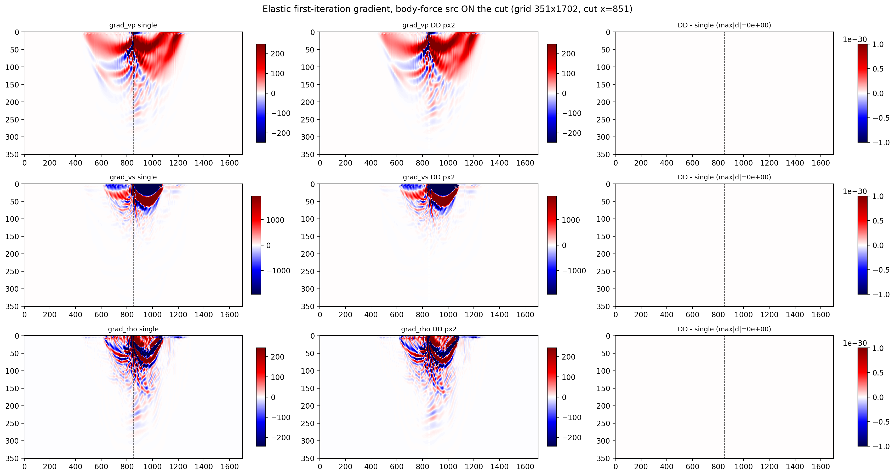

# Torch Multi-GPU Examples

This directory contains Torch distributed examples launched with `torchrun`.
They cover the two independent ways of using more than one GPU, which solve
different problems and compose with each other:

| | what is split | each rank holds | use it when |
|---|---|---|---|
| **shot parallel** (`fwi_marmousi_dist.py`) | the shot list | the whole model | the model fits on one GPU and you have many shots |
| **model parallel / DD** (`dd_*.py`) | the model, into tiles | one tile, all shots | the model does **not** fit on one GPU |

`MeshTopology(py, px, shot_groups=...)` does both at once.

## Shot parallel: 2D acoustic FWI on Marmousi

Script:

- `fwi_marmousi_dist.py`

Prepare the Marmousi `.npy` files first:

```bash
python3 examples/models/marmousi/download_marmousi.py --extract
python3 examples/models/marmousi/extract_model_segy.py
python3 examples/models/marmousi/convert_segy_to_npy.py
python3 examples/models/marmousi/prepare_fwi_models.py \
  --input examples/models/marmousi/npy/vp_1p25m.npy \
  --source-dh 1.25 \
  --target-dh 12.5 \
  --radii 16,16 \
  --passes 3
```

Run on two GPUs:

```bash
torchrun --standalone --nproc_per_node=2 \
  examples/multi-gpu/torch/fwi_marmousi_dist.py --backend torch --impl c --device cuda
```

The script splits each global shot batch across ranks, sums model gradients
with `torch.distributed.all_reduce`, and applies the same optimizer step on
every rank. Rank 0 writes figures to `multi_gpu_acoustic_fwi_cuda/`.

## Model parallel: domain decomposition

`ModelParallel(prop, mesh)` wraps an ordinary propagator and runs it with the
model cut into tiles. The call signature does not change and the forward stays
autograd-transparent, so the only DD-specific lines in an FWI loop are two
`all_reduce` calls — one for the global misfit, one to assemble the global
gradient.

Two rules keep the split invisible to everything else:

- **Keep the optimisation variable on the physical grid** and apply
  `sweep.parallel.pad_to_mesh` inside the loss closure. DD needs uniform tiles
  (`Nx % px == 0`) and never pads implicitly; padding the *stored* model
  instead would move the pad into your optimiser state and, with a
  reparameterised model, silently rewrite the whole velocity field.
- **Reduce a detached misfit.** `all_reduce` is invisible to autograd, so
  reducing a tensor that is still on the graph and then calling `.backward()`
  on it gives the local gradient under a global-looking number. That happens
  to be right for a plain sum, and is wrong the moment anything nonlinear
  follows the reduction.

### 2D — Marmousi, with a single-GPU cross-check

- `dd_fwi_marmousi_2d.py`

A full inversion (Adam, 60 iterations, 20 shots), written so the same script
runs decomposed or not. Marmousi at downsample 8 is 1701 cells wide, which is
not divisible by 4, so `--pad-px` is decoupled from `--px`: both sides can be
put on the same padded grid, which is what makes the comparison meaningful.

```bash
torchrun --standalone --nproc-per-node=4 \
  examples/multi-gpu/torch/dd_fwi_marmousi_2d.py --px 4 --tag dd4 --outdir out
python3 examples/multi-gpu/torch/dd_fwi_marmousi_2d.py \
  --px 1 --pad-px 4 --tag single --outdir out --check dd4
```

The first command writes this — Marmousi at 10 m, 20 shots, 5 Hz, 60 Adam
iterations, the model split four ways (dashed lines are the cuts):


The layering, the faulted zone near 10 km and the fast wedge at 2.5–3 km all
come back; below ~3 km the shots do not illuminate and the starting model
survives untouched. Nothing marks the tile boundaries — a halo bug shows up
there first, as a step or a ringing streak across the cut.

The second command adds the comparison:


The middle panel is `single - dd4` on a fixed ±0.001 m/s scale, so an exactly
zero difference stays blank instead of being stretched into noise; after 60
iterations `max |dvp|` is 0. The right panel is the per-iteration misfit gap:
half the iterations agree to the last bit and the rest sit within 1–2 fp64
ulp. That residue is the reduction order, not the physics — under DD each rank
sums only its own receivers before the `all_reduce`. The models stay
bit-identical because the *gradient* drives Adam, and the gradient is exact.

`--check` also prints those numbers, so you do not need the figure to see
them. A third run with `--pad-px 1 --obs-pad-px 4` inverts the same observed
data on the unpadded grid, which separates what the pad itself costs from
anything DD does: three extra columns out of 1701 leave the inversion quality
alone (RMSE 309.92 vs 309.89 m/s) but move the final model by up to 185 m/s
locally. Change the tile count and you change the pad, so pin `--pad-px` if
you need runs to be comparable.

Each run writes `dd_fwi_marmousi_2d_<tag>.png` plus `hist_<tag>.npz` and
`vp_final_<tag>.npy`.

#### How big does it have to be before DD is also faster?

The run above is deliberately small so it finishes in minutes, and at that
size DD *loses*: 48.6 s per iteration on four V100s against 11.5 s on one.
Nothing is wrong — each tile is 351×426, its kernels take tens of
microseconds, and one halo exchange per time step costs more than that. The
only lever is the tile size. One forward+backward on V100s, steady state:

| `--downsample` | grid | 1 GPU | 4 GPUs | speedup |
|---|---|---|---|---|
| 8 | 0.60 M | 145 µs/step | 502 | **0.29×** |
| 4 | 2.38 M | 450 µs/step | 527 | **0.85×** |
| 2 | 9.53 M | 1604 µs/step | 620 | **2.59×** |
| 1 | 38.10 M | 6175 µs/step | 1859 | **3.32×** |

The break-even is between 2.4 M and 9.5 M cells. The per-step cost does not
depend on the record length (measured from 600 to 64000 steps, unchanged), so
these extrapolate to any `--seconds`. The single-GPU column is not linear
either: at 0.60 M one card reaches 4.1 Gcell/s against 6.1 Gcell/s at 38 M, so
a small model wastes one GPU as well as four.

Memory *is* linear in the record length, because the boundary ring is. At
8.0 s (32000 steps at `--downsample 2`, 64000 at `--downsample 1`):

| `--downsample` | ring | 1 GPU | 4 GPUs |
|---|---|---|---|
| 2 | fp32 | 8.35 GiB | 2.65 GiB |
| 1 | fp32 | **out of memory** | 10.57 GiB |
| 1 | bf16 | 21.62 GiB | 7.14 GiB |
| 1 | int8 | 15.85 GiB | 5.45 GiB |

So full resolution at 8 s needs the ring compressed to fit one card at all —
with fp32 it wants 1.6 GiB more than a 32 GB V100 has:

```bash
torchrun --standalone --nproc-per-node=4 \
  examples/multi-gpu/torch/dd_fwi_marmousi_2d.py --px 4 --downsample 1 \
  --seconds 8 --nshot 1 --iters 2 --boundary-dtype bf16 --tag big4 --outdir out
python3 examples/multi-gpu/torch/dd_fwi_marmousi_2d.py --px 1 --pad-px 4 \
  --downsample 1 --seconds 8 --nshot 1 --iters 2 --boundary-dtype bf16 \
  --tag big1 --outdir out
```

`--seconds` rather than `--nt`: dt is derived from the CFL number, so halving
`--downsample` halves both dh and dt for you and the record stays 8 s.

Two things to know before you time this yourself:

- **Never time DD's first call.** It pays a one-time setup — the capture probe
  forward, the ring allocation, the NCCL bring-up. At full resolution that is
  about 98 s, which charged to a 64000-step run looks like a 1.8× slowdown and
  is easy to misread as a bad interconnect or an nt effect. Single-GPU runs
  have no such cost, so only the DD numbers move. Time the *second* call.
- **A lossy ring is not bit-exact across tile counts.** bf16 and int8 quantise
  per block, and a tile's blocks are not the whole domain's, so `--check` will
  report a small difference. Keep `--boundary-dtype fp32` for the parity
  recipe above and use the lossy modes only when memory forces it.

### 2D elastic — Marmousi, a body-force source ON the cut

- `dd_fwi_marmousi_elastic_2d.py`

The elastic version of the same idea: vp from Marmousi at downsample 8,
vs = vp/1.73, rho = Gardner (held fixed), a vertical body-force source, 8
shots, 3 s records, 30 Adam iterations on vp and vs. One shot is placed
exactly on the tile cut on purpose — the elastic backward is the DD path with
the most protocol traffic (velocity and stress halos exchanged separately,
plus an injection sub-phase), and a body-force source on the cut exercises
every leg of it.

```bash
torchrun --standalone --nproc-per-node=2 \
  examples/multi-gpu/torch/dd_fwi_marmousi_elastic_2d.py --px 2 --tag dd2 --outdir out
python3 examples/multi-gpu/torch/dd_fwi_marmousi_elastic_2d.py \
  --px 1 --pad-px 2 --tag single --outdir out --check dd2
```

Measured on V100s: 21 s per iteration on one GPU (wall 639 s), 72 s on two
(wall 2182 s), misfit down 94.2 % on both. `--check` reports
`max|dvp| = max|dvs| = 0` after 30 iterations — the models are bit-identical —
with the misfit scalar matching to the last bit on 14 of 30 iterations and
sitting within 1–2 ulp otherwise (reduction order again, as in the acoustic
example). At 0.6 M cells elastic DD is ~3.4× *slower* than one GPU: elastic
exchanges two halo groups per step where acoustic exchanges one, and the
phased backward adds two more, so its latency floor is higher and the
break-even table above shifts right. Treat this example as a correctness
fixture, not a speed demo.

The first-iteration gradients of all three parameters (rho as a leaf too, for
the check) are bit-identical between DD and single — the residual column is
exactly zero:



The same check on 3-D Overthrust (Elastic3D, vs and rho derived the same way,
source on the x-cut) is also bit-exact for vp, vs and rho.

Each run writes `ehist_<tag>.npz`, `evp_final_<tag>.npy` and
`evs_final_<tag>.npy`.

### 3D — Overthrust, one model update

- `dd_fwi_overthrust_update.py`

One complete FWI iteration on a 3-D model split 2×2: observed data, multi-shot
gradient, preconditioning, a backtracking line search, and a re-evaluated
misfit that says whether the update actually helped.

```bash
torchrun --standalone --nproc-per-node=4 \
  examples/multi-gpu/torch/dd_fwi_overthrust_update.py --py 2 --px 2
```

It also shows the forward-only path: generating observed data under
`torch.no_grad()` keeps the DD capture free of adjoint wavefields and of the
boundary ring, and the capture is promoted automatically at the first
`.backward()`.

### Across nodes

Every script above runs unchanged on several machines. They read `LOCAL_RANK`
and the process group, and `torchrun` sets both the same way whether the ranks
share a machine or not — so going multi-node is a launcher change, not a code
change. What grows is `py × px`, which must equal *nodes × GPUs-per-node*.

`torchrun` needs four numbers, and only one of them is awkward:

| | where it comes from |
|---|---|
| `--nnodes` | you know it |
| `--nproc-per-node` | GPUs per node, you know it |
| `--rdzv-endpoint` | pick one node as the meeting point |
| *which node am I* | **the only thing a scheduler is needed for** |

With `--rdzv-backend=c10d` the ranks negotiate their own numbering, so that
last row disappears and every node runs an identical command. Two nodes, four
GPUs each, by hand:

```bash
# on BOTH nodes, character for character
torchrun --nnodes=2 --nproc-per-node=4 \
  --rdzv-backend=c10d --rdzv-endpoint=node0:29500 --rdzv-id=dd1 \
  examples/multi-gpu/torch/dd_fwi_overthrust_update.py --py 4 --px 2
```

That is the whole mechanism; a scheduler only automates it. On SLURM:

```bash
sbatch examples/multi-gpu/torch/dd_fwi_multinode.slurm
```

`dd_fwi_multinode.slurm` is that same command with `--nnodes` and the endpoint
filled in from the allocation. On PBS, LSF or SGE, substitute the host list
(`$PBS_NODEFILE`, `$LSB_DJOB_HOSTFILE`, `$PE_HOSTFILE`) for `scontrol show
hostnames` and launch it once per node however that scheduler does it — only
the SLURM path is exercised here, so treat the others as the recipe rather than
a tested script.

The older static form (`--node-rank=$SLURM_NODEID` with `--master-addr` /
`--master-port`) also works and is what you want if your torch predates
`--rdzv-backend`. It needs the scheduler to tell each node its index, which is
exactly the coupling c10d removes.

**Verified** on `origin/dev`, V100: `test/dd_nccl_backward_check.py` with tiles
spanning a node boundary returns `grad_vp`, `grad_wavelet` and both
illuminations **bit-identical** to the single-domain reference — on 2 nodes and
on 3, under c10d and static rendezvous alike. `dd_fwi_multinode.slurm` itself
was run unmodified over 2 nodes on `dd_fwi_overthrust_update.py`: a full 3-D
update, misfit 7.44e+02 -> 6.76e+02, 4.70 GiB per tile. Production runs at this
repo's scale have gone to 12 V100 over 3 nodes and 16 over 4.

Three things that cost real time when they are wrong:

- **One task per node, not one per GPU.** `--ntasks-per-node=1`: `srun` starts
  one `torchrun` and `torchrun` forks the GPU workers. One task per GPU starts
  four launchers per node and the job hangs in rendezvous.
- **Never pipe `torchrun` through `grep`/`tail`.** The pipe eats the worker
  traceback and a crash reports only the launcher's exit code.
- **Ask for partial nodes.** On a cluster whose GPU nodes hold 8, requesting
  4 GPUs on each of 3 nodes schedules far sooner than 8 on each of 2, and the
  halo does not care.
